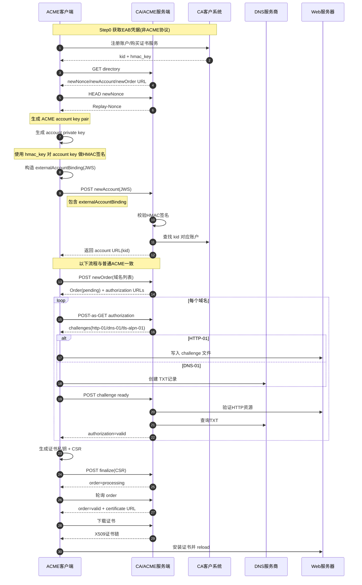

```mermaid
sequenceDiagram
autonumber
participant 客户端 as ACME客户端
participant CA as CA/ACME服务端
participant 外部系统 as CA客户系统
participant DNS as DNS服务商
participant WEB as Web服务器

    Note over 客户端,外部系统: Step0 获取EAB凭据(非ACME协议)
    客户端->>外部系统: 注册账户/购买证书服务
    外部系统-->>客户端: kid + hmac_key

    客户端->>CA: GET directory
    CA-->>客户端: newNonce/newAccount/newOrder URL

    客户端->>CA: HEAD newNonce
    CA-->>客户端: Replay-Nonce

    Note over 客户端: 生成 ACME account key pair
    客户端->>客户端: 生成 account private key

    Note over 客户端: 使用 hmac_key 对 account key 做HMAC签名
    客户端->>客户端: 构造 externalAccountBinding(JWS)

    客户端->>CA: POST newAccount(JWS)
    Note right of 客户端: 包含 externalAccountBinding
    CA->>CA: 校验HMAC签名
    CA->>外部系统: 查找 kid 对应账户
    CA-->>客户端: 返回 account URL(kid)

    Note over 客户端,CA: 以下流程与普通ACME一致

    客户端->>CA: POST newOrder(域名列表)
    CA-->>客户端: Order(pending) + authorization URLs

    loop 每个域名
        客户端->>CA: POST-as-GET authorization
        CA-->>客户端: challenges(http-01/dns-01/tls-alpn-01)

        alt HTTP-01
            客户端->>WEB: 写入 challenge 文件
        else DNS-01
            客户端->>DNS: 创建 TXT记录
        end

        客户端->>CA: POST challenge ready
        CA->>WEB: 验证HTTP资源
        CA->>DNS: 查询TXT
        CA-->>客户端: authorization=valid
    end

    客户端->>客户端: 生成证书私钥 + CSR
    客户端->>CA: POST finalize(CSR)
    CA-->>客户端: order=processing

    客户端->>CA: 轮询 order
    CA-->>客户端: order=valid + certificate URL

    客户端->>CA: 下载证书
    CA-->>客户端: X509证书链

    客户端->>WEB: 安装证书并 reload
```

