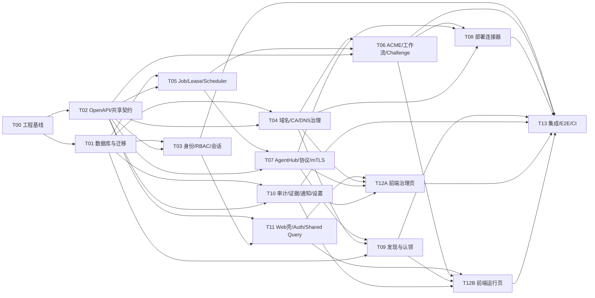

# AutoCertX AI 并行研发规划 V2.0

- 编写日期：2026-04-16
- 适用范围：一期 GA 并行研发组织、AI 任务拆分、自动化验收设计
- 关联文档：
  - `doc/需求说明书.md`
  - `doc/GA一期与后续需求规划.md`
  - `doc/一期GA详细设计.md`
  - `doc/开源组件选型与扩展性设计.md`
  - `sql/001_init_schema.sql`

## 文档关系

- `doc/需求说明书.md` 提供产品目标、长期边界和非目标。
- `doc/GA一期与后续需求规划.md` 冻结一期 GA 的范围、成功标准和阶段顺序。
- `doc/一期GA详细设计.md` 冻结技术基线、模块边界、数据模型和共享契约。
- `doc/开源组件选型与扩展性设计.md` 约束组件复用边界和扩展路径。
- 本文档不再讨论需求取舍，重点负责研发任务拆分、主写范围划分和自动化验收设计。

## 1. 文档目标

这份文档不是传统里程碑 Roadmap，而是面向“多个 AI 并行研发”的执行手册。

目标有三件事：

1. 把一期 GA 的研发任务拆成可并行、低冲突、可独立验收的任务包
2. 为每个任务包定义清晰的输入、输出、依赖、写入范围和验收标准
3. 把验收标准转换成 AI 可执行的自动化验收动作，尽量减少人工 review 才能发现的问题

## 2. 并行研发总原则

### 2.1 一期研发边界

一期只做以下闭环：

- `Let's Encrypt`
- `ACME v2`
- `HTTP-01`
- `DNS-01 (TXT, 阿里云)`
- `NGINX`
- `Tomcat (JSSE + PKCS12)`
- `RSA`
- `Web Console + Control Plane + Execution Plane`

任何 AI 任务不得擅自扩展到：

- `SM2 / ECDSA / ECC`
- 非阿里云 DNS Provider
- 非 `NGINX / Tomcat` 目标连接器
- `OIDC / SAML`
- 网络级 TLS 探测

### 2.2 并行拆分原则

- 先冻结接口，再并行实现
- 先拆“写入范围”，再拆“功能范围”
- 每个任务包必须有唯一主写集，避免多个 AI 修改同一目录
- 每个任务包都必须自带自动化验收脚本或命令
- 没有自动化验收的任务，不允许进入集成波次

### 2.3 AI 协作角色

建议至少使用四类 AI 角色：

- `Orchestrator`
  - 负责拆任务、派工、跟踪依赖、控制 merge 顺序
- `Worker`
  - 负责某个任务包的具体实现
- `Checker`
  - 负责按任务包验收要求执行自动化验收并做代码复核
- `Integrator`
  - 负责解决跨任务冲突、做集成修正、推进联合测试

### 2.4 任务完成定义

任意任务包完成，必须同时满足：

- 代码实现完成
- 测试实现完成
- 自动化验收命令可执行
- 文档或接口契约已同步
- 不破坏其他任务包既有契约

## 3. 目标代码布局与写入边界

为了支撑多 AI 并行，先约定目录级写集边界。

| 区域 | 目标目录 | 主要内容 | 允许主写任务 |
| --- | --- | --- | --- |
| 控制面入口 | `cmd/controlplane/` | 控制面启动入口 | `T00`、`T13` |
| Agent 入口 | `cmd/agent/` | Agent 启动入口 | `T00`、`T07`、`T13` |
| 平台基础设施 | `internal/platform/` | DB、config、logger、middleware、common infra | `T00`、`T01`、`T02`、`T05` |
| 身份与权限 | `internal/controlplane/identity/` | 登录、租户上下文、RBAC、API Key | `T03` |
| 域名与凭据治理 | `internal/controlplane/domainmgr/` | 域名、DNS 凭据、验证记录 | `T04` |
| CA 账户治理 | `internal/controlplane/issuer/` | ACME 账户管理、能力查询 | `T04`、`T06` |
| 证书与工作流 | `internal/controlplane/certificate/` `internal/controlplane/workflow/` | 申请、版本、工作流 | `T06` |
| 调度与作业 | `internal/controlplane/scheduler/` `internal/controlplane/job/` | jobs、lease、worker | `T05` |
| Agent Hub | `internal/controlplane/agenthub/` | 注册、心跳、派发、结果接收 | `T07` |
| 部署 | `internal/controlplane/deployment/` `internal/agent/deploy/` `internal/agent/keymgr/` | 部署与回滚 | `T08` |
| 发现 | `internal/controlplane/discovery/` `internal/agent/discover/` | 配置扫描、匹配、认领 | `T09` |
| 审计与证据 | `internal/controlplane/audit/` `internal/controlplane/evidence/` | 审计、证据、导出 | `T10` |
| 通知与设置 | `internal/controlplane/notification/` `internal/controlplane/settings/` | Webhook、系统设置 | `T10` |
| 协议与契约 | `api/openapi/` `pkg/protocol/acme/` | OpenAPI、Agent API、ACME 协议封装 | `T02`、`T06`、`T07` |
| 前端基础壳 | `web/src/app/` `web/src/shared/` | 路由、鉴权、API client、基础 UI | `T11` |
| 前端治理页 | `web/src/modules/domains/` `web/src/modules/ca-accounts/` `web/src/modules/targets/` `web/src/modules/nodes/` `web/src/modules/settings/` | 治理型页面 | `T12A` |
| 前端运行页 | `web/src/modules/assets/` `web/src/modules/requests/` `web/src/modules/jobs/` `web/src/modules/discoveries/` `web/src/modules/dashboard/` `web/src/modules/audit/` | 运行型页面 | `T12B` |
| SQL 与迁移 | `sql/` `migrations/` | 初始化 DDL、版本迁移、种子数据 | `T01` |
| 集成与 E2E | `tests/integration/` `tests/e2e/` `scripts/` `.github/workflows/` | 集成测试、E2E、CI | `T13` |

约束：

- 非主写任务只允许做最小接口适配，不允许大面积改写他人拥有目录
- 如果必须修改共享契约目录，先由 `Orchestrator` 冻结接口再派发

## 4. 自动化验收总规约

### 4.1 验收分层

每个任务包的自动化验收分五层：

1. `静态校验`
   - 格式化、lint、依赖检查、OpenAPI 校验
2. `单元测试`
   - 模块内部逻辑、边界条件、错误路径
3. `契约测试`
   - API、DTO、事件、Agent 协议、Repository 接口契约
4. `集成测试`
   - PostgreSQL / Redis / mock ACME / mock Agent / fixture runtime
5. `端到端测试`
   - 从控制台/API 到现场执行结果的整链路回归

### 4.2 统一交付要求

每个任务包必须交付：

- 代码
- 测试
- 至少一个可直接执行的验收命令
- 必要的接口契约更新
- 必要的文档更新

### 4.3 建议统一 Make 目标

为了让多个 AI 都能执行统一验收，建议后续统一沉淀这些命令：

- `make fmt`
- `make lint`
- `make test-unit`
- `make test-integration`
- `make test-e2e-http01`
- `make test-e2e-dns01`
- `make web-lint`
- `make web-test`
- `make web-build`
- `make db-verify`
- `make openapi-verify`
- `make ci-task-<TASK_ID>`

### 4.4 AI 自动验收执行规则

- `Worker AI` 完成实现后，必须先执行本任务包的自动化验收
- `Checker AI` 必须独立重复执行同一组验收命令
- 若任务包存在集成依赖，`Integrator AI` 必须在集成分支重复执行一次
- 只有三者结果一致，任务包才允许进入下一波次

## 5. 并行研发波次与依赖图

### 5.1 推荐波次

- `Wave 0`
  - `T00`
- `Wave 1`
  - `T01`
  - `T02`
- `Wave 2`
  - `T03`
  - `T04`
  - `T05`
  - `T10`
  - `T11`
- `Wave 3`
  - `T06`
  - `T07`
  - `T12A`
- `Wave 4`
  - `T08`
  - `T09`
  - `T12B`
- `Wave 5`
  - `T13`

### 5.2 依赖图



## 6. 任务节点设计

下面的任务节点格式固定为：

- `任务目标`
- `前置依赖`
- `推荐 AI 类型`
- `主写范围`
- `交付物`
- `验收要求`
- `自动化验收`

### T00 工程基线与仓库骨架

- 任务目标
  - 建立统一目录结构、构建入口、开发环境脚本、基础 Makefile
- 前置依赖
  - 无
- 推荐 AI 类型
  - `Backend Infra AI`
- 主写范围
  - `cmd/`
  - `internal/platform/`
  - `Makefile`
  - `docker-compose.yml`
  - `.github/workflows/` 的基础骨架
- 交付物
  - 控制面和 Agent 空启动入口
  - 基础配置加载
  - 基础日志模块
  - 本地 PostgreSQL / Redis 启动脚本
- 验收要求
  - 仓库目录结构符合详细设计的模块边界
  - 控制面和 Agent 都能启动到健康检查阶段
  - 本地开发依赖可一键启动
  - 后续任务可在既定目录下直接接入
- 自动化验收
  - `make ci-task-T00`
  - `go test ./cmd/... ./internal/platform/...`
  - `docker compose config`

### T01 数据库与迁移基线

- 任务目标
  - 落地数据库初始化、迁移体系、种子数据策略
- 前置依赖
  - `T00`
- 推荐 AI 类型
  - `Database AI`
- 主写范围
  - `sql/`
  - `migrations/`
  - `internal/platform/db/`
  - `tests/integration/db/`
- 交付物
  - 初始化 DDL
  - 迁移框架
  - 基础种子数据脚本
  - Repository 基础设施
- 验收要求
  - 空库可以初始化到最新版本
  - 迁移具备幂等性和顺序性
  - 核心表、索引、updated_at 触发器可正常创建
  - 基础租户、系统角色种子数据可正确落库
- 自动化验收
  - `make ci-task-T01`
  - `make db-verify`
  - `go test ./internal/platform/db/... ./tests/integration/db/...`

### T02 OpenAPI / 共享契约 / 错误码

- 任务目标
  - 冻结控制面 API、Agent API、错误码、DTO、配置契约
- 前置依赖
  - `T00`
- 推荐 AI 类型
  - `Contract AI`
- 主写范围
  - `api/openapi/`
  - `internal/platform/httpapi/`
  - `internal/platform/errors/`
  - `internal/platform/config/`
- 交付物
  - 控制面 OpenAPI 文档
  - Agent 协议文档
  - 错误码规范
  - 请求/响应 DTO
- 验收要求
  - 控制面和前端共用的接口字段不歧义
  - Agent 协议与控制面派发模型一致
  - 关键资源接口至少覆盖：auth、domains、ca-accounts、dns-credentials、certificate-assets、jobs、nodes、discoveries、audit、dashboard
  - 接口变更具备 diff 校验
- 自动化验收
  - `make ci-task-T02`
  - `make openapi-verify`
  - `go test ./internal/platform/httpapi/... ./internal/platform/errors/...`

### T03 身份、租户上下文与 RBAC

- 任务目标
  - 落地登录、会话、API Key、租户上下文和资源级权限
- 前置依赖
  - `T01`
  - `T02`
- 推荐 AI 类型
  - `Backend Identity AI`
- 主写范围
  - `internal/controlplane/identity/`
  - `tests/integration/identity/`
- 交付物
  - 用户登录/登出/me
  - refresh token 会话模型
  - API Key 鉴权
  - tenant/project/environment 上下文装载
  - 基础 RBAC 中间件
- 验收要求
  - 账号密码登录可用
  - API Key 与 JWT 均可访问受保护接口
  - 跨租户访问被阻断
  - 权限不足返回统一错误码并产生日志/审计
  - 登出后 refresh token 失效
- 自动化验收
  - `make ci-task-T03`
  - `go test ./internal/controlplane/identity/... ./tests/integration/identity/...`
  - `make test-auth-contract`

### T04 域名、CA 账户与 DNS 凭据治理

- 任务目标
  - 落地域名资产、DNS 凭据、ACME 账户管理及其状态治理
- 前置依赖
  - `T01`
  - `T02`
- 推荐 AI 类型
  - `Backend Domain AI`
- 主写范围
  - `internal/controlplane/domainmgr/`
  - `internal/controlplane/issuer/account/`
  - `tests/integration/domainmgr/`
- 交付物
  - 域名资产 CRUD
  - DNS 凭据 CRUD、启停用、轮换状态
  - ACME 账户 CRUD、能力查询、状态校验
  - 域名与 DNS 凭据绑定
- 验收要求
  - 同环境下域名唯一
  - 只能绑定同环境 DNS 凭据和 CA 账户
  - 泛域名策略与 challenge 类型约束生效
  - 域名验证记录、TXT 操作历史可查询
- 自动化验收
  - `make ci-task-T04`
  - `go test ./internal/controlplane/domainmgr/... ./internal/controlplane/issuer/account/... ./tests/integration/domainmgr/...`
  - `make test-domain-governance`

### T05 Job / Lease / Scheduler / Worker 框架

- 任务目标
  - 落地异步任务系统、`SKIP LOCKED` claim/lease、重试与过期回收
- 前置依赖
  - `T01`
  - `T02`
- 推荐 AI 类型
  - `Backend Scheduler AI`
- 主写范围
  - `internal/controlplane/job/`
  - `internal/controlplane/scheduler/`
  - `internal/platform/lock/`
  - `tests/integration/job/`
- 交付物
  - Job 创建与查询
  - Claim / renew / reap
  - JobAttempt 记录
  - Worker 基础执行框架
- 验收要求
  - 多 worker 下同一 job 不会被并发执行
  - worker 崩溃后 lease 能回收
  - JobAttempt 能完整记录每次执行
  - retry / failed / timed_out 流转符合设计
- 自动化验收
  - `make ci-task-T05`
  - `go test ./internal/controlplane/job/... ./internal/controlplane/scheduler/... ./tests/integration/job/...`
  - `make test-job-lease`

### T06 ACME / 工作流 / Challenge 编排

- 任务目标
  - 落地 `CertificateRequest -> IssueWorkflow -> WorkflowChallenge` 主链路
- 前置依赖
  - `T04`
  - `T05`
  - `T02`
- 推荐 AI 类型
  - `Backend Workflow AI`
- 主写范围
  - `pkg/protocol/acme/`
  - `internal/controlplane/certificate/`
  - `internal/controlplane/workflow/`
  - `tests/integration/workflow/`
- 交付物
  - ACME 账户、order、authorization、finalize、download 封装
  - 申请单和工作流状态机
  - HTTP-01 / DNS-01 challenge 编排
  - 证书版本生成逻辑
- 验收要求
  - 新申请与续期共用同一工作流模型
  - `HTTP-01` 和 `DNS-01` 路由都能推进到 `issued`
  - 失败时能写入结构化错误并进入正确状态
  - challenge 清理动作不会遗漏
- 自动化验收
  - `make ci-task-T06`
  - `go test ./pkg/protocol/acme/... ./internal/controlplane/certificate/... ./internal/controlplane/workflow/... ./tests/integration/workflow/...`
  - `make test-e2e-issue-http01`
  - `make test-e2e-issue-dns01-mock`

### T07 AgentHub / Agent 协议 / mTLS

- 任务目标
  - 落地 Agent 注册、心跳、任务拉取、结果回传、mTLS
- 前置依赖
  - `T05`
  - `T02`
- 推荐 AI 类型
  - `Backend AgentHub AI`
- 主写范围
  - `internal/controlplane/agenthub/`
  - `internal/agent/bootstrap/`
  - `internal/agent/mtls/`
  - `internal/agent/heartbeat/`
  - `internal/agent/poller/`
  - `internal/agent/reporter/`
  - `tests/integration/agenthub/`
- 交付物
  - Agent 注册令牌校验
  - mTLS 身份建立
  - 心跳与能力上报
  - 任务 poll/progress/complete
- 验收要求
  - 不兼容 Agent 不能领取任务
  - 被停用节点不能继续上报成功心跳
  - 任务派发遵循能力匹配和环境隔离
  - Agent 回报能写入 JobAttempt 和审计
- 自动化验收
  - `make ci-task-T07`
  - `go test ./internal/controlplane/agenthub/... ./internal/agent/... ./tests/integration/agenthub/...`
  - `make test-agent-protocol`

### T08 部署连接器与现场验证

- 任务目标
  - 落地 RSA 私钥生成、HTTP-01 文件落地、NGINX/Tomcat 部署、验证和回滚
- 前置依赖
  - `T06`
  - `T07`
  - `T04`
- 推荐 AI 类型
  - `Agent Deployment AI`
- 主写范围
  - `internal/agent/keymgr/`
  - `internal/agent/deploy/nginx/`
  - `internal/agent/deploy/tomcat/`
  - `internal/controlplane/deployment/`
  - `tests/integration/deploy/`
- 交付物
  - RSA 私钥生成
  - HTTP-01 present / cleanup
  - NGINX 部署与 reload
  - Tomcat PKCS12 生成与部署
  - 失败回滚与部署后验证
- 验收要求
  - NGINX 成功部署后能返回生效证书指纹
  - Tomcat 成功部署后能返回 keystore 生效验证结果
  - 部署失败时回滚状态正确
  - 部署记录与证据能串回资产详情
- 自动化验收
  - `make ci-task-T08`
  - `go test ./internal/agent/keymgr/... ./internal/agent/deploy/... ./internal/controlplane/deployment/... ./tests/integration/deploy/...`
  - `make test-agent-http01`
  - `make test-agent-deploy-nginx`
  - `make test-agent-deploy-tomcat`

### T09 发现、匹配与认领

- 任务目标
  - 落地 NGINX/Tomcat 配置扫描、本地证书解析、匹配、认领、drifted 判定
- 前置依赖
  - `T07`
  - `T04`
  - `T01`
- 推荐 AI 类型
  - `Agent Discovery AI`
- 主写范围
  - `internal/agent/discover/nginx/`
  - `internal/agent/discover/tomcat/`
  - `internal/controlplane/discovery/`
  - `tests/integration/discovery/`
- 交付物
  - NGINX/Tomcat 配置解析
  - 本地证书 / PKCS12 元数据提取
  - 资产匹配器
  - 未纳管认领和忽略流程
- 验收要求
  - 能输出节点、服务、配置路径、证书指纹、到期时间
  - 能区分 `matched / unmanaged / invalid / ignored`
  - 认领后能建立 `DiscoveryRecord -> CertificateAsset` 关联
  - 若现场版本与绑定版本不一致，能标记 `drifted`
- 自动化验收
  - `make ci-task-T09`
  - `go test ./internal/agent/discover/... ./internal/controlplane/discovery/... ./tests/integration/discovery/...`
  - `make test-discovery-nginx`
  - `make test-discovery-tomcat`

### T10 审计、证据、Webhook、系统设置

- 任务目标
  - 落地审计链、证据归档、Webhook 外发、系统设置和导出记录
- 前置依赖
  - `T01`
  - `T02`
  - `T05`
- 推荐 AI 类型
  - `Backend Governance AI`
- 主写范围
  - `internal/controlplane/audit/`
  - `internal/controlplane/evidence/`
  - `internal/controlplane/notification/`
  - `internal/controlplane/settings/`
  - `tests/integration/governance/`
- 交付物
  - 审计事件写入与查询
  - 证据存储引用和导出记录
  - Webhook 投递与重试
  - 系统设置读写
- 验收要求
  - 登录、申请、challenge、部署、发现、重试、取消等关键动作都能审计
  - Webhook 失败进入 `retry`
  - 系统设置修改可追溯
  - 证据能关联资源并可查询
- 自动化验收
  - `make ci-task-T10`
  - `go test ./internal/controlplane/audit/... ./internal/controlplane/evidence/... ./internal/controlplane/notification/... ./internal/controlplane/settings/... ./tests/integration/governance/...`
  - `make test-webhook-retry`

### T11 Web 基础壳、鉴权与共享查询层

- 任务目标
  - 落地前端基础壳、鉴权、路由、API client、共享查询层
- 前置依赖
  - `T02`
  - `T03`
- 推荐 AI 类型
  - `Frontend Platform AI`
- 主写范围
  - `web/src/app/`
  - `web/src/shared/`
  - `web/src/router/`
  - `web/tests/`
- 交付物
  - 登录页
  - 路由守卫
  - API client
  - 错误处理与全局状态
  - 基础布局和导航
- 验收要求
  - 未登录无法进入受保护页面
  - 租户上下文切换影响接口请求
  - 基础布局能挂载后续业务页面
  - API 错误能统一展示
- 自动化验收
  - `make ci-task-T11`
  - `pnpm -C web lint`
  - `pnpm -C web test`
  - `pnpm -C web build`

### T12A 前端治理页

- 任务目标
  - 实现治理类页面：域名、CA 账户、部署目标、节点、系统设置
- 前置依赖
  - `T11`
  - `T04`
  - `T07`
  - `T10`
- 推荐 AI 类型
  - `Frontend Governance AI`
- 主写范围
  - `web/src/modules/domains/`
  - `web/src/modules/ca-accounts/`
  - `web/src/modules/targets/`
  - `web/src/modules/nodes/`
  - `web/src/modules/settings/`
- 交付物
  - 治理页列表和详情
  - 表单与状态展示
  - 节点详情与能力视图
  - 系统设置页
- 验收要求
  - 关键治理对象可增删改查
  - 状态字段与后端状态机一致
  - 表单校验与后端约束一致
  - 详情页可跳转到相关作业或审计
- 自动化验收
  - `make ci-task-T12A`
  - `pnpm -C web test -- domains ca-accounts targets nodes settings`
  - `pnpm -C web build`

### T12B 前端运行页

- 任务目标
  - 实现运行类页面：仪表盘、证书资产、证书申请、作业、发现、审计
- 前置依赖
  - `T11`
  - `T06`
  - `T09`
  - `T10`
- 推荐 AI 类型
  - `Frontend Operations AI`
- 主写范围
  - `web/src/modules/dashboard/`
  - `web/src/modules/assets/`
  - `web/src/modules/requests/`
  - `web/src/modules/jobs/`
  - `web/src/modules/discoveries/`
  - `web/src/modules/audit/`
- 交付物
  - Dashboard
  - 资产列表与详情
  - 申请表单
  - JobDetail
  - DiscoveryDetail
  - 审计查询页
- 验收要求
  - 能从申请页触发申请并看到作业跟踪
  - 资产详情能串起版本、部署、发现、审计
  - 作业详情能展示 attempts 和错误信息
  - 发现结果能执行认领或忽略
- 自动化验收
  - `make ci-task-T12B`
  - `pnpm -C web test -- dashboard assets requests jobs discoveries audit`
  - `pnpm -C web build`

### T13 集成、E2E、CI 与交付基线

- 任务目标
  - 形成可持续回归的集成测试、端到端测试和 CI 流水线
- 前置依赖
  - `T03`
  - `T06`
  - `T08`
  - `T09`
  - `T10`
  - `T12A`
  - `T12B`
- 推荐 AI 类型
  - `Integration AI`
- 主写范围
  - `tests/e2e/`
  - `tests/integration/`
  - `scripts/`
  - `.github/workflows/`
- 交付物
  - E2E 用例
  - 集成测试编排
  - CI job
  - 失败排障说明
- 验收要求
  - 至少覆盖 4 条主链路：
    - `HTTP-01` 新申请到部署完成
    - `DNS-01` 新申请到部署完成
    - 发现到认领
    - 失败重试与回滚
  - 后端、前端、Agent 的核心回归都进入 CI
  - PR 能基于自动化验收结果判断是否可合并
- 自动化验收
  - `make ci-task-T13`
  - `make test-integration`
  - `make test-e2e-http01`
  - `make test-e2e-dns01`
  - `pnpm -C web build`

## 7. 集成顺序与合并策略

### 7.1 建议合并顺序

1. `T00`
2. `T01 + T02`
3. `T03 + T04 + T05 + T10 + T11`
4. `T06 + T07 + T12A`
5. `T08 + T09 + T12B`
6. `T13`

### 7.2 合并门禁

每次合并至少检查：

- 当前任务包自动化验收全部通过
- 依赖任务包契约无破坏
- `git diff --check` 通过
- 关键目录无越界修改

### 7.3 冲突处理原则

- 若两个 AI 同时需要修改共享契约，先冻结 `T02` 产物，再继续开发
- 若运行页和治理页都依赖同一前端共享组件，由 `T11` 统一收口
- 若部署与发现都依赖 Agent 协议变更，由 `T07` 先升级协议，再让 `T08 / T09` 跟进

## 8. AI 自动化验收执行模板

建议每个 AI 任务完成后按如下模板输出：

```text
TASK_ID: Txx
CHANGED_PATHS:
- ...

ACCEPTANCE_COMMANDS:
- make ci-task-Txx
- ...

RESULT:
- PASS / FAIL

NOTES:
- 依赖接口是否变更
- 是否需要 Integrator 做二次集成
```

## 9. 最终交付判定

一期 GA 进入可交付状态，必须满足：

- 核心闭环可跑通：
  - 申请
  - challenge
  - 签发
  - 部署
  - 验证
  - 发现
  - 续期
- 控制台核心页面可用：
  - 登录
  - 域名管理
  - 证书资产
  - 证书申请
  - 节点管理
  - 作业中心
  - 审计
- 自动化验收闭环可用：
  - 单元
  - 契约
  - 集成
  - E2E
  - 构建

这意味着 AI 并行研发的最终目标不是“代码都写完”，而是：

- 每个任务包可独立完成
- 每个任务包可独立验收
- 所有任务包可以按依赖图顺序无缝集成
