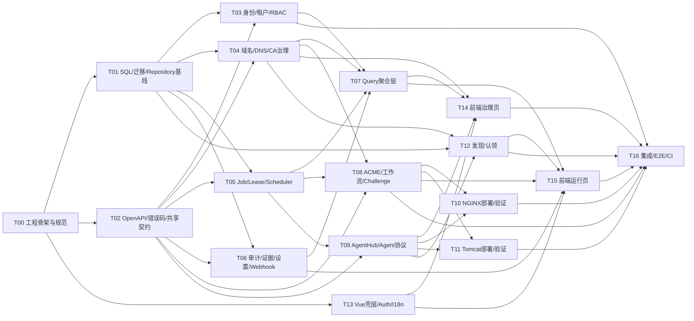

# AutoCertX AI 并行研发执行规划 V3.1

- 编写日期：2026-04-20
- 适用范围：一期 GA 并行研发组织、任务拆分、自动化验收、集成门禁
- 关联文档：
  - `doc/需求说明书.md`
  - `doc/GA一期与后续需求规划.md`
  - `doc/一期GA详细设计.md`
  - `doc/前端页面设计.md`
  - `doc/开源组件选型与扩展性设计.md`
  - `doc/后端代码结构评估与重构建议.md`
  - `sql/001_init_schema.sql`

## 文档关系

- `doc/需求说明书.md` 定义产品级需求、长期边界、角色和非目标。
- `doc/GA一期与后续需求规划.md` 冻结一期 GA 范围、成功标准和后续演进边界。
- `doc/一期GA详细设计.md` 冻结技术基线、状态机、关系模型、数据库表、服务边界和 API 组织方式。
- `doc/前端页面设计.md` 冻结控制台信息架构、一级导航、页面职责和前端页面验收口径。
- `doc/后端代码结构评估与重构建议.md` 约束后端代码结构必须采用“分层 + Query 聚合”的组织方式。
- 本文档不再讨论需求取舍，目标是把上述输入转换为“可由多个 AI 并行执行”的研发计划和验收规则。
- 当前执行进度：
  - `Wave 0` 已完成
  - `Wave 1` 已完成
  - `Wave 2` 已完成
  - `Wave 3` 进行中
  - 其中 `T03`、`T04`、`T05`、`T06`、`T13` 已完成基线实现，`T07` 处于 Phase A 进行中

## 1. 文档目标

本文档解决四件事：

1. 把一期 GA 拆成可并行、低冲突、可自动验收的任务包。
2. 为每个任务包定义唯一主写范围、依赖关系、输出物和门禁。
3. 明确多个 AI 工具协同时的分工方式、集成顺序和冲突处理规则。
4. 为每个任务包定义可自动执行的验收命令，降低人工 review 才能发现问题的比例。

## 2. 一期研发冻结基线

### 2.1 功能冻结范围

一期只交付以下闭环：

- `Let's Encrypt`
- `ACME v2`
- `HTTP-01`
- `DNS-01 (TXT, 阿里云)`
- `NGINX`
- `Tomcat (JSSE + PKCS12)`
- `RSA`
- `Web Console + Control Plane + Execution Plane`
- `zh-CN / en-US` 双语切换

### 2.2 成功标准

一期 GA 成功必须同时满足：

- 具备完善的 Web 管理能力：
  - 登录认证
  - 域名管理
  - 证书资产管理
  - CA 账户管理
  - 交付管理
  - 发现结果
  - 作业中心
  - 审计与基础查询统计
- 具备自动签发能力：
  - 支持 `HTTP-01`、`DNS-01(TXT, 阿里云)`
  - 支持证书申请状态跟踪、挑战跟踪、签发结果入库
- 具备自动续期能力：
  - 支持续期窗口扫描、分布式 claim/lease 调度、幂等重试
- 具备自动部署能力：
  - 支持 `NGINX`
  - 支持 `Tomcat(JSSE + PKCS12)`
  - 支持部署后验证、失败回滚、结果审计
- 具备发现与有效期检测能力：
  - 执行面可达范围内配置扫描
  - 本地证书解析
  - 未纳管证书认领
- 具备多租户、RBAC、审计、证据导出和基础 Webhook 能力

### 2.3 明确不做

本计划不包含：

- `SM2 / ECDSA / ECC / 抗量子`
- 非阿里云 DNS Provider
- 非 `NGINX / Tomcat` 连接器
- `OIDC / SAML`
- 邮件、钉钉、飞书、企业微信通知
- 网络级 TLS 握手探测
- 自建 ACME Server

## 3. 多 AI 并行研发模型

### 3.1 AI 角色

建议至少使用五类 AI 角色：

- `Orchestrator`
  - 负责任务拆分、依赖排序、接口冻结、分支合并顺序控制
- `Worker`
  - 负责单个任务包的设计落地和测试实现
- `Checker`
  - 负责按任务验收规则重复执行自动化验收并做代码复核
- `Integrator`
  - 负责波次集成、冲突收敛、E2E 回归和发布候选构建
- `Doc/Contract Keeper`
  - 负责 OpenAPI、SQL、README、研发文档与代码实现的一致性校验

### 3.2 协作原则

- 一个任务包只允许一个 `Worker AI` 作为主写者。
- 每个任务包必须有唯一主写目录，禁止多个 AI 并行改同一主写目录。
- 契约优先于实现：
  - `sql/`、`api/openapi/`、共享错误码、共享 DTO 必须先冻结，再进入功能实现。
- 页面聚合查询必须通过 `application/query` 层组织，不允许把控制台聚合逻辑直接塞进 `domain` 或 `repository`。
- `交付管理` 只是页面聚合域，后端仍必须保持 `DeploymentTarget` 和 `AgentNode` 分离。
- `web/console/*.html` 为原型参考，正式 Vue 3 工程代码统一落在 `web/console/src/`。

### 3.3 工作方式

建议采用 `一任务一 worktree/一任务一分支`：

- 分支命名：`codex/Txx-<topic>`
- 每个任务包独立 worktree，禁止多个 AI 在同一工作副本里交叉提交
- 共享文件修改采用“契约优先”流程：
  - 先由 `T01/T02/T13` 冻结共享变更
  - 其他任务只消费稳定契约

### 3.4 任务完成定义

任意任务包完成，必须同时满足：

- 代码实现完成
- 必要测试完成
- 对应 `make ci-task-Txx` 可执行且通过
- 文档或接口契约同步
- 不破坏已冻结契约
- Checker AI 在独立 worktree 重跑通过

## 4. 目标代码结构与写入边界

### 4.1 后端目标结构

控制面按以下结构展开：

```text
internal/
  app/
    controlplane/
      bootstrap/
      http/
      middleware/
      wiring/
  domain/
    identity/
    tenancy/
    domains/
    dnscredentials/
    issuer/
    certificateasset/
    certificaterequest/
    issueworkflow/
    deploymenttarget/
    agentnode/
    discovery/
    job/
    audit/
    settings/
  application/
    command/
    query/
  repository/
  workflow/
  driver/
  scheduler/
  agent/
    bootstrap/
    keymgr/
    challenge/http01/
    deploy/nginx/
    deploy/tomcat/
    discover/nginx/
    discover/tomcat/
    verify/nginx/
    verify/tomcat/
```

### 4.2 目录级主写边界

| 区域                  | 目标目录                                                                                                                                                                                                                                                                          | 主写任务              |
| ------------------- | ----------------------------------------------------------------------------------------------------------------------------------------------------------------------------------------------------------------------------------------------------------------------------- | ----------------- |
| 工程入口与基础设施           | `cmd/` `internal/platform/` `internal/app/controlplane/`                                                                                                                                                                                                                      | `T00` `T13` `T16` |
| 数据模型与持久化            | `sql/` `internal/repository/`                                                                                                                                                                                                                                                 | `T01`             |
| 共享契约                | `api/openapi/` `internal/platform/httpx/` 共享错误码/DTO                                                                                                                                                                                                                           | `T02`             |
| 身份、租户、RBAC          | `internal/domain/identity/` `internal/domain/tenancy/` `internal/application/command/auth/` `internal/application/query/authcontext/`                                                                                                                                         | `T03`             |
| 域名、DNS 凭据、CA 账户     | `internal/domain/domains/` `internal/domain/dnscredentials/` `internal/domain/issuer/` `internal/application/command/domains/` `internal/application/command/caaccounts/`                                                                                                     | `T04`             |
| 调度与任务系统             | `internal/domain/job/` `internal/scheduler/` `internal/application/command/jobs/`                                                                                                                                                                                             | `T05`             |
| 审计、证据、设置、导出、Webhook | `internal/domain/audit/` `internal/domain/settings/` `internal/application/command/settings/` `internal/application/query/audit/`                                                                                                                                             | `T06`             |
| 聚合查询层               | `internal/application/query/dashboard/` `internal/application/query/domains/` `internal/application/query/assets/` `internal/application/query/delivery/` `internal/application/query/discoveries/` `internal/application/query/jobs/` `internal/application/query/settings/` | `T07`             |
| ACME 与签发工作流         | `internal/domain/certificaterequest/` `internal/domain/certificateasset/` `internal/domain/issueworkflow/` `internal/workflow/` `internal/driver/acme/` `internal/driver/dns/`                                                                                                | `T08`             |
| Agent 管理、部署目标治理与协议  | `internal/domain/agentnode/` `internal/domain/deploymenttarget/` `internal/application/command/nodes/` `internal/application/command/targets/` `internal/driver/agenttransport/` `internal/agent/bootstrap/`                                                                  | `T09`             |
| NGINX 部署与验证         | `internal/agent/deploy/nginx/` `internal/agent/verify/nginx/`                                                                                                                                                                                                                 | `T10`             |
| Tomcat 部署与验证        | `internal/agent/deploy/tomcat/` `internal/agent/verify/tomcat/`                                                                                                                                                                                                               | `T11`             |
| 发现与认领               | `internal/domain/discovery/` `internal/agent/discover/nginx/` `internal/agent/discover/tomcat/` `internal/application/command/discoveries/`                                                                                                                                   | `T12`             |
| Vue 壳层与共享前端能力       | `web/console/src/app/` `web/console/src/shared/`                                                                                                                                                                                                                              | `T13`             |
| 前端治理页               | `web/console/src/modules/domains/` `web/console/src/modules/ca-accounts/` `web/console/src/modules/delivery/` `web/console/src/modules/settings/`                                                                                                                             | `T14`             |
| 前端运行页               | `web/console/src/modules/dashboard/` `web/console/src/modules/assets/` `web/console/src/modules/jobs/` `web/console/src/modules/discoveries/` `web/console/src/modules/audit/`                                                                                                | `T15`             |
| 集成、E2E、CI、发布        | `tests/` `scripts/` `.github/workflows/` `docker/`                                                                                                                                                                                                                            | `T16`             |

### 4.3 共享文件冻结名单

以下文件只能由指定任务或 Integrator 修改：

- `go.mod` `go.sum`：`T00`、`T16`
- `sql/001_init_schema.sql` 与迁移基线：`T01`、`T16`
- `api/openapi/*`：`T02`、必要时 `T16`
- 根级 `Makefile`：`T00`、`T16`
- `.github/workflows/*`：`T16`
- `web/console/package.json` `web/console/vite.config.*` `web/console/tsconfig*.json`：`T13`、`T16`

## 5. 研发波次与并行顺序

### 5.1 波次划分

- `Wave 0（已完成）`
  - `T00`
- `Wave 1（已完成）`
  - `T01`
  - `T02`
- `Wave 2（已完成）`
  - `T03`
  - `T04`
  - `T05`
  - `T06`
  - `T13`
- `Wave 3（进行中）`
  - `T07`
  - `T08`
  - `T09`
  - `T14`
- `Wave 4（待开始）`
  - `T10`
  - `T11`
  - `T12`
  - `T15`
- `Wave 5（待开始）`
  - `T16`

### 5.2 依赖图



### 5.3 当前执行状态

| 任务   | 名称                          | 波次     | 状态   | 已完成结果 |
| ---- | --------------------------- | ------ | ---- | ------ |
| `T00` | 工程骨架与规范冻结                  | `Wave 0` | 已完成 | 控制面装配骨架、最小可运行 Make 工具链、基础中间件与测试基线已落地，`make ci-task-T00` 已通过 |
| `T01` | SQL、迁移与 Repository 基线      | `Wave 1` | 已完成 | `migrations/0001_init_schema.sql`、`internal/repository/postgres` 基线、`scripts/verify_ddl.sh` 已落地，`make ci-task-T01` 已通过 |
| `T02` | OpenAPI、错误码与共享契约           | `Wave 1` | 已完成 | `api/openapi/openapi.json`、`errors.json`、契约测试已落地，`make ci-task-T02` 已通过 |
| `T03` | 身份、租户上下文与 RBAC             | `Wave 2` | 已完成 | 身份、租户上下文、权限中间件、语言偏好与 `/api/v1/auth/*` 基线已落地，`make ci-task-T03` 已通过 |
| `T04` | 域名、DNS 凭据与 CA 账户治理         | `Wave 2` | 已完成 | 域名、DNS 凭据、CA 账户治理服务与 `/api/v1/domains`、`/api/v1/dns-credentials`、`/api/v1/ca-accounts` 基线已落地，`make ci-task-T04` 已通过 |
| `T05` | Job、Lease 与 Scheduler      | `Wave 2` | 已完成 | `job` 域模型、planner/worker/reaper、PostgreSQL `SKIP LOCKED` 仓储、数据库级集成验证与 `make ci-task-T05` 已落地并通过 |
| `T06` | 审计、证据、系统设置与 Webhook       | `Wave 2` | 已完成 | 审计域/设置域、`/api/v1/audit-events*` 与 `/api/v1/settings/*`、同步 CSV 导出产物、导出记录与 Webhook 状态跟踪、`make ci-task-T06` 基线已落地 |
| `T07` | 聚合查询层与控制台读模型               | `Wave 3` | 进行中 | Phase A 已落地 `dashboard/jobs/domains/settings` 四个 query 模块、控制面 GET 路由切换到 query service、`make test-integration-query` 与 `make ci-task-T07` 基线已补齐，`assets/delivery/discoveries` 与依赖真实资产/发现事实的查询延后到后续任务 |
| `T08` | ACME、签发工作流与 Challenge 编排   | `Wave 3` | 未开始 | 等待执行 |
| `T09` | Agent 管理、部署目标治理与协议         | `Wave 3` | 未开始 | 等待执行 |
| `T10` | NGINX 部署与验证                | `Wave 4` | 未开始 | 等待执行 |
| `T11` | Tomcat 部署与验证               | `Wave 4` | 未开始 | 等待执行 |
| `T12` | 发现与认领                      | `Wave 4` | 未开始 | 等待执行 |
| `T13` | Vue 壳层与共享前端能力              | `Wave 2` | 已完成 | `Vite + Vue 3 + TypeScript` 正式工程入口、登录页、控制台壳层、路由守卫、`Pinia` 登录态、`vue-i18n` 双语、API client、query key、权限映射和 `PermissionGuard` 基线已落地，`make ci-task-T13` 已通过 |
| `T14` | 前端治理页                      | `Wave 3` | 未开始 | 等待执行 |
| `T15` | 前端运行页                      | `Wave 4` | 未开始 | 等待执行 |
| `T16` | 集成、E2E、CI、发布               | `Wave 5` | 未开始 | 等待执行 |

### 5.4 推荐 AI 分工

| AI 角色                | 推荐承接任务                    |
| -------------------- | ------------------------- |
| `AI-A Orchestrator`  | `T00` 协调、波次推进、共享契约冻结、合并门禁 |
| `AI-B Platform/DB`   | `T01` `T05` `T16`         |
| `AI-C Security/API`  | `T02` `T03` `T06`         |
| `AI-D Workflow/PKI`  | `T04` `T08`               |
| `AI-E Agent/Runtime` | `T09` `T10` `T11` `T12`   |
| `AI-F Frontend`      | `T13` `T14` `T15`         |
| `AI-G Checker`       | 每个波次独立复验                  |

## 6. 任务包设计

每个任务包均包含：

- 任务目标
- 前置依赖
- 主写范围
- 关键交付物
- 验收要求
- 自动化验收

### T00 工程骨架与规范冻结

- 执行状态：已完成（2026-04-20）
- 任务目标：
  - 建立目标目录结构
  - 冻结基础 Make 目标、测试约定、配置约定、日志/错误处理基线
- 前置依赖：无
- 主写范围：
  - `cmd/`
  - `internal/platform/`
  - `internal/app/controlplane/`
  - 根级 `Makefile`
- 关键交付物：
  - `cmd/controlplane` 已切换到 `internal/app/controlplane/bootstrap`
  - `internal/app/controlplane/{bootstrap,http,middleware,wiring}` 最小装配骨架
  - `internal/platform/httpx` 与 `internal/platform/runtime.Serve` 通用运行时封装
  - 本地缓存隔离的 `make fmt` `make lint` `make test-unit` `make ci-task-T00`
  - `router`、`wiring` 的最小单元测试
- 实现差异说明：
  - `T00` 的 `lint` 基线当前采用 `go vet`，未在此阶段引入 `golangci-lint` 或 `staticcheck`
  - `T00` 只冻结控制面装配壳层，未在此阶段展开 `internal/domain`、`internal/application` 业务代码
- 验收要求：
  - 仓库可完成基础编译
  - 目录结构与 `doc/后端代码结构评估与重构建议.md` 对齐
  - 不再以旧的 `internal/controlplane/*` 平铺结构继续扩张
- 自动化验收：
  - `make ci-task-T00`
  - `go test ./cmd/... ./internal/platform/... ./internal/app/...`

### T01 SQL、迁移与 Repository 基线

- 执行状态：已完成（2026-04-20）
- 任务目标：
  - 将 `sql/001_init_schema.sql` 转换为可执行迁移
  - 建立 PostgreSQL Repository 基线和测试夹具
- 前置依赖：`T00`
- 主写范围：
  - `sql/`
  - `migrations/`
  - `internal/repository/`
- 关键交付物：
  - `migrations/0001_init_schema.sql` 初始迁移包装文件
  - `internal/repository/postgres/manifest.go` 迁移清单
  - `internal/repository/postgres/manifest_test.go` 静态校验基线
  - `scripts/verify_ddl.sh` 真库初始化校验脚本
- 实现差异说明：
  - `T01` 当前完成的是“迁移与仓储基线冻结”，尚未在此阶段展开具体 domain repository 实现
  - DDL 真库校验采用隔离的 `docker compose -p <project>` 方式执行，并沿用当前仓库的 `postgres:latest` 开发依赖版本
- 验收要求：
  - 空库可以完整初始化
  - 所有表包含 `id`、`created_at`、`updated_at`
  - 核心表、约束、索引与设计文档一致
- 自动化验收：
  - `make ci-task-T01`
  - `make verify-ddl`
  - `make test-repository`

### T02 OpenAPI、错误码与共享契约

- 执行状态：已完成（2026-04-20）
- 任务目标：
  - 冻结控制面 REST API、Agent 协议、错误码和共享 DTO
- 前置依赖：`T00`
- 主写范围：
  - `api/openapi/`
  - 共享错误码/DTO
- 关键交付物：
  - `api/openapi/openapi.json` 一期 OpenAPI 初版
  - `api/openapi/errors.json` 共享错误码目录
  - `api/openapi/contracts_test.go` 契约覆盖与静态校验
  - `api/openapi/README.md` 契约冻结说明
- 实现差异说明：
  - 契约当前以 `JSON + Go 测试` 形式冻结，未在 `T02` 阶段生成 SDK 或代码生成 DTO
  - Agent 协议基线统一为 `REST + JSON + POST-only` 写接口，和详细设计保持一致
- 验收要求：
  - 契约覆盖一期一级导航对应页面和核心运行链路
  - 错误码具备稳定语义，不把中文直接写入协议字段
  - 契约变更有版本说明
- 自动化验收：
  - `make ci-task-T02`
  - `make openapi-verify`
  - `make test-contracts`

### T03 身份、租户上下文与 RBAC

- 执行状态：已完成（2026-04-20）
- 任务目标：
  - 完成账号密码登录、刷新、退出、当前用户上下文、RBAC 校验
- 前置依赖：`T01` `T02`
- 主写范围：
  - `internal/domain/identity/`
  - `internal/domain/tenancy/`
  - `internal/application/command/auth/`
  - `internal/application/query/authcontext/`
- 关键交付物：
  - `internal/domain/identity` 身份、密码散列、token、session 基线
  - `internal/domain/tenancy` 多租户上下文解析、角色绑定和权限模型
  - `internal/application/command/auth` 登录、刷新、登出、语言偏好更新
  - `internal/application/query/authcontext` 顶栏上下文与 locale 读模型
  - `/api/v1/auth/login`、`/refresh`、`/logout`、`/me`、`/me/preferences` 路由与测试
- 验证结果：
  - `make ci-task-T03` 已通过
- 实现差异说明：
  - 当前实现以 `identity.NewMemoryStore` 和 `tenancy.NewMemoryStore` 为运行时基线，尚未接入 PostgreSQL repository
  - 当前交付的是“一期身份/RBAC 可运行基线”，后续若引入真实 repository，不应改变当前 API 和权限语义
- 验收要求：
  - 受保护 API 必须做鉴权和权限校验
  - 多租户隔离正确
  - 前端顶栏上下文与语言偏好有后端来源
- 自动化验收：
  - `make ci-task-T03`
  - `go test ./internal/domain/identity/... ./internal/domain/tenancy/...`
  - `make test-integration-auth`

### T04 域名、DNS 凭据与 CA 账户治理

- 执行状态：已完成（2026-04-20）
- 任务目标：
  - 建立域名资产、DNS 凭据、CA 账户和能力元数据的治理能力
- 前置依赖：`T01` `T02`
- 主写范围：
  - `internal/domain/domains/`
  - `internal/domain/dnscredentials/`
  - `internal/domain/issuer/`
  - `internal/application/command/domains/`
  - `internal/application/command/caaccounts/`
- 关键交付物：
  - `internal/domain/domains` 域名治理模型与 TXT/验证/关联资产读模型
  - `internal/domain/dnscredentials` 阿里云 DNS 凭据治理模型
  - `internal/domain/issuer` Let's Encrypt/ACME 账户和能力元数据模型
  - `internal/application/command/domains`、`caaccounts` 命令服务
  - `/api/v1/domains`、`/api/v1/dns-credentials`、`/api/v1/ca-accounts` 路由与测试
- 验证结果：
  - `make ci-task-T04` 已通过
- 实现差异说明：
  - 当前域名、DNS 凭据和 CA 账户治理均采用内存实现，尚未接入 PostgreSQL repository
  - 统一审计落库/导出/设置控制已在 `T06` 接管，`T04` 仅保留面向治理命令的审计适配入口
- 验收要求：
  - CA 列表和能力必须从后端返回
  - 域名和 DNS 凭据操作纳入审计
  - 域名与环境、项目、租户边界正确
- 自动化验收：
  - `make ci-task-T04`
  - `go test ./internal/domain/domains/... ./internal/domain/dnscredentials/... ./internal/domain/issuer/...`
  - `make test-integration-domain-governance`

### T05 Job、Lease 与 Scheduler

- 执行状态：已完成（2026-04-20）
- 任务目标：
  - 建立 `jobs + job_attempts + SKIP LOCKED + lease` 调度基线
- 前置依赖：`T01` `T02`
- 主写范围：
  - `internal/domain/job/`
  - `internal/scheduler/`
  - `internal/application/command/jobs/`
- 关键交付物：
  - `internal/domain/job` 作业与 attempt 状态模型
  - `internal/application/command/jobs` claim/lease/retry/backoff 服务
  - `internal/scheduler` planner/worker/reaper 基线
  - `MemoryRepository` 参考实现和对应测试
  - `internal/repository/postgres/jobstore` PostgreSQL `SKIP LOCKED` 仓储实现
  - `scripts/test_scheduler_integration.sh` 数据库级集成验证脚本
- 验证结果：
  - `make ci-task-T05` 已通过
  - `make test-integration-scheduler` 已通过
- 实现说明：
  - 并发 claim 通过 PostgreSQL 短事务 `FOR UPDATE SKIP LOCKED` 完成
  - lease renew/complete/reap 都在 repository 事务中维护 `jobs + job_attempts` 一致性
  - 内存仓储保留为调度域单测基线，PostgreSQL 仓储承担数据库级真实验证
- 验收要求：
  - 多副本并发 claim 不重复消费
  - worker 崩溃后 lease 能被回收
  - job\_attempts 保留完整执行历史
- 自动化验收：
  - `make ci-task-T05`
  - `go test ./internal/domain/job/... ./internal/scheduler/...`
  - `make test-integration-scheduler`

### T06 审计、证据、系统设置与 Webhook

- 执行状态：已完成（2026-04-21）
- 任务目标：
  - 完成审计事件、证据、导出记录、系统设置和基础 Webhook
- 前置依赖：`T01` `T02`
- 主写范围：
  - `internal/domain/audit/`
  - `internal/domain/settings/`
  - `internal/application/command/settings/`
  - `internal/application/query/audit/`
- 关键交付物：
  - 审计事件写入与查询
  - 证据/导出记录
  - 系统设置与租户级设置
  - 基础 Webhook 发送与重试
- 验证结果：
  - 审计域、设置域、同步 CSV 导出与导出记录状态跟踪已落地
  - `/api/v1/audit-events`、`/api/v1/audit-events/{id}`、`/api/v1/audit-events/export-csv`、`/api/v1/settings/*` 已接入认证与权限控制
  - `go test ./...` 已通过
- 实现差异说明：
  - 当前导出采用“同步导出 + 落本地文件产物”模式，未引入异步导出作业
  - Webhook 采用内存状态机和 stub deliverer 完成基础发送/重试状态跟踪，尚未接入真实外部投递驱动
- 验收要求：
  - 高风险动作必须有审计事件
  - 导出记录和 Webhook 事件具备可追踪状态
  - 设置修改受权限控制
- 自动化验收：
  - `make ci-task-T06`
  - `make test-audit-settings`
  - `make test-integration-audit`

### T07 聚合查询层与控制台读模型

- 执行状态：进行中（2026-04-22，Phase A）
- 任务目标：
  - 建立面向页面的聚合查询 API
- 前置依赖：`T03` `T04` `T05` `T06`
- 主写范围：
  - `internal/application/query/dashboard/`
  - `domains/`
  - `assets/`
  - `delivery/`
  - `discoveries/`
  - `jobs/`
  - `settings/`
- 关键交付物：
  - 仪表盘统计
  - `AssetDetail / JobDetail / AgentDetail / DiscoveryDetail`
  - 交付管理聚合查询
  - 列表筛选、分页、风险计数
- 验收要求：
  - 页面聚合逻辑不落在 repository
  - 查询结果满足前端页面设计的字段需要
  - 所有查询遵守租户隔离和 RBAC
- 自动化验收：
  - `make ci-task-T07`
  - `go test ./internal/application/query/...`
  - `make test-integration-query`
- 当前 Phase A 已完成：
  - 新增 `internal/application/query/dashboard/`、`internal/application/query/domains/`、`internal/application/query/jobs/`、`internal/application/query/settings/`
  - 控制面 GET 路由切换到 query service：
    - `GET /api/v1/dashboard/summary`
    - `GET /api/v1/dashboard/job-failures`
    - `GET /api/v1/jobs`
    - `GET /api/v1/jobs/{id}`
    - `GET /api/v1/jobs/{id}/attempts`
    - `GET /api/v1/domains`
    - `GET /api/v1/domains/{id}`
    - `GET /api/v1/domains/{id}/validation-records`
    - `GET /api/v1/domains/{id}/txt-operations`
    - `GET /api/v1/domains/{id}/certificate-assets`
    - `GET /api/v1/dns-credentials`
    - `GET /api/v1/ca-accounts`
    - `GET /api/v1/ca-accounts/{id}`
    - `GET /api/v1/ca-accounts/{id}/capabilities`
    - `GET /api/v1/settings/webhooks`
    - `GET /api/v1/settings/renewal-window`
    - `GET /api/v1/settings/security`
  - `query` 路径已补齐单测，控制面已补齐带鉴权的 `TestQuery*` 集成测试
  - `jobs` read repository 已补齐按 scope 的事实列表读取，供 `jobs/dashboard` 查询复用
- Phase A 明确延后：
  - `internal/application/query/assets/` → `T08`
  - `internal/application/query/delivery/` → `T09`
  - `internal/application/query/discoveries/` → `T12`
  - `GET /api/v1/dashboard/expiring-certificates` → 依赖真实 `certificate_assets`，放到 `T08`
  - `GET /api/v1/dashboard/discovery-anomalies` → 依赖真实 `discoveries`，放到 `T12`
  - `AssetDetail / AgentDetail / DiscoveryDetail` → 放到 `T08/T09/T12`

### T08 ACME、签发工作流与 Challenge 编排

- 任务目标：
  - 完成证书申请、ACME order/challenge/finalize、版本入库和续期流程
- 前置依赖：`T04` `T05` `T02`
- 主写范围：
  - `internal/domain/certificaterequest/`
  - `internal/domain/certificateasset/`
  - `internal/domain/issueworkflow/`
  - `internal/workflow/`
  - `internal/driver/acme/`
  - `internal/driver/dns/`
- 关键交付物：
  - 申请单与工作流状态机
  - Let's Encrypt ACME 客户端封装
  - DNS-01 控制面执行
  - HTTP-01 编排与 challenge 跟踪
  - 续期复用原 challenge 逻辑
- 验收要求：
  - `HTTP-01`、`DNS-01` 两条链路均可独立通过
  - 状态机、失败分类、补偿逻辑与详细设计一致
  - 幂等键和重复提交处理正确
- 自动化验收：
  - `make ci-task-T08`
  - `go test ./internal/domain/certificaterequest/... ./internal/domain/certificateasset/... ./internal/domain/issueworkflow/... ./internal/workflow/...`
  - `make test-integration-acme`

### T09 AgentHub 与 Agent 协议

- 任务目标：
  - 完成 Agent 注册、心跳、能力上报、部署目标治理、任务拉取和结果回传
- 前置依赖：`T05` `T02`
- 主写范围：
  - `internal/domain/agentnode/`
  - `internal/domain/deploymenttarget/`
  - `internal/application/command/nodes/`
  - `internal/application/command/targets/`
  - `internal/driver/agenttransport/`
  - `internal/agent/bootstrap/`
- 关键交付物：
  - 节点注册 token
  - 节点状态管理
  - 部署目标 CRUD 与节点绑定关系
  - 任务派发协议
  - 结果回报与错误语义
- 验收要求：
  - pull 模式成立，控制面不主动打入客户网络
  - 节点能力与任务匹配正确
  - 节点离线、版本不兼容、心跳超时能被识别
- 自动化验收：
  - `make ci-task-T09`
  - `go test ./internal/domain/agentnode/... ./internal/domain/deploymenttarget/... ./internal/agent/...`
  - `make test-integration-agenthub`

### T10 NGINX 部署与验证

- 任务目标：
  - 完成 NGINX 证书部署、reload、回滚与部署后验证
- 前置依赖：`T08` `T09`
- 主写范围：
  - `internal/agent/deploy/nginx/`
  - `internal/agent/verify/nginx/`
- 关键交付物：
  - PEM 文件落地
  - 配置校验
  - reload/rollback
  - 部署记录回传
- 验收要求：
  - reload 失败时支持回滚
  - 部署成功后能够验证服务已切换到新证书
  - 结果写入部署记录和审计
- 自动化验收：
  - `make ci-task-T10`
  - `go test ./internal/agent/deploy/nginx/... ./internal/agent/verify/nginx/...`
  - `make test-integration-nginx-deploy`

### T11 Tomcat 部署与验证

- 任务目标：
  - 完成 Tomcat(JSSE + PKCS12) 部署、重载/重启控制与验证
- 前置依赖：`T08` `T09`
- 主写范围：
  - `internal/agent/deploy/tomcat/`
  - `internal/agent/verify/tomcat/`
- 关键交付物：
  - PKCS12 生成/落地
  - `server.xml` 或目标配置绑定
  - 部署后验证与回滚
- 验收要求：
  - 一期仅支持 `JSSE + PKCS12`
  - 不允许隐式扩张到 `JKS` 或其他变体
  - 部署结果、失败原因和证据回传完整
- 自动化验收：
  - `make ci-task-T11`
  - `go test ./internal/agent/deploy/tomcat/... ./internal/agent/verify/tomcat/...`
  - `make test-integration-tomcat-deploy`

### T12 发现、匹配与认领

- 任务目标：
  - 完成 NGINX/Tomcat 配置扫描、本地证书解析、发现记录和认领
- 前置依赖：`T04` `T09` `T01`
- 主写范围：
  - `internal/domain/discovery/`
  - `internal/agent/discover/nginx/`
  - `internal/agent/discover/tomcat/`
  - `internal/application/command/discoveries/`
- 关键交付物：
  - 发现任务编排
  - NGINX/Tomcat 配置解析
  - 证书指纹和有效期采集
  - 未纳管认领/忽略/关联资产
- 验收要求：
  - 能定位服务、节点、配置路径、证书、到期日
  - 认领后与资产台账建立稳定关联
  - 重复发现不会产生脏数据
- 自动化验收：
  - `make ci-task-T12`
  - `go test ./internal/domain/discovery/... ./internal/agent/discover/...`
  - `make test-integration-discovery`

### T13 Vue 壳层、鉴权与国际化

- 执行状态：已完成（2026-04-23）
- 任务目标：
  - 搭建正式 Vue 3 前端工程骨架，承接 HTML 原型
- 前置依赖：`T00`
- 主写范围：
  - `web/console/src/app/`
  - `web/console/src/shared/`
  - `web/console/package.json`
- 关键交付物：
  - 路由、布局、菜单、顶栏
  - 登录鉴权
  - 语言切换 `zh-CN / en-US`
  - API client、query key、状态管理基线
- 验证结果：
  - 正式前端入口已落地为 `web/console/app.html`，避免覆盖原型 `web/console/index.html`
  - `web/console/package.json`、`vite.config.ts`、`tsconfig*.json`、`src/app/`、`src/shared/` 已完成基线工程化组织
  - `Vue Router` 路由树覆盖一期一级导航和详情/子页面占位路由
  - `ConsoleLayout` 已包含左侧导航、顶栏、版本、当前时间、角色、租户/项目/环境上下文和语言切换
  - 登录页已接入 `/api/v1/auth/login`，壳层上下文已接入 `/api/v1/auth/me`
  - 语言偏好切换已接入 `/api/v1/auth/me/preferences`，未登录场景回退本地偏好
  - `Pinia` 管理登录态、token、上下文与 locale，`@tanstack/vue-query` 和 query key 基线已建立
  - 前端 RBAC 映射、路由级权限守卫和组件级 `PermissionGuard` 已落地
  - `make ci-task-T13` 已通过，覆盖 `web-lint`、`web-test`、`web-build`
- 实现说明：
  - 现有 HTML 原型文件保持不动，继续作为页面设计输入
  - 当前 T14/T15 对应业务页仅接入占位容器，真实查询、表格和动作组件在后续任务替换
  - 左侧导航风险计数预留 `/api/v1/statistics/summary` 查询位，后端统计接口未就绪时前端降级为空计数
- 验收要求：
  - 顶栏包含版本、时间、角色、上下文、语言切换
  - 路由守卫和登录跳转正确
  - 不破坏现有 HTML 原型作为设计参考
- 自动化验收：
  - `make ci-task-T13`
  - `make web-lint`
  - `make web-test`
  - `make web-build`

### T14 前端治理页

- 任务目标：
  - 完成域名管理、CA 账户、交付管理、系统设置等治理型页面
- 前置依赖：`T13` `T04` `T07` `T09`
- 主写范围：
  - `web/console/src/modules/domains/`
  - `web/console/src/modules/ca-accounts/`
  - `web/console/src/modules/delivery/`
  - `web/console/src/modules/settings/`
- 关键交付物：
  - 列表页、详情页、表单页、风险摘要
  - 部署目标/节点双页签
  - 权限控制和高风险动作确认
- 验收要求：
  - 页面字段与前端页面设计一致
  - 与 Query API 对齐，不在前端拼凑领域规则
  - 国际化键完整
- 自动化验收：
  - `make ci-task-T14`
  - `make web-test-governance`
  - `make web-build`

### T15 前端运行页

- 任务目标：
  - 完成仪表盘、证书资产、申请向导、作业中心、发现结果、审计页面
- 前置依赖：`T13` `T07` `T08` `T12` `T06`
- 主写范围：
  - `web/console/src/modules/dashboard/`
  - `web/console/src/modules/assets/`
  - `web/console/src/modules/jobs/`
  - `web/console/src/modules/discoveries/`
  - `web/console/src/modules/audit/`
- 关键交付物：
  - `证书资产` 内发起申请
  - 资产详情、版本、部署、发现、作业、审计视图
  - 作业详情和发现认领交互
- 验收要求：
  - 主业务链可串起：
    - `域名管理 -> 证书资产(发起申请) -> 作业中心 -> 证书资产`
  - 风险状态、错误状态、空状态完整
  - 详情页能直接进入排障路径
- 自动化验收：
  - `make ci-task-T15`
  - `make web-test-runtime`
  - `make web-build`

### T16 集成、E2E、CI 与交付基线

- 任务目标：
  - 打通一期完整链路并建立 CI/CD 门禁
- 前置依赖：`T03` `T08` `T10` `T11` `T12` `T14` `T15`
- 主写范围：
  - `tests/`
  - `scripts/`
  - `.github/workflows/`
  - `docker/`
- 关键交付物：
  - 本地和 CI 集成编排
  - Mock ACME / AliDNS / Agent fixture
  - NGINX/Tomcat E2E 场景
  - 波次级和发布级验收脚本
- 验收要求：
  - 至少覆盖四条关键链路：
    - `HTTP-01 -> NGINX 签发部署`
    - `DNS-01 -> Tomcat 签发部署`
    - `续期 -> 再部署`
    - `发现 -> 认领 -> 资产关联`
  - CI 失败能定位到具体任务包
  - 文档、SQL、OpenAPI、前后端实现保持一致
- 自动化验收：
  - `make ci-task-T16`
  - `make test-integration`
  - `make test-e2e-http01`
  - `make test-e2e-dns01`

## 7. 自动化验收体系

### 7.1 统一命名规则

每个任务必须提供：

- `make ci-task-Txx`
- 至少一个模块级测试命令
- 如涉及接口或 SQL，必须提供契约或迁移校验命令

推荐总命令集合：

- `make fmt`
- `make lint`
- `make test-unit`
- `make test-integration`
- `make web-lint`
- `make web-test`
- `make web-build`
- `make verify-ddl`
- `make openapi-verify`

### 7.2 领域专项验收要求

不同任务除了通用测试，还必须覆盖：

- 安全相关：
  - 未授权
  - 越权
  - 跨租户访问
- 状态机相关：
  - 正常路径
  - 重试路径
  - 超时路径
  - 幂等重复提交
- 外部交互相关：
  - 上游超时
  - 上游错误码
  - 部分成功后的补偿
- Agent 相关：
  - 离线
  - 心跳超时
  - 结果重复回传
- 前端相关：
  - 空状态
  - 错误状态
  - 加载状态
  - 国际化切换

### 7.3 AI 验收执行规则

- `Worker AI`
  - 必须先跑本任务 `make ci-task-Txx`
  - 输出本次改动、已知限制、验收结果摘要
- `Checker AI`
  - 必须在独立 worktree 重跑相同命令
  - 必须检查写入范围是否越界
- `Integrator AI`
  - 必须在集成分支重跑：
    - 当前 wave 全量任务命令
    - 对应 wave 的回归命令

## 8. 合并与集成策略

### 8.1 合并顺序

- 先合并 `T00`
- 再合并 `T01`、`T02`
- Wave 2 内任务可并行开发，但必须在 `T01/T02` 合并后开始 rebase
- `T07` 必须在 `T03/T04/T05/T06` 基本稳定后再合并
- `T10/T11/T12` 必须消费稳定的 `T08/T09`
- `T16` 最后进入

### 8.2 合并门禁

任务进入主干前必须满足：

- 对应 `make ci-task-Txx` 通过
- Checker AI 复验通过
- 主写目录未越界
- 未擅自修改共享冻结文件
- 需求、设计、接口、SQL 不冲突

### 8.3 冲突处理原则

- 共享契约冲突：
  - 由 `Orchestrator` 或 `Doc/Contract Keeper` 统一裁决
- 同目录冲突：
  - 优先保持主写任务所有权
- 状态机或数据库模型冲突：
  - 以 `doc/一期GA详细设计.md` 和 `sql/001_init_schema.sql` 为基线重新收口

## 9. AI 派工模板

### 9.1 Worker 派工模板

```text
任务ID：Txx
任务名称：
目标：
输入文档：
- doc/需求说明书.md
- doc/一期GA详细设计.md
- doc/前端页面设计.md
- doc/后端代码结构评估与重构建议.md

允许主写目录：
可读目录：
禁止修改目录：

必须交付：
- 代码
- 测试
- 文档/契约更新
- make ci-task-Txx

自动化验收：
- make ci-task-Txx
- 其他专项命令

结果汇报格式：
- 变更摘要
- 主要文件
- 风险点
- 验收结果
```

### 9.2 Checker 派工模板

```text
任务ID：Txx
职责：
- 独立 worktree 拉取任务分支
- 只做验收和复核，不做大面积实现

检查项：
- 主写目录是否越界
- 自动化验收是否通过
- 是否破坏共享契约
- 是否遗漏错误路径/幂等/权限测试

输出：
- 通过 / 不通过
- 问题列表
- 复验命令和结果
```

## 10. 最终交付判定

只有当以下条件全部满足，才算一期研发计划执行完成：

- 所有任务包完成并通过对应 `make ci-task-Txx`
- `T16` 的关键 E2E 场景全部通过
- 文档、SQL、OpenAPI、前后端页面和实现一致
- 一期成功标准全部可被演示或自动验证：
  - 登录认证
  - 双语切换
  - 自动签发
  - 自动续期
  - 自动部署
  - 部署后验证
  - 发现与认领
  - 审计和基础统计

## 11. 核心建议

如果只抓一条原则：

**先冻结** **`SQL + OpenAPI + Query API`，再并行做业务实现和前端页面。**

如果这三层不先收口，多 AI 并行很快会在以下地方反复返工：

- 状态机字段不一致
- 页面字段缺失
- 作业状态和审计事件语义不一致
- Agent 返回结果和控制台详情页对不上

所以实际执行时，优先确保 `T01`、`T02`、`T07` 的质量，这三项是并行研发的稳定底座。
