# AutoCertX 一期 GA 详细设计 V1.0

- 编写日期：2026-04-15
- 适用范围：首个 GA 版本实现设计、研发拆分、接口与数据模型冻结输入
- 关联文档：
  - `doc/需求说明书.md`
  - `doc/GA一期与后续需求规划.md`
  - `doc/开源组件选型与扩展性设计.md`
  - `doc/AI系统开发规划.md`

## 文档关系

- `doc/需求说明书.md` 提供产品级需求、长期演进方向和非目标。
- `doc/GA一期与后续需求规划.md` 冻结一期 GA 范围、成功标准和交付边界。
- `doc/开源组件选型与扩展性设计.md` 约束组件复用边界和后续扩展方式。
- 本文档在上述输入基础上冻结一期实现所需的技术基线、模块边界、数据模型和接口约束。
- `doc/AI系统开发规划.md` 以本文为主要实现输入，继续拆解并行研发任务和自动化验收动作。

## 1. 文档目标

本文档用于将一期 GA 范围从“需求规划”推进到“可直接开发”的详细设计层。

本文档只覆盖一期 GA 范围，不展开二期实现，但必须满足以下约束：

- 一期形成完整闭环：自动签发、自动续期、自动部署、部署后验证、证书发现与有效期检测
- 控制面与执行面边界稳定
- 控制面不持有客户私钥
- 后续支持 `SM2`、私有 `ACME` 扩展字段与流程时，不更换核心组件

## 2. 一期范围与技术基线

### 2.1 一期冻结范围

- CA：`Let's Encrypt`
- 协议：`ACME v2`
- 挑战方式：`HTTP-01`、`DNS-01 (TXT)`
- DNS Provider：`阿里云 DNS`
- 目标中间件：`NGINX`、`Tomcat`
- Tomcat 范围：仅支持 `JSSE + PKCS12`
- 密钥算法：仅支持 `RSA`
- 执行模型：客户侧多 `Agent`
- 前端：`Vue 3`
- 后端 / Agent：`Go 1.26.2`

### 2.2 一期明确不做

- `Vault PKI`
- 自建 CA 个性化适配
- `SM2 / ECDSA / ECC / 抗量子`
- `TLS-ALPN-01`
- 阿里云以外的 DNS Provider
- `NGINX / Tomcat` 以外的目标连接器
- `OIDC / SAML`
- 邮件、钉钉、飞书、企业微信通知
- 网络级 TLS 探测

### 2.3 核心设计约束

- 核心域模型自研，不能直接绑定第三方 ACME 库的原生对象
- `ACME` 作为内部协议子系统存在，不是系统架构中心
- 一期 `DNS-01` 固定由控制面执行
- 所有副作用操作必须幂等
- 所有后台任务必须支持多副本 `claim/lease`
- `PostgreSQL` 是业务事实源，`Redis` 不承载业务真相

## 3. 总体架构

### 3.1 架构视图

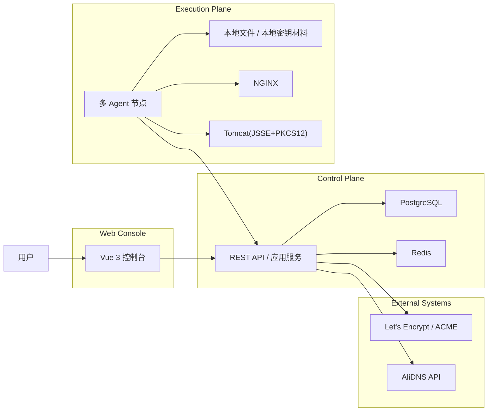

### 3.2 平面划分

#### Web Console

负责：

- 登录认证
- 域名管理
- 证书资产管理
- 证书申请
- CA 账户管理
- 部署目标管理
- 节点管理
- 发现结果查询
- 作业中心
- 审计与基础统计

#### Control Plane

负责：

- 租户隔离与权限控制
- ACME 编排
- `DNS-01` 执行
- 作业调度与状态机推进
- Agent 管理与任务分发
- 资产台账、审计、统计

#### Execution Plane

负责：

- 私钥生成
- CSR 生成
- `HTTP-01` 文件落地
- `NGINX / Tomcat` 证书部署
- 配置扫描与本地证书解析
- 结果、证据、发现记录回传

#### External Systems

- `Let's Encrypt / ACME Directory`
- `AliDNS`
- `NGINX`
- `Tomcat`

### 3.3 架构图与平面划分映射说明

当前 3.1 和 3.2 采用的是同一套四平面模型，只是表达视角不同：

- 3.1 是部署与交互视角
  - 强调“谁和谁通信、数据流和副作用落在哪一侧”
- 3.2 是职责与边界视角
  - 强调“每个平面负责什么、不负责什么”

两者的一一对应关系如下：

| 架构图元素 | 所属平面 | 对应职责 |
| --- | --- | --- |
| `Vue 3 控制台` | `Web Console` | 用户登录、控制台页面、发起管理操作 |
| `REST API / 应用服务` | `Control Plane` | 业务编排、状态机推进、作业调度、审计统计 |
| `PostgreSQL`、`Redis` | `Control Plane` 内部基础设施 | 业务事实源、缓存和辅助状态 |
| `多 Agent 节点` | `Execution Plane` | 私钥/CSR、HTTP-01、部署、发现、结果回传 |
| `本地文件 / 本地密钥材料` | `Execution Plane` | 现场证书文件、keystore、私钥不出客户边界 |
| `Let's Encrypt / ACME`、`AliDNS API` | `External Systems` | 控制面唯一外部依赖 |
| `NGINX`、`Tomcat` | `Execution Plane` 管理的现场目标 | Agent 直接操作和验证的服务对象 |

### 3.4 平面间交互原则

- `Web Console` 不能直接访问数据库或外部系统，只能通过 `Control Plane API`
- `Control Plane` 是唯一允许访问 `PostgreSQL / Redis / ACME / AliDNS` 的平面
- `Execution Plane` 采用 `pull` 模式连接 `Control Plane`，控制面不主动打入客户网络
- `Execution Plane` 是唯一允许接触客户私钥、现场配置文件、`NGINX / Tomcat` 运行实例的平面
- `External Systems` 不承载平台业务状态，只提供 ACME 和 DNS 外部能力

因此，3.1 中的每个节点都能落到 3.2 的平面职责里，不存在“图是一套、平面划分是另一套”的问题。后续若新增组件，也必须先归属到这四个平面中的一个。

## 4. 模块边界

### 4.1 控制面模块

一期控制面采用 `单二进制 + 模块化单体`，不拆微服务。

#### `identity`

- 账号密码登录
- JWT 会话
- 租户 / 项目 / 环境
- 用户、角色、资源级绑定

#### `domainmgr`

- 域名资产台账
- 域名默认 challenge 策略
- DNS 凭据绑定
- 域名验证状态与 TXT 操作历史

#### `issuer`

- CA 账户管理
- ACME 目录与账户能力
- 签发上下文准备

#### `certificate`

- 证书申请
- 证书资产台账
- 证书版本管理

#### `workflow`

- 签发、challenge、部署、续期、发现状态机
- 幂等校验

#### `scheduler`

- 续期扫描
- 发现计划
- 失败重试
- 过期 lease 回收

#### `agenthub`

- Agent 注册
- 心跳
- 版本兼容
- 能力建模
- 任务分发

#### `deployment`

- 目标服务管理
- 部署策略
- 部署记录

#### `discovery`

- 配置扫描编排
- 发现结果管理
- 未纳管证书认领

#### `audit`

- 审计事件
- 证据记录
- 审计查询

#### `stats`

- 仪表盘统计
- 风险计数
- 作业聚合查询

### 4.2 Agent 模块

Agent 一期采用单二进制，内部按能力拆分：

- `bootstrap`
- `mtls`
- `heartbeat`
- `poller`
- `executor`
- `keymgr`
- `deploy/nginx`
- `deploy/tomcat`
- `discover/nginx`
- `discover/tomcat`
- `evidence`
- `reporter`

### 4.3 协议与扩展模块

需要预留但一期只实现最小范围的抽象：

- `IssuerDriver`
- `KeyAlgorithmProvider`
- `ChallengeProvider`
- `DNSProvider`
- `TargetConnector`
- `DiscoveryProvider`

### 4.4 最终可用开源组件与应用方式

一期设计采用“核心自研 + 聚焦型开源库复用”的方式，不引入任何全栈产品作为底座。

#### 4.4.1 进入一期运行时的开源组件

| 模块 | 开源项目 | 使用位置 | 应用方式 | 设计约束 |
| --- | --- | --- | --- | --- |
| `pkg/protocol/acme` | `golang.org/x/crypto/acme` | 控制面 | 封装 `directory / account / order / challenge / finalize / download` | 业务层不得直接依赖原生类型 |
| `internal/driver/dns` | `github.com/libdns/libdns` | 控制面 | 统一 DNS Provider 抽象 | 业务层只依赖 `DNSProvider` 接口 |
| `internal/driver/dns/alidns` | `github.com/libdns/alidns` | 控制面 | 执行 `DNS-01` 的 TXT 创建、更新、删除 | 一期仅支持阿里云，且只在控制面执行 |
| `internal/agent/discover/nginx` | `github.com/tufanbarisyildirim/gonginx` | Agent | 解析 `nginx.conf` 与引用配置，提取证书路径和 `server_name` | 仅用于发现与解析，不用于写回配置 |
| `internal/agent/deploy/tomcat` | `software.sslmate.com/src/go-pkcs12` | Agent | 生成、读取和校验 `PKCS12` | 仅用于 `Tomcat(JSSE + PKCS12)` |

#### 4.4.2 仅保留扩展边界、不进入一期运行路径的开源组件

| 模块边界 | 开源项目 | 预留用途 | 一期处理方式 |
| --- | --- | --- | --- |
| `internal/crypto/smx509` | `github.com/emmansun/gmsm` | 后续 `SM2 / SM3 / SM4 / 国密 x509` 支持 | 一期不启用，不进入运行路径，只保留算法抽象边界 |

#### 4.4.3 仅作为参考，不进入运行时依赖

| 参考项目 | 参考用途 | 不进入运行时的原因 |
| --- | --- | --- |
| `github.com/go-acme/lego` | ACME 流程、AliDNS 对照实现、联调基线 | 抽象中心是通用 ACME 客户端，不适合作为长期协议内核 |
| `github.com/certimate-go/certimate` | 产品能力与连接器实现参考 | 完整产品耦合过重，不适合作为核心底座 |
| `github.com/caddyserver/certmagic` | ACME 自动化实现参考 | 面向自动取证，不面向多租户治理平台 |
| `github.com/mholt/acmez` | ACME 协议实现参考 | 与内部 ACME 子系统职责重叠，不适合做长期核心依赖 |

## 5. 领域模型

### 5.1 隔离与身份对象

- `Tenant`
- `Project`
- `Environment`
- `User`
- `Role`
- `RoleBinding`

### 5.2 域名与凭据对象

- `DomainAsset`
- `DomainValidationRecord`
- `CAAccount`
- `DNSCredential`

### 5.3 证书生命周期对象

- `CertificateRequest`
- `IssueWorkflow`
- `WorkflowChallenge`
- `CertificateAsset`
- `CertificateVersion`

### 5.4 部署与发现对象

- `DeploymentTarget`
- `DeploymentBinding`
- `DeploymentRecord`
- `DiscoveryRecord`

### 5.5 运行与审计对象

- `AgentNode`
- `Job`
- `JobAttempt`
- `AuditEvent`
- `EvidenceRecord`

### 5.6 关键对象职责

#### `DomainAsset`

表示可治理域名资源，而非申请单中的普通字符串。负责承载：

- 域名归属关系
- 默认 challenge 策略
- DNS Provider 与 DNS 凭据绑定
- 最近验证状态
- TXT 操作历史入口

#### `CertificateRequest`

表示一次用户意图，可能来自：

- 手工申请
- 续期触发

该对象不直接等同于签发执行实例。

#### `IssueWorkflow`

表示一次具体签发执行，承载：

- ACME `order`
- challenge 流转
- finalize
- 下载证书
- 部署推进

#### `CertificateAsset`

表示平台长期管理的逻辑证书资产。

#### `CertificateVersion`

表示每次签发得到的具体版本。  
续期不会覆盖旧版本，而是为同一资产生成新版本。

## 6. 关系模型

### 6.1 治理态与资源关系图

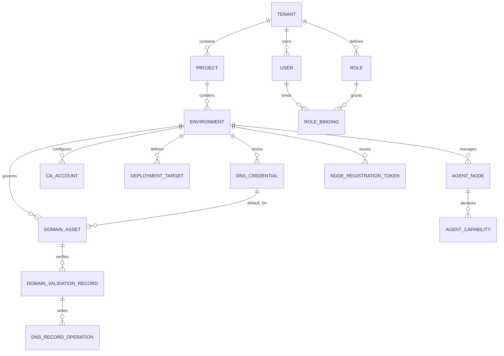

### 6.2 运行态与执行关系图

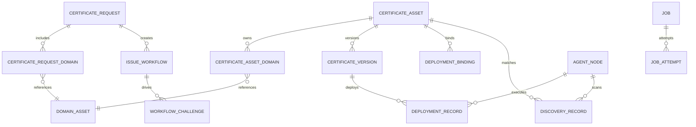

### 6.3 关系模型说明

关系模型分三层：

- 隔离与治理层：`Tenant / Project / Environment / User / RoleBinding`
  - 负责租户边界、权限边界和资源归属
  - 所有业务资源最终必须落在 `Environment` 上，保证一期 RBAC、审计和筛选口径统一
- 资源配置层：`DomainAsset / DNSCredential / CAAccount / DeploymentTarget / AgentNode`
  - 负责定义“有哪些可治理资源”和“可以如何被使用”
  - 这一层对象生命周期较长，变化频率低，但影响运行期所有工作流
- 运行执行层：`CertificateRequest / IssueWorkflow / WorkflowChallenge / CertificateAsset / DeploymentRecord / Job`
  - 负责承载一次申请、一次 challenge、一次部署、一次扫描的执行过程
  - 这一层对象高频变化，必须通过状态机与作业系统驱动

### 6.4 核心关系介绍

#### 6.4.1 隔离主轴

- `Tenant -> Project -> Environment` 是所有业务数据的归属主轴
- `Environment` 是一期最小治理单元
- 域名、CA 账户、DNS 凭据、部署目标、Agent 都必须挂在 `Environment` 下，避免跨环境引用带来的权限和配置漂移

#### 6.4.2 域名治理主轴

- `DomainAsset` 不是证书申请里的普通字符串，而是长期治理对象
- `DomainAsset -> DNSCredential` 表示该域名默认使用哪套 DNS 凭据完成 `DNS-01`
- `DomainAsset -> DomainValidationRecord -> DNSRecordOperation` 形成完整验证证据链
- 这样可以回答三个关键问题：
  - 某个域名当前绑定了哪套凭据
  - 最近一次域名验证是否成功
  - 具体创建过哪些 TXT 记录、由谁触发、何时清理

#### 6.4.3 签发执行主轴

- `CertificateRequest` 表示一次业务意图
- `IssueWorkflow` 表示一次实际签发执行
- `WorkflowChallenge` 表示签发过程中每个标识符、每种 challenge 的执行细节
- `CertificateRequest` 与 `IssueWorkflow` 分离，是为了把“用户意图”和“执行实例”解耦

#### 6.4.4 资产主轴

- `CertificateAsset` 表示长期治理对象
- `CertificateVersion` 表示每次实际签发得到的证书版本
- `CertificateAssetDomain` 负责把资产与域名治理对象绑定起来
- 这样续期时只新增版本，不覆盖旧证书，也便于部署回滚、证据追溯和发现匹配

#### 6.4.5 部署与发现主轴

- `DeploymentTarget` 定义目标服务
- `DeploymentBinding` 定义证书资产与目标服务的绑定关系
- `DeploymentRecord` 记录某次版本下发到某个目标的全过程
- `DiscoveryRecord` 记录从现场扫描回来的实际配置与证书事实
- `DeploymentBinding` 与 `DiscoveryRecord` 联动后，可识别：
  - 实际服务是否已安装目标版本
  - 是否发生漂移
  - 发现到的证书是否为未纳管资产

#### 6.4.6 调度与执行主轴

- `Job` 是调度事实表，描述“当前要执行什么”
- `JobAttempt` 是执行历史表，描述“具体哪一次怎么执行的”
- `AgentNode` 通过 `AgentCapability` 暴露能力边界
- `DeploymentRecord`、`DiscoveryRecord` 与 `JobAttempt` 共同形成现场执行证据链

### 6.5 关键约束

- `Environment` 内资源引用必须闭合，禁止跨环境直接绑定 `DomainAsset / CAAccount / DeploymentTarget / AgentNode`
- `CertificateRequestDomain` 与 `CertificateAssetDomain` 必须引用 `DomainAsset`，不能直接保存裸域名作为长期治理事实
- `CertificateAsset` 同一时刻只能存在一个 `current_version_id`
- `DeploymentBinding` 必须引用已启用的 `DeploymentTarget`
- `DeploymentRecord`、`DiscoveryRecord` 必须能够回溯到 `AgentNode`
- `Job` 与领域对象之间必须通过 `aggregate_type + aggregate_id` 建立可追溯关联

### 6.6 核心关系清单

- `Tenant 1:N Project`
- `Project 1:N Environment`
- `Environment 1:N DomainAsset`
- `Environment 1:N CAAccount`
- `Environment 1:N DeploymentTarget`
- `Environment 1:N AgentNode`
- `DomainAsset N:1 DNSCredential`
- `DomainAsset 1:N DomainValidationRecord`
- `DomainValidationRecord 1:N DNSRecordOperation`
- `CertificateRequest 1:N CertificateRequestDomain`
- `CertificateRequestDomain N:1 DomainAsset`
- `CertificateRequest 1:N IssueWorkflow`
- `CertificateAsset 1:N CertificateVersion`
- `CertificateAsset 1:N CertificateAssetDomain`
- `CertificateAssetDomain N:1 DomainAsset`
- `CertificateAsset 1:N DeploymentBinding`
- `CertificateVersion 1:N DeploymentRecord`
- `CertificateAsset 1:N DiscoveryRecord`
- `AgentNode 1:N AgentCapability`
- `Environment 1:N NodeRegistrationToken`
- `Job 1:N JobAttempt`

## 7. 状态机设计

### 7.0 状态机总原则

一期所有状态机统一遵守以下规则：

- 区分治理态资源与运行态对象
- 每次状态变化必须可审计，记录 `trigger / actor / occurred_at / reason`
- 失败状态必须保留 `error_code / error_message`
- 所有异步状态推进必须通过 `Job` 驱动
- 禁止跨层跳状态
- 允许重试的状态必须有明确补偿规则

其中：

- 治理态资源：长生命周期、低频变化，例如 `DomainAsset`、`DNSCredential`、`CAAccount`、`DeploymentTarget`、`AgentNode`
- 运行态对象：围绕一次申请、challenge、部署、发现、调度而变化，例如 `CertificateRequest`、`IssueWorkflow`、`WorkflowChallenge`、`DeploymentRecord`、`Job`

#### 状态分层总览图

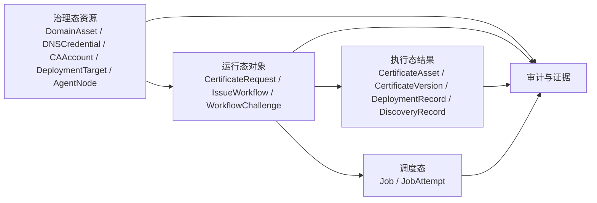

状态分层的设计意图：

- 治理态资源解决“是否允许做、用什么做”
- 运行态对象解决“现在做到了哪一步”
- 执行态结果解决“现场实际上发生了什么”
- 调度态解决“谁在驱动状态变化、失败后如何重试”

### 7.1 治理态资源状态

#### 治理态资源状态图

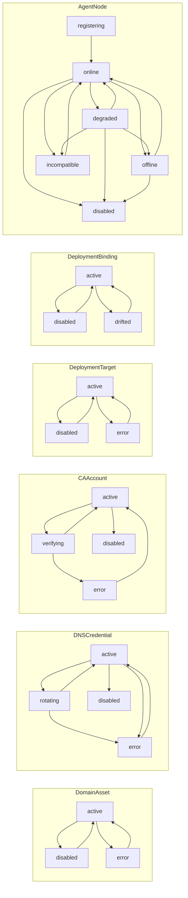

治理态资源的共同特征：

- 状态变更通常由人工配置、健康探测或恢复动作触发
- `error / degraded / drifted / incompatible` 不意味着资源消失，而意味着资源不再满足稳定运行条件
- 治理态状态变化会影响申请、部署、发现等运行态对象是否允许继续推进

#### `DomainAsset`

状态：

- `active`
- `disabled`
- `error`

流转：

- `active -> disabled`
  - 触发源：`api_trigger`
  - 说明：管理员停用域名资产
- `disabled -> active`
  - 触发源：`api_trigger`
  - 说明：管理员恢复域名资产
- `active -> error`
  - 触发源：`system_recovery_trigger`
  - 说明：默认 DNS 凭据失效或域名治理配置异常
- `error -> active`
  - 触发源：`api_trigger`
  - 说明：修复后恢复

#### `DNSCredential`

状态：

- `active`
- `disabled`
- `error`
- `rotating`

流转：

- `active -> rotating`
  - 触发源：`api_trigger`
  - 说明：发起密钥轮换
- `rotating -> active`
  - 触发源：`worker_trigger`
  - 说明：新凭据验证成功
- `rotating -> error`
  - 触发源：`worker_trigger`
  - 说明：轮换失败
- `active -> error`
  - 触发源：`system_recovery_trigger`
  - 说明：调用连续失败或健康检查失败
- `error -> active`
  - 触发源：`api_trigger`
  - 说明：人工修复并重新验证
- `active -> disabled`
  - 触发源：`api_trigger`
  - 说明：人工停用

#### `CAAccount`

状态：

- `active`
- `disabled`
- `error`
- `verifying`

流转：

- `active -> verifying`
  - 触发源：`api_trigger / scheduler_trigger`
  - 说明：手工或定时探测账户可用性
- `verifying -> active`
  - 触发源：`worker_trigger`
  - 说明：探测成功
- `verifying -> error`
  - 触发源：`worker_trigger`
  - 说明：账户不可用
- `active -> disabled`
  - 触发源：`api_trigger`
  - 说明：人工停用
- `error -> active`
  - 触发源：`api_trigger`
  - 说明：修复后恢复

#### `DeploymentTarget`

状态：

- `active`
- `disabled`
- `error`

流转：

- `active -> disabled`
- `disabled -> active`
- `active -> error`
- `error -> active`

说明：

- `error` 表示目标定义本身不合法，如配置路径缺失、关键参数不完整

#### `DeploymentBinding`

状态：

- `active`
- `disabled`
- `drifted`

流转：

- `active -> disabled`
- `disabled -> active`
- `active -> drifted`
  - 触发源：`agent_trigger / system_recovery_trigger`
  - 说明：发现结果显示目标实际证书与资产当前版本不一致
- `drifted -> active`
  - 触发源：`worker_trigger / api_trigger`
  - 说明：重新部署或人工修正后恢复

#### `AgentNode`

状态：

- `registering`
- `online`
- `degraded`
- `offline`
- `disabled`
- `incompatible`

流转：

- `registering -> online`
  - 触发源：`agent_trigger`
  - 说明：注册完成且首个心跳通过
- `online -> degraded`
  - 触发源：`system_recovery_trigger`
  - 说明：连续任务失败、能力缺失或健康异常
- `degraded -> online`
  - 触发源：`agent_trigger`
  - 说明：恢复正常
- `online/degraded -> offline`
  - 触发源：`system_recovery_trigger`
  - 说明：心跳超时
- `offline -> online`
  - 触发源：`agent_trigger`
  - 说明：节点恢复上报
- `online/degraded/offline -> disabled`
  - 触发源：`api_trigger`
  - 说明：管理员停用
- `online/degraded -> incompatible`
  - 触发源：`system_recovery_trigger`
  - 说明：控制面升级后节点协议或版本不兼容
- `incompatible -> online`
  - 触发源：`agent_trigger`
  - 说明：升级后恢复兼容

### 7.2 域名验证与 DNS 操作状态

#### 域名验证与 DNS 操作状态图

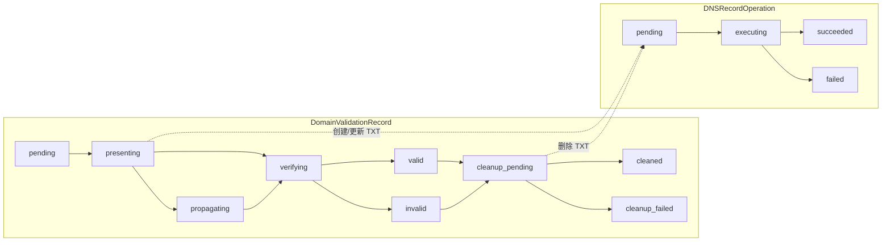

状态设计要点：

- `DomainValidationRecord` 记录一次验证事务，从 challenge 呈现到清理结束
- `DNSRecordOperation` 只记录一次具体 TXT 操作，不承载验证事务全局状态
- 两者分离后，可以清晰区分“验证失败”与“某次 TXT 写入失败”

#### `DomainValidationRecord`

状态：

- `pending`
- `presenting`
- `propagating`
- `verifying`
- `valid`
- `invalid`
- `cleanup_pending`
- `cleaned`
- `cleanup_failed`

流转：

- `pending -> presenting`
- `presenting -> propagating`
  - 主要适用于 `DNS-01`
- `presenting -> verifying`
  - 适用于 `HTTP-01`
- `propagating -> verifying`
- `verifying -> valid`
- `verifying -> invalid`
- `valid -> cleanup_pending`
- `invalid -> cleanup_pending`
- `cleanup_pending -> cleaned`
- `cleanup_pending -> cleanup_failed`

补偿规则：

- `invalid` 或 `cleanup_failed` 必须写审计，并保留对应 TXT 操作记录

#### `DNSRecordOperation`

状态：

- `pending`
- `executing`
- `succeeded`
- `failed`

流转：

- `pending -> executing`
- `executing -> succeeded`
- `executing -> failed`

### 7.3 `CertificateRequest` 状态

#### 状态图

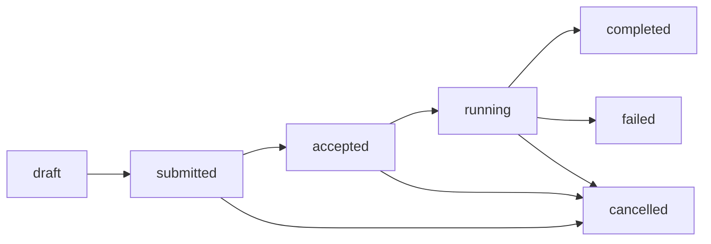

状态设计说明：

- `CertificateRequest` 只表达业务意图是否被接受并进入执行
- 从 `accepted` 开始，系统承诺为该申请创建或恢复 `IssueWorkflow`
- `completed` 只表示一期闭环完成，不区分单目标或多目标的部署细节；这些细节由 `IssueWorkflow` 和 `DeploymentRecord` 表达

- `draft`
- `submitted`
- `accepted`
- `running`
- `completed`
- `failed`
- `cancelled`

流转：

- `draft -> submitted`
  - 触发源：`api_trigger`
  - 说明：用户提交申请
- `submitted -> accepted`
  - 触发源：`worker_trigger`
  - 说明：通过前置校验，准备创建工作流
- `accepted -> running`
  - 触发源：`worker_trigger`
  - 说明：已创建 `IssueWorkflow`
- `running -> completed`
  - 触发源：`worker_trigger`
  - 说明：一期闭环完成
- `running -> failed`
  - 触发源：`worker_trigger`
  - 说明：工作流最终失败
- `submitted/accepted/running -> cancelled`
  - 触发源：`api_trigger`
  - 说明：人工取消

### 7.4 `IssueWorkflow` 状态

#### 状态图

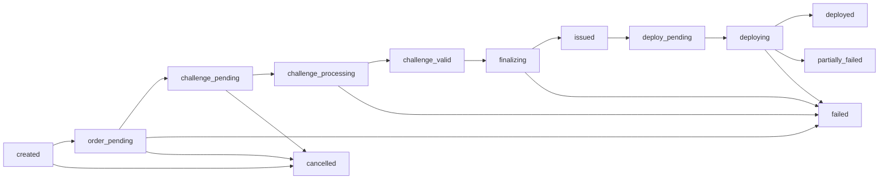

状态设计说明：

- `IssueWorkflow` 是证书生命周期编排的主状态机
- `order_pending` 到 `issued` 表示 ACME 侧流程
- `deploy_pending` 到 `deployed / partially_failed` 表示控制面与执行面协同部署流程
- `partially_failed` 的存在是为了适配一份证书绑定多个部署目标时的局部失败语义

- `created`
- `order_pending`
- `challenge_pending`
- `challenge_processing`
- `challenge_valid`
- `finalizing`
- `issued`
- `deploy_pending`
- `deploying`
- `deployed`
- `partially_failed`
- `failed`
- `cancelled`

说明：

- `issued` 表示证书已签发成功，但不代表部署完成
- `deployed` 表示一期闭环完成
- `partially_failed` 表示签发成功但部分目标部署失败

流转：

- `created -> order_pending`
- `order_pending -> challenge_pending`
- `challenge_pending -> challenge_processing`
- `challenge_processing -> challenge_valid`
- `challenge_valid -> finalizing`
- `finalizing -> issued`
- `issued -> deploy_pending`
- `deploy_pending -> deploying`
- `deploying -> deployed`
- `deploying -> partially_failed`
- `order_pending/challenge_processing/finalizing/deploying -> failed`
- `created/order_pending/challenge_pending -> cancelled`

补偿规则：

- `challenge_processing -> failed` 时必须进入 challenge 清理流程
- `issued` 之后失败不得回退到未签发状态，只能进入 `partially_failed` 或 `failed`

### 7.5 `WorkflowChallenge` 状态

#### 状态图

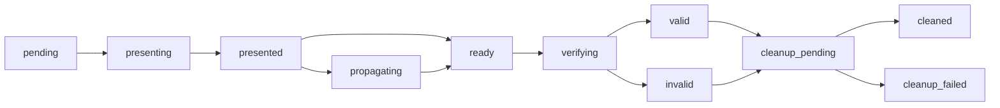

状态设计说明：

- `WorkflowChallenge` 是 `IssueWorkflow` 下的局部子状态机
- `presented` 表示 challenge 已落地，但还不能断言 CA 已可见
- `ready` 表示 challenge 已满足 ACME 侧发起验证的前置条件
- 无论验证成功还是失败，都必须进入清理阶段，保证 HTTP 文件或 TXT 记录不会长期遗留

- `pending`
- `presenting`
- `presented`
- `propagating`
- `ready`
- `verifying`
- `valid`
- `invalid`
- `cleanup_pending`
- `cleaned`
- `cleanup_failed`

说明：

- `DNS-01` 必须显式表达 `propagating`
- `HTTP-01` 不要求 `propagating`，但状态模型保持统一

流转：

- `pending -> presenting`
- `presenting -> presented`
- `presented -> propagating`
- `presented -> ready`
- `propagating -> ready`
- `ready -> verifying`
- `verifying -> valid`
- `verifying -> invalid`
- `valid -> cleanup_pending`
- `invalid -> cleanup_pending`
- `cleanup_pending -> cleaned`
- `cleanup_pending -> cleanup_failed`

### 7.6 `CertificateAsset` 状态

#### 资产与版本状态图

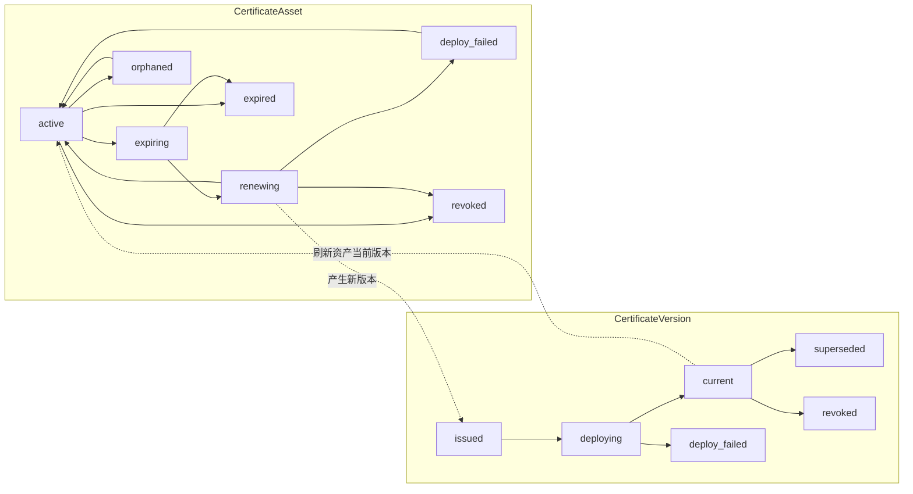

状态设计说明：

- `CertificateAsset` 表示长期治理视角，关注“是否健康、是否需要续期、是否存在漂移或失效”
- `CertificateVersion` 表示某次签发结果，关注“这个版本是否已成为现场生效版本”
- 资产和版本分离后，续期、回滚、发现匹配、漂移修复都可以基于版本展开，而不破坏资产主键稳定性

- `active`
- `expiring`
- `renewing`
- `deploy_failed`
- `expired`
- `revoked`
- `orphaned`

流转：

- `active -> expiring`
- `expiring -> renewing`
- `renewing -> active`
- `renewing -> deploy_failed`
- `active/expiring -> expired`
- `active/renewing -> revoked`
- `active -> orphaned`
- `deploy_failed/orphaned -> active`

### 7.7 `CertificateVersion` 状态

- `issued`
- `deploying`
- `current`
- `superseded`
- `deploy_failed`
- `revoked`

流转：

- `issued -> deploying`
- `deploying -> current`
- `deploying -> deploy_failed`
- `current -> superseded`
- `current -> revoked`

约束：

- 同一 `CertificateAsset` 同一时刻只能有一个 `current`

### 7.8 `DeploymentRecord` 状态

#### 状态图

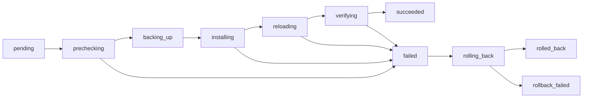

状态设计说明：

- `DeploymentRecord` 是最贴近现场副作用的状态机
- 该状态机必须显式表达“预检、备份、安装、重载、验证、回滚”这些阶段，不能只保留 `running / success / failed`
- 只有这样才能在 `NGINX / Tomcat` 部署失败时精确定位失败点并执行补偿

- `pending`
- `prechecking`
- `backing_up`
- `installing`
- `reloading`
- `verifying`
- `succeeded`
- `failed`
- `rolling_back`
- `rolled_back`
- `rollback_failed`

流转：

- `pending -> prechecking`
- `prechecking -> backing_up`
- `backing_up -> installing`
- `installing -> reloading`
- `reloading -> verifying`
- `verifying -> succeeded`
- `prechecking/installing/reloading/verifying -> failed`
- `failed -> rolling_back`
- `rolling_back -> rolled_back`
- `rolling_back -> rollback_failed`

### 7.9 `DiscoveryRecord` 状态

#### 运行支撑状态图

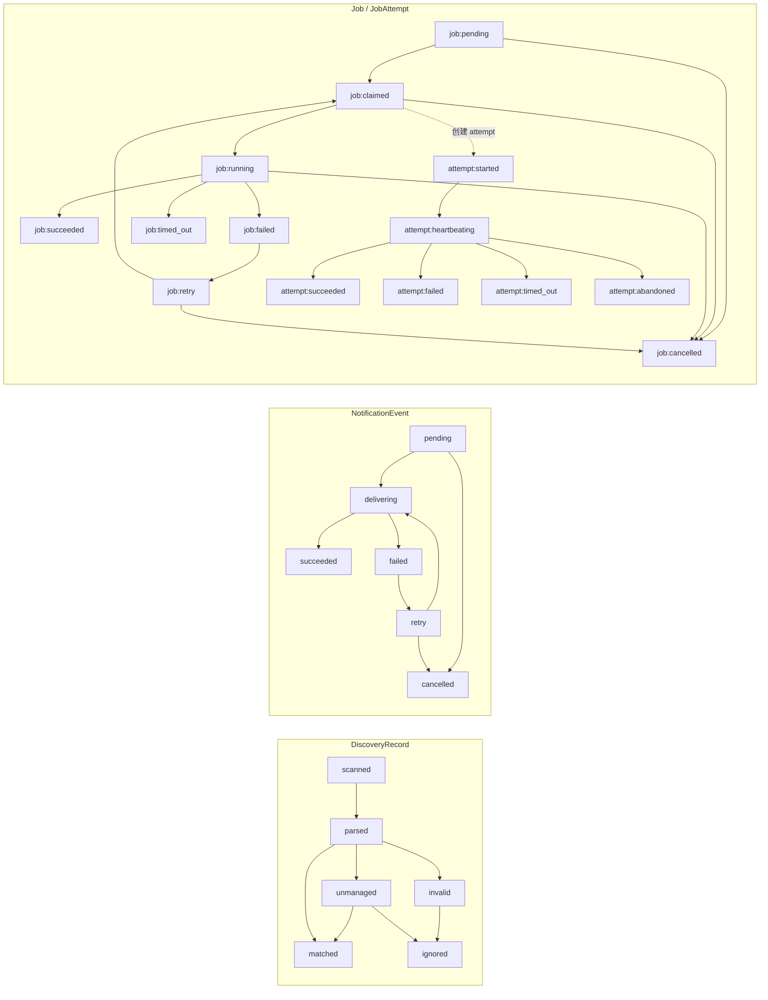

状态设计说明：

- `DiscoveryRecord` 关注扫描后如何进入匹配、认领或忽略
- `NotificationEvent` 关注异步外发过程，不与业务主状态机耦合
- `Job / JobAttempt` 负责驱动所有异步状态变化，并保留完整执行历史

- `scanned`
- `parsed`
- `matched`
- `unmanaged`
- `invalid`
- `ignored`

流转：

- `scanned -> parsed`
- `parsed -> matched`
- `parsed -> unmanaged`
- `parsed -> invalid`
- `unmanaged/invalid -> ignored`
- `unmanaged -> matched`
  - 认领后建立关联

### 7.10 `NotificationEvent` 状态

- `pending`
- `delivering`
- `succeeded`
- `failed`
- `retry`
- `cancelled`

流转：

- `pending -> delivering`
- `delivering -> succeeded`
- `delivering -> failed`
- `failed -> retry`
- `retry -> delivering`
- `pending/retry -> cancelled`

### 7.11 `Job` 状态

- `pending`
- `claimed`
- `running`
- `retry`
- `succeeded`
- `failed`
- `cancelled`
- `timed_out`

流转：

- `pending -> claimed`
- `claimed -> running`
- `running -> succeeded`
- `running -> failed`
- `running -> timed_out`
- `failed -> retry`
- `retry -> claimed`
- `pending/claimed/running/retry -> cancelled`

### 7.12 `JobAttempt` 状态

- `started`
- `heartbeating`
- `succeeded`
- `failed`
- `timed_out`
- `abandoned`

### 7.13 失败分类与重试规则

#### 重试判定图

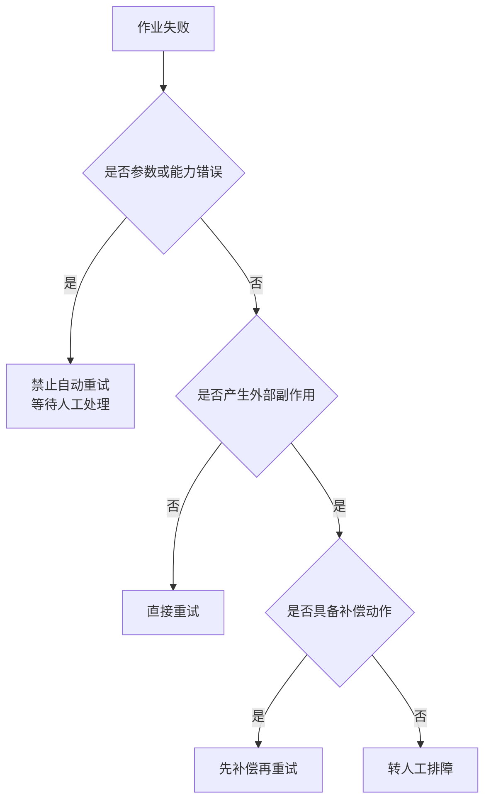

判定原则：

- 只要失败可能导致现场状态不确定，就不能直接重试
- 只要失败属于配置或能力问题，就必须阻断自动重试，避免形成放大故障
- `Job` 的重试策略必须与领域对象的状态补偿策略一起设计，而不是由调度器单独决定

一期失败统一分三类：

- 可直接重试
  - 如 ACME 暂时失败、AliDNS 超时、Webhook 超时
- 需补偿后重试
  - 如 challenge 已落地、TXT 已写入、部署已部分写文件
- 禁止自动重试
  - 如参数非法、域名与 challenge 类型冲突、节点能力不满足

所有失败都必须明确：

- `retryable`
- `compensation_required`
- `error_code`
- `failed_stage`

## 8. 控制面详细设计

### 8.1 分层结构

控制面内部统一采用五层结构：

- `api`
- `application`
- `domain`
- `infrastructure`
- `scheduler/worker`

约束：

- `api` 不直接操作数据库
- `scheduler` 不直接修改业务表
- 所有状态推进必须通过领域方法

### 8.2 关键服务

- `IdentityService`
- `RoleService`
- `TenantContextService`
- `DomainService`
- `CAAccountService`
- `DNSCredentialService`
- `CertificateRequestService`
- `CertificateAssetService`
- `IssueWorkflowService`
- `ChallengeService`
- `RenewalService`
- `IssuerService`
- `DNSExecutionService`
- `AgentDispatchService`
- `DeploymentTargetService`
- `DeploymentService`
- `DiscoveryService`
- `AgentService`
- `LeaseService`
- `JobService`
- `AuditService`
- `EvidenceService`
- `NotificationService`
- `SettingsService`
- `DetailQueryService`
- `StatsQueryService`

### 8.3 关键服务总览图

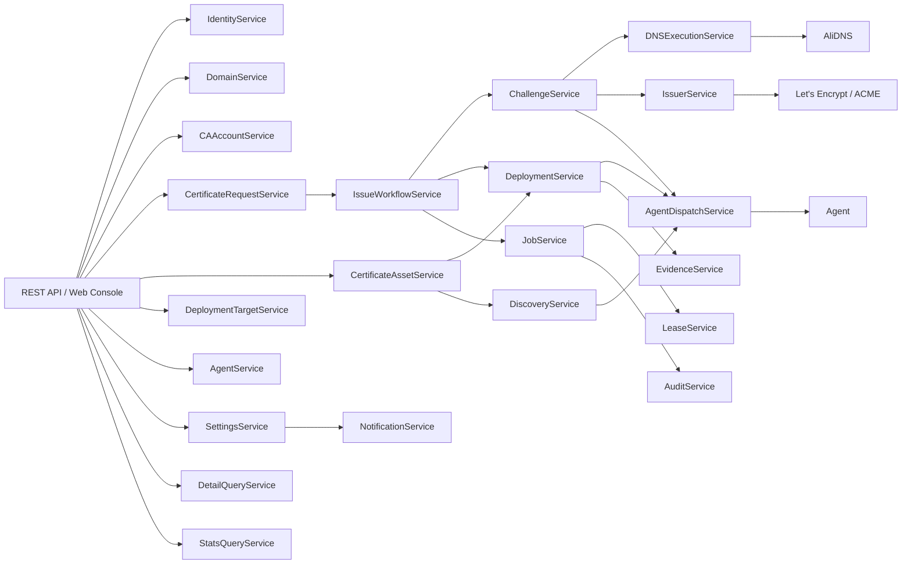

### 8.4 关键服务用途与功能

| 服务 | 定位 | 用途 | 核心功能 |
| --- | --- | --- | --- |
| `IdentityService` | 身份服务 | 统一登录会话与用户身份 | 登录、登出、会话刷新、用户基础校验 |
| `RoleService` | 授权服务 | 管理角色和绑定关系 | 角色配置、作用域校验、权限装配 |
| `TenantContextService` | 上下文服务 | 固定租户/项目/环境边界 | 上下文解析、隔离校验、跨环境阻断 |
| `DomainService` | 域名治理服务 | 管理域名资产和治理属性 | 域名资产 CRUD、challenge 策略、DNS 凭据绑定、验证历史查询 |
| `DNSCredentialService` | 凭据治理服务 | 管理阿里云 DNS 凭据 | 凭据加密存储、启停用、验证、轮换 |
| `CAAccountService` | CA 治理服务 | 管理 ACME 账户 | 账户创建、能力探测、启停用、账户健康检查 |
| `CertificateRequestService` | 申请入口服务 | 承接用户申请或续期触发 | 申请校验、创建 `CertificateRequest`、启动工作流 |
| `IssueWorkflowService` | 编排主服务 | 推进签发主状态机 | 创建 order、驱动 challenge、触发 finalize、进入部署阶段 |
| `ChallengeService` | challenge 编排服务 | 按 challenge 类型路由执行 | `HTTP-01 / DNS-01` 分流、子状态机推进、清理逻辑 |
| `IssuerService` | CA 外部出口 | 唯一对接 ACME | account/order/challenge/finalize/download |
| `DNSExecutionService` | DNS 外部出口 | 唯一对接阿里云 DNS | TXT 创建、删除、传播检查、DNS 审计记录 |
| `AgentDispatchService` | 执行面外部出口 | 唯一对接 Agent | 注册、心跳、任务派发、结果接收 |
| `DeploymentTargetService` | 目标治理服务 | 管理部署目标定义 | 目标配置、节点选择器校验、目标合法性检查 |
| `DeploymentService` | 部署编排服务 | 负责证书落地到目标服务 | 创建部署记录、派发部署、验证、回滚 |
| `CertificateAssetService` | 资产聚合服务 | 负责资产级治理和详情聚合 | 版本聚合、风险展示、续期入口、部署发现联动 |
| `DiscoveryService` | 发现编排服务 | 负责配置扫描与认领 | 派发扫描、结果匹配、未纳管认领、忽略处理 |
| `AgentService` | 节点治理服务 | 管理 Agent 节点资源 | 节点注册、停用、标签与能力管理、兼容性检查 |
| `JobService` | 调度服务 | 管理异步任务主事实 | 创建 job、状态推进、重试、取消 |
| `LeaseService` | 并发控制服务 | 保证多 worker 任务互斥 | claim/renew/reap lease、过期回收 |
| `AuditService` | 审计服务 | 记录所有关键动作 | 审计事件写入、查询、合规输出 |
| `EvidenceService` | 证据服务 | 记录现场可验证材料 | challenge、部署、发现、回滚证据归档 |
| `NotificationService` | 外发服务 | 管理 Webhook 通知 | 通知构造、投递、重试 |
| `SettingsService` | 配置服务 | 管理系统级参数 | 续期窗口、Webhook 配置、系统安全参数 |
| `DetailQueryService` | 聚合查询服务 | 为详情页提供聚合视图 | `AssetDetail / JobDetail / NodeDetail / DiscoveryDetail` |
| `StatsQueryService` | 统计查询服务 | 为仪表盘提供统计视图 | 风险指标、趋势统计、汇总查询 |

### 8.5 进程形态

一期保持单进程部署，不拆微服务。  
理由：

- 一期复杂度集中在状态机、一致性、审计、编排
- 使用单体更容易保证数据库事务边界清晰
- 避免服务间调用带来的分布式一致性问题

### 8.6 服务关联关系

#### 分组

##### 身份与治理组

- `IdentityService`
- `RoleService`
- `TenantContextService`

##### 证书生命周期组

- `DomainService`
- `CAAccountService`
- `CertificateRequestService`
- `CertificateAssetService`
- `IssueWorkflowService`
- `ChallengeService`
- `RenewalService`

##### 执行与运行组

- `AgentService`
- `AgentDispatchService`
- `DeploymentTargetService`
- `DeploymentService`
- `DiscoveryService`
- `JobService`
- `LeaseService`

##### 观测与输出组

- `AuditService`
- `EvidenceService`
- `NotificationService`
- `SettingsService`
- `StatsQueryService`
- `DetailQueryService`

#### 外部交互唯一出口

一期控制面统一约束三个唯一外部交互出口：

- `IssuerService`
  - 唯一负责与 `CA / ACME` 交互
- `DNSExecutionService`
  - 唯一负责与 `AliDNS` 交互
- `AgentDispatchService`
  - 唯一负责与客户侧 `Agent` 通信

任何业务服务不得直接调用：

- `ACME client`
- `AliDNS SDK`
- `Agent transport`

#### 关键服务依赖

##### `CertificateRequestService`

依赖：

- `TenantContextService`
- `DomainService`
- `CAAccountService`
- `IssueWorkflowService`
- `JobService`
- `AuditService`

职责：

- 创建申请单
- 做前置校验
- 创建首个工作流
- 投递启动作业

##### `IssueWorkflowService`

依赖：

- `ChallengeService`
- `IssuerService`
- `DeploymentService`
- `JobService`
- `AuditService`

职责：

- 推进工作流主状态机
- 连接 ACME 阶段和部署阶段

##### `ChallengeService`

依赖：

- `DomainService`
- `DNSExecutionService`
- `AgentDispatchService`
- `IssuerService`
- `AuditService`

职责：

- 按 `HTTP-01 / DNS-01` 分流 challenge 执行
- 推进 challenge 子状态机

##### `DNSExecutionService`

依赖：

- `DNSCredentialRepository`
- `DomainRepository`
- `DNSProvider`
- `DomainValidationRepository`
- `DNSRecordOperationRepository`
- `AuditService`

职责：

- 执行 TXT 记录创建、更新、删除
- 记录域名验证和 TXT 操作历史

##### `IssuerService`

依赖：

- `CAAccountRepository`
- `AcmeFacade`
- `AuditService`

职责：

- 创建账户
- 创建 order
- 获取 authorization
- challenge ready
- finalize
- 下载证书

##### `AgentDispatchService`

依赖：

- `AgentRepository`
- `JobRepository`
- `LeaseService`
- `AuditService`

职责：

- Agent 注册
- 心跳处理
- 任务下发
- 进度与结果接收

##### `DeploymentService`

依赖：

- `DeploymentTargetRepository`
- `DeploymentBindingRepository`
- `DeploymentRecordRepository`
- `AgentDispatchService`
- `AuditService`

职责：

- 创建部署记录
- 下发部署任务
- 处理部署结果和回滚状态

##### `CertificateAssetService`

依赖：

- `CertificateAssetRepository`
- `CertificateVersionRepository`
- `DeploymentBindingRepository`
- `DeploymentService`
- `DiscoveryService`
- `AuditService`

职责：

- 提供证书资产详情聚合
- 负责续期入口校验和资产级操作
- 汇总版本、部署、发现与风险信息

##### `DeploymentTargetService`

依赖：

- `DeploymentTargetRepository`
- `AgentService`
- `AuditService`

职责：

- 管理 `NGINX / Tomcat` 部署目标定义
- 校验节点选择器与目标配置合法性
- 为部署绑定提供候选目标

##### `SettingsService`

依赖：

- `SystemSettingsRepository`
- `NotificationService`
- `AuditService`

职责：

- 管理系统级运行参数
- 维护续期窗口、Webhook 等基础配置
- 统一输出配置变更审计

##### `DiscoveryService`

依赖：

- `DiscoveryRepository`
- `AgentDispatchService`
- `CertificateAssetMatcher`
- `AuditService`

职责：

- 下发发现任务
- 接收发现结果
- 做匹配、认领和忽略

### 8.7 事务边界

#### 事务内允许的动作

- 领域对象状态推进
- 数据持久化
- 创建/更新 `Job`
- 创建审计事件

#### 事务外执行的动作

- 调 ACME
- 调 AliDNS
- 等待 DNS 传播
- 等待 Agent 部署
- 等待 NGINX reload / Tomcat 重启完成

#### 推荐模式

- 事务内决定下一步
- 事务外执行外部动作
- 事务内提交外部动作结果

### 8.8 典型调用链

#### 申请证书

- `CertificateRequestAPI`
- `CertificateRequestService`
- `DomainService`
- `CAAccountService`
- `IssueWorkflowService`
- `JobService`
- `AuditService`

#### 处理 `DNS-01`

- `JobWorker`
- `ChallengeService`
- `DNSExecutionService`
- `DNSProvider(alidns)`
- `IssuerService`
- `AuditService`

#### 处理 `HTTP-01`

- `JobWorker`
- `ChallengeService`
- `AgentDispatchService`
- `Agent`
- `IssueWorkflowService`

#### 部署证书

- `JobWorker`
- `DeploymentService`
- `AgentDispatchService`
- `Agent`
- `DeploymentService`

#### 发现证书

- `JobWorker`
- `DiscoveryService`
- `AgentDispatchService`
- `Agent`
- `CertificateAssetMatcher`

### 8.9 核心业务逻辑

#### 核心业务逻辑总览图

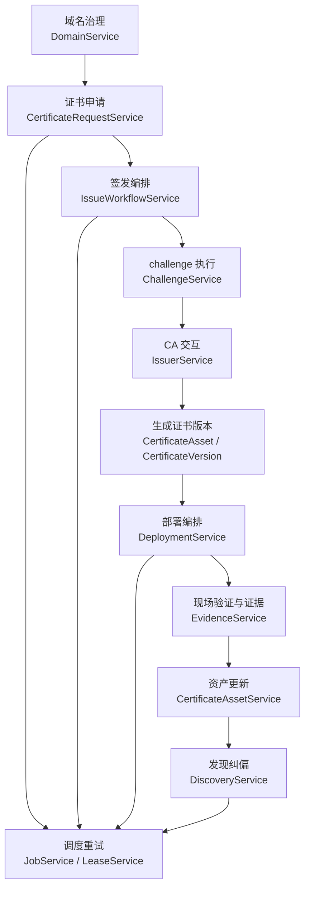

#### 8.9.1 域名治理逻辑

- 先创建 `DomainAsset`，再绑定 `DNSCredential`
- 域名治理阶段解决三个问题：
  - 该域名属于哪个环境
  - 默认使用哪种 challenge
  - 若走 `DNS-01`，默认使用哪套阿里云凭据
- 任何申请在进入工作流前，都必须回到域名治理对象上做合法性校验

#### 8.9.2 申请与签发逻辑

##### 申请到签发完成时序图

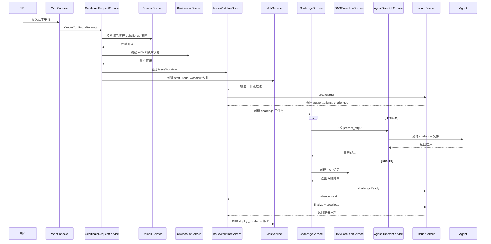

- `CertificateRequestService` 接收申请并做前置校验
- 校验通过后创建 `CertificateRequest` 与首个 `IssueWorkflow`
- `IssueWorkflowService` 负责把业务意图推进成 ACME 执行事实
- `IssuerService` 只负责对接 CA，不负责业务决策

这条逻辑的边界是：

- 申请服务决定“是否允许做”
- 工作流服务决定“下一步做什么”
- ACME 服务决定“如何与签发方交互”

#### 8.9.3 Challenge 路由逻辑

- `ChallengeService` 根据 `challenge_type` 进行分流
- `HTTP-01` 路由到 `AgentDispatchService`
- `DNS-01` 路由到 `DNSExecutionService`
- 两条链路执行完成后，统一由 `IssuerService` 通知 ACME 服务端开始验证

关键点：

- challenge 分流不改变 `IssueWorkflow` 主状态机，只改变 challenge 子状态机
- `DNS-01` 固定由控制面执行，因此 DNS 凭据不下沉到 Agent

#### 8.9.4 证书资产与部署逻辑

##### 部署与资产更新时序图

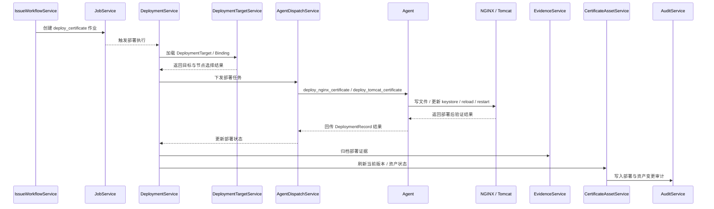

- 证书签发成功后，系统先生成 `CertificateVersion`
- 再由 `DeploymentService` 针对每个 `DeploymentBinding` 生成 `DeploymentRecord`
- Agent 完成安装、reload、验证后回传结果
- `CertificateAssetService` 根据部署结果更新资产状态、当前版本与风险视图

这里的关键抽象是：

- `CertificateVersion` 解决“签发出来了什么”
- `DeploymentRecord` 解决“落地到了哪里，是否成功”
- `CertificateAsset` 解决“平台当前应该如何看待这份证书”

#### 8.9.5 发现与纠偏逻辑

##### 发现、匹配与纠偏时序图

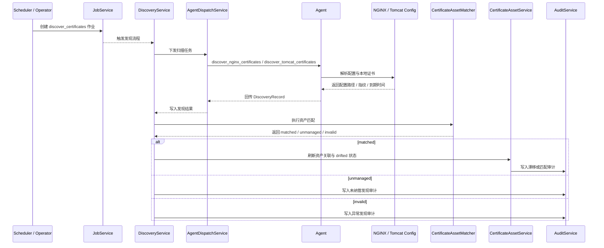

- `DiscoveryService` 定时或手动发起扫描
- Agent 返回 `DiscoveryRecord`
- 控制面按指纹、序列号、`subject + SAN + not_after` 执行匹配
- 对未纳管证书可执行认领，对已纳管但不一致的目标则标记 `drifted`

发现逻辑的目的不是替代部署，而是校验现场事实并发现偏差。

#### 8.9.6 调度、重试与补偿逻辑

##### 调度、重试与补偿时序图

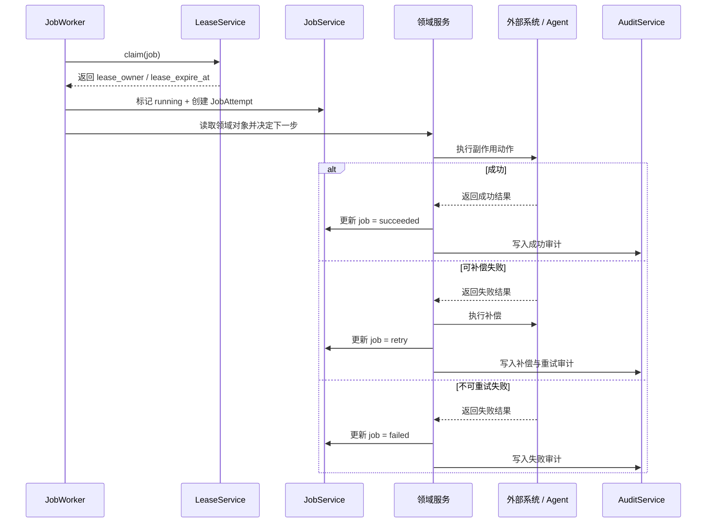

- 所有异步动作都通过 `JobService` 创建 `Job`
- `LeaseService` 保证多 worker 情况下任务只被一个执行单元持有
- 失败时根据 `retryable / compensation_required / failed_stage` 判定是否重试
- `JobAttempt` 负责沉淀每次执行历史，支持排障与审计

#### 8.9.7 审计与证据逻辑

- 每次治理动作、状态变化、外部调用、现场执行都必须写入 `AuditEvent`
- challenge、部署、回滚、发现产生的现场材料必须写入 `EvidenceRecord`
- `NotificationService` 只负责外发，不改变业务主状态

因此，一期核心业务逻辑遵循统一原则：

- 治理对象定义边界
- 工作流推进状态
- 作业系统驱动异步执行
- 证据和审计记录现场事实

## 9. ACME 协议子系统设计

### 9.1 模块边界

内部协议子系统固定路径：

- `pkg/protocol/acme`

该模块只向上暴露自定义 DTO 和接口，不暴露底层库对象。

### 9.2 一期能力

- Directory 发现
- Nonce 获取与复用
- JWS/JWK 封装
- Account 创建 / 查询
- Order 创建
- Authorization 查询
- Challenge 触发
- Finalize
- 证书下载

### 9.3 一期实现方式

一期内部实现基于：

- `golang.org/x/crypto/acme`

但业务层只能依赖：

- `IssuerDriver`
- `AcmeClientFacade`

### 9.4 后续扩展预留

一期虽然不实现 `SM2`，但必须预留以下扩展点：

- 自定义 JWS Header
- 自定义 JWK Key Type
- 自定义 order 扩展字段
- 自定义 challenge 类型
- 自定义 finalize 参数
- 自定义证书下载后处理

## 10. 域名验证设计

### 10.1 `HTTP-01`

执行位置：

- `Agent`

执行步骤：

1. 控制面创建 challenge
2. 控制面下发 `present_http01` job
3. Agent 写入 `/.well-known/acme-challenge/`
4. Agent 回传文件落地结果
5. 控制面通知 ACME 校验
6. 校验成功后下发 `cleanup_http01`
7. Agent 清理 challenge 文件

### 10.2 `DNS-01`

执行位置：

- 控制面

执行步骤：

1. 控制面从 ACME 获取 TXT challenge
2. 根据 `DomainAsset` 找到绑定的 `DNSCredential`
3. 控制面调用 `AliDNS`
4. 写入 `_acme-challenge` TXT 记录
5. 轮询传播状态
6. 通知 ACME 服务端校验
7. 校验成功后删除 TXT 记录
8. 写入 `DomainValidationRecord` 与审计事件

### 10.3 选择控制面执行 `DNS-01` 的原因

- 一期只支持阿里云，控制面集中执行复杂度最低
- DNS 凭据统一管理、统一轮换、统一审计
- Agent 保持“本地执行节点”定位，不接触云侧 DNS 凭据

### 10.4 后续扩展约束

后续如需支持客户侧执行 `DNS-01`，只能新增执行模式：

- `dns_execution_mode = control_plane | agent`

不能推翻现有对象模型。

## 11. 证书申请与续期流程

### 11.1 新申请流程

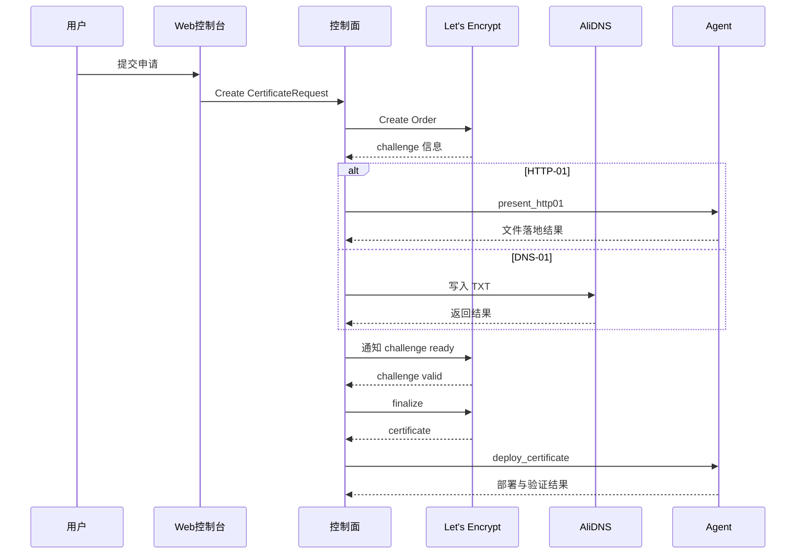

### 11.2 续期流程

续期与申请共用同一套 `IssueWorkflow` 状态机。区别仅在于：

- `CertificateRequest.request_type = renew`
- 触发源为 `scheduled`
- 默认复用原 challenge 类型与部署目标

### 11.3 续期窗口

一期建议按资产当前版本 `not_after` 进行阈值扫描，阈值配置为：

- 默认提前 30 天

续期失败后必须：

- 记录结构化错误
- 进入 `retry`
- 触发告警

## 12. 部署连接器设计

### 12.1 `NGINX` 连接器

职责：

- 证书文件写入
- 私钥文件写入
- 配置校验
- `reload`
- 部署后验证
- 回滚

关键输入：

- 证书链文件路径
- 私钥文件路径
- 配置文件路径
- 服务名 / reload 命令

关键输出：

- 影响路径
- 配置测试结果
- reload 结果
- 生效证书指纹
- 回滚结果

### 12.2 `Tomcat(JSSE + PKCS12)` 连接器

职责：

- 生成 / 更新 `PKCS12`
- 更新 `server.xml` 或引用配置
- 控制重载 / 重启
- 部署后验证
- 回滚

关键输入：

- `keystoreFile`
- `keystoreType`
- `keystorePasswordRef`
- `server.xml` 路径

一期不支持：

- `JKS`
- APR / Native 模式

## 13. 发现机制设计

### 13.1 发现范围

#### `NGINX`

- `ssl_certificate`
- `ssl_certificate_key`
- `server_name`

#### `Tomcat`

- `server.xml`
- `SSLHostConfig`
- `Certificate`
- `keystoreFile`
- `keystoreType`

### 13.2 发现流程

1. 控制面创建发现 job
2. Agent 执行配置扫描
3. Agent 读取本地证书或 `PKCS12`
4. Agent 解析元数据与有效期
5. Agent 回传发现记录
6. 控制面执行资产匹配
7. 生成 `matched / unmanaged / invalid` 结果

### 13.3 匹配规则

优先按以下顺序匹配：

1. 指纹
2. 序列号
3. `subject + SAN + not_after`

## 14. Agent 详细设计

### 14.1 Agent 职责

- 本地私钥生成
- CSR 生成
- `HTTP-01` challenge 文件落地
- `NGINX / Tomcat` 证书部署
- 配置扫描
- 证书解析
- 结果与证据回传

### 14.2 Agent 注册与信任

一期采用：

- 注册令牌 + 双向 `mTLS`

流程：

1. 管理员创建注册令牌
2. Agent 首次注册时携带令牌
3. 控制面校验并签发节点身份
4. 后续所有通信使用 `mTLS`

### 14.3 任务执行模型

- 只采用 `pull` 模式
- Agent 周期性拉任务
- 控制面按标签、能力、环境匹配下发

### 14.4 Agent 能力模型

一期节点能力至少包括：

- `keygen:rsa`
- `challenge:http-01`
- `deploy:nginx`
- `deploy:tomcat-jsse-pkcs12`
- `discover:nginx`
- `discover:tomcat`

### 14.5 本地执行约束

- 所有副作用动作必须有 `operation_id`
- 写文件前必须备份
- 部署前必须校验
- 部署后必须验证
- 失败必须回滚
- 允许路径必须受白名单控制

## 15. 作业调度与一致性设计

### 15.1 为什么拆分 `jobs` 和 `job_attempts`

#### `jobs`

代表任务当前事实，承载：

- 任务类型
- 当前状态
- 下次执行时间
- lease 信息
- 最后一次错误

这是调度热表。

#### `job_attempts`

代表每次具体执行尝试，承载：

- 第几次执行
- 哪个 worker / agent 执行
- 开始时间 / 完成时间
- 结果状态
- 错误明细
- 证据引用

这是排障与审计历史表。

### 15.2 拆分后的好处

- 热路径调度字段与历史大字段分离
- 可以完整保留失败 / 超时 / 重试历史
- 便于统计成功率、平均耗时、超时率
- 不把 `jobs` 热表做宽

### 15.3 为什么使用 `PostgreSQL SKIP LOCKED`

`SKIP LOCKED` 只用于“高并发抢任务”，不用于长事务持锁执行。

claim 原理：

1. worker 在短事务中查询可执行 job
2. 使用 `FOR UPDATE SKIP LOCKED`
3. 抢占成功后立即更新：
   - `lease_owner`
   - `lease_expire_at`
   - `status = running`
4. 同时写入 `job_attempts`
5. 提交事务

这样多个控制面 worker 可以并发 claim，而不会相互阻塞。

### 15.4 为什么 `claim` 与 `lease` 分离

不能依赖数据库行锁持有整个执行过程，因为：

- 任务执行可能持续几十秒甚至几分钟
- 长事务会导致锁等待、连接占用、VACUUM 压力

因此：

- `claim` 是短事务
- `lease` 用字段表达逻辑所有权

关键字段：

- `lease_owner`
- `lease_expire_at`

### 15.5 标准执行流程

1. claim：短事务抢占任务
2. execute：事务外执行
3. renew：周期续租
4. finish：事务内提交结果、推进领域对象、写审计

### 15.6 过期 lease 回收

若 worker 崩溃或失联：

- `lease_expire_at` 超时后由 reaper 扫描器回收
- `jobs.status` 转为 `retry`
- 当前未完成的 `job_attempt` 标记为 `timed_out` 或 `abandoned`

### 15.7 Redis 的作用边界

Redis 一期只用于：

- 登录态元数据
- 限流
- 热点查询缓存
- challenge 轮询辅助缓存
- 短期在线状态缓存

Redis 不用于：

- 业务主队列
- lease 唯一事实源
- 审计存储

## 16. 数据库设计

### 16.1 存储原则

- `PostgreSQL` 是唯一事实源
- 所有状态机推进与审计事件一起事务落库
- `JSONB` 只用于扩展字段，不用于主过滤条件

### 16.2 统一表设计约定

一期所有业务表必须统一满足以下要求：

- 必须包含主键字段：`id uuid primary key default gen_random_uuid()`
- 必须包含创建时间：`created_at timestamptz not null default now()`
- 必须包含修改时间：`updated_at timestamptz not null default now()`

其他统一约定：

- 所有业务状态字段使用 `varchar(32)` 或 `varchar(64)` 存储，状态合法性由应用层和数据库约束共同保证
- 表级状态枚举必须与第 7 章状态机定义保持一致
- 所有跨租户业务表必须带 `tenant_id`
- 涉及项目、环境的业务表必须同时带 `project_id`、`environment_id`
- `JSONB` 只用于扩展字段、能力元数据和证据细节
- 一期不引入通用软删除字段，逻辑删除统一通过 `status` 表达

### 16.3 核心表清单

#### 身份与隔离

- `tenants`
- `projects`
- `environments`
- `users`
- `user_credentials`
- `roles`
- `role_bindings`

#### 域名与凭据

- `domain_assets`
- `domain_validation_records`
- `dns_record_operations`
- `ca_accounts`
- `dns_credentials`

#### 证书与工作流

- `certificate_requests`
- `certificate_request_domains`
- `issue_workflows`
- `workflow_challenges`
- `certificate_assets`
- `certificate_asset_domains`
- `certificate_versions`

#### 部署与发现

- `deployment_targets`
- `deployment_bindings`
- `deployment_records`
- `discovery_records`

#### Agent 与调度

- `agents`
- `agent_capabilities`
- `node_registration_tokens`
- `jobs`
- `job_attempts`

#### 审计与通知

- `audit_events`
- `evidence_records`
- `webhook_endpoints`
- `notification_events`

### 16.4 详细表定义

#### `tenants`

| 字段 | 类型 | 约束 | 说明 |
| --- | --- | --- | --- |
| `id` | `uuid` | PK | 租户主键 |
| `name` | `varchar(128)` | not null | 租户显示名称 |
| `code` | `varchar(64)` | not null, unique | 租户编码，供路由和唯一识别使用 |
| `status` | `varchar(32)` | not null | `active / suspended / disabled` |
| `plan_code` | `varchar(64)` | null | 套餐或版本标识 |
| `locale` | `varchar(16)` | not null | 默认语言区域，如 `zh-CN` |
| `created_at` | `timestamptz` | not null | 创建时间 |
| `updated_at` | `timestamptz` | not null | 更新时间 |

索引与约束建议：

- `uk_tenants_code(code)`

#### `projects`

| 字段 | 类型 | 约束 | 说明 |
| --- | --- | --- | --- |
| `id` | `uuid` | PK | 项目主键 |
| `tenant_id` | `uuid` | not null, FK | 所属租户 |
| `name` | `varchar(128)` | not null | 项目名称 |
| `code` | `varchar(64)` | not null | 项目编码 |
| `description` | `text` | null | 项目说明 |
| `status` | `varchar(32)` | not null | `active / archived / disabled` |
| `created_at` | `timestamptz` | not null | 创建时间 |
| `updated_at` | `timestamptz` | not null | 更新时间 |

索引与约束建议：

- `uk_projects_tenant_code(tenant_id, code)`
- `idx_projects_tenant_status(tenant_id, status)`

#### `environments`

| 字段 | 类型 | 约束 | 说明 |
| --- | --- | --- | --- |
| `id` | `uuid` | PK | 环境主键 |
| `tenant_id` | `uuid` | not null, FK | 所属租户 |
| `project_id` | `uuid` | not null, FK | 所属项目 |
| `name` | `varchar(128)` | not null | 环境名称 |
| `code` | `varchar(64)` | not null | 环境编码 |
| `environment_type` | `varchar(32)` | not null | `dev / test / staging / prod` |
| `status` | `varchar(32)` | not null | `active / archived / disabled` |
| `created_at` | `timestamptz` | not null | 创建时间 |
| `updated_at` | `timestamptz` | not null | 更新时间 |

索引与约束建议：

- `uk_environments_project_code(project_id, code)`
- `idx_environments_tenant_project(tenant_id, project_id)`

#### `users`

| 字段 | 类型 | 约束 | 说明 |
| --- | --- | --- | --- |
| `id` | `uuid` | PK | 用户主键 |
| `tenant_id` | `uuid` | null, FK | 所属租户；平台级用户可为空 |
| `username` | `varchar(64)` | not null, unique | 登录用户名 |
| `display_name` | `varchar(128)` | not null | 显示名称 |
| `email` | `varchar(255)` | null | 邮箱 |
| `phone` | `varchar(32)` | null | 手机号 |
| `status` | `varchar(32)` | not null | `active / locked / disabled` |
| `last_login_at` | `timestamptz` | null | 最近登录时间 |
| `created_at` | `timestamptz` | not null | 创建时间 |
| `updated_at` | `timestamptz` | not null | 更新时间 |

索引与约束建议：

- `uk_users_username(username)`
- `idx_users_tenant_status(tenant_id, status)`

#### `user_credentials`

| 字段 | 类型 | 约束 | 说明 |
| --- | --- | --- | --- |
| `id` | `uuid` | PK | 凭据主键 |
| `user_id` | `uuid` | not null, FK | 所属用户 |
| `credential_type` | `varchar(32)` | not null | 一期固定为 `password` |
| `password_hash` | `text` | not null | 密码哈希值 |
| `password_algo_version` | `integer` | not null | 密码算法或参数版本 |
| `must_change_password` | `boolean` | not null | 是否强制修改密码 |
| `password_updated_at` | `timestamptz` | not null | 密码最近更新时间 |
| `created_at` | `timestamptz` | not null | 创建时间 |
| `updated_at` | `timestamptz` | not null | 更新时间 |

索引与约束建议：

- `uk_user_credentials_user_type(user_id, credential_type)`

#### `roles`

| 字段 | 类型 | 约束 | 说明 |
| --- | --- | --- | --- |
| `id` | `uuid` | PK | 角色主键 |
| `tenant_id` | `uuid` | null, FK | 租户级自定义角色时有值，系统角色可为空 |
| `role_code` | `varchar(64)` | not null | 角色编码 |
| `role_name` | `varchar(128)` | not null | 角色名称 |
| `scope_level` | `varchar(32)` | not null | `tenant / project / environment` |
| `is_system` | `boolean` | not null | 是否系统预置角色 |
| `status` | `varchar(32)` | not null | `active / disabled` |
| `created_at` | `timestamptz` | not null | 创建时间 |
| `updated_at` | `timestamptz` | not null | 更新时间 |

索引与约束建议：

- `uk_roles_tenant_code(tenant_id, role_code)`

#### `role_bindings`

| 字段 | 类型 | 约束 | 说明 |
| --- | --- | --- | --- |
| `id` | `uuid` | PK | 角色绑定主键 |
| `tenant_id` | `uuid` | not null, FK | 所属租户 |
| `project_id` | `uuid` | null, FK | 所属项目 |
| `environment_id` | `uuid` | null, FK | 所属环境 |
| `user_id` | `uuid` | not null, FK | 被绑定用户 |
| `role_id` | `uuid` | not null, FK | 角色 ID |
| `scope_type` | `varchar(32)` | not null | `tenant / project / environment` |
| `scope_id` | `uuid` | not null | 作用域对象 ID |
| `status` | `varchar(32)` | not null | `active / disabled` |
| `created_at` | `timestamptz` | not null | 创建时间 |
| `updated_at` | `timestamptz` | not null | 更新时间 |

索引与约束建议：

- `uk_role_bindings_user_role_scope(user_id, role_id, scope_type, scope_id)`

#### `domain_assets`

| 字段 | 类型 | 约束 | 说明 |
| --- | --- | --- | --- |
| `id` | `uuid` | PK | 域名资产主键 |
| `tenant_id` | `uuid` | not null, FK | 所属租户 |
| `project_id` | `uuid` | not null, FK | 所属项目 |
| `environment_id` | `uuid` | not null, FK | 所属环境 |
| `domain_name` | `varchar(255)` | not null | 域名，如 `api.example.com` |
| `domain_type` | `varchar(32)` | not null | `single / wildcard_root / san_member` |
| `default_challenge_type` | `varchar(32)` | not null | 默认 challenge 类型 |
| `default_dns_provider` | `varchar(32)` | null | 一期为 `alidns` |
| `dns_credential_id` | `uuid` | null, FK | 默认 DNS 凭据 |
| `allow_wildcard` | `boolean` | not null | 是否允许基于该域名申请泛域名 |
| `status` | `varchar(32)` | not null | `active / disabled / error` |
| `last_validation_status` | `varchar(32)` | null | 最近验证状态 |
| `last_validated_at` | `timestamptz` | null | 最近验证时间 |
| `created_at` | `timestamptz` | not null | 创建时间 |
| `updated_at` | `timestamptz` | not null | 更新时间 |

索引与约束建议：

- `uk_domain_assets_env_domain(environment_id, domain_name)`
- `idx_domain_assets_dns_credential(dns_credential_id)`

#### `domain_validation_records`

| 字段 | 类型 | 约束 | 说明 |
| --- | --- | --- | --- |
| `id` | `uuid` | PK | 域名验证记录主键 |
| `tenant_id` | `uuid` | not null, FK | 所属租户 |
| `project_id` | `uuid` | not null, FK | 所属项目 |
| `environment_id` | `uuid` | not null, FK | 所属环境 |
| `domain_asset_id` | `uuid` | not null, FK | 所属域名资产 |
| `validation_type` | `varchar(32)` | not null | `dns-01 / http-01` |
| `provider_type` | `varchar(32)` | not null | 一期主要为 `alidns / agent-http01` |
| `workflow_challenge_id` | `uuid` | null, FK | 对应的 challenge 记录 |
| `job_id` | `uuid` | null, FK | 触发该验证的 job |
| `status` | `varchar(32)` | not null | `pending / presenting / propagating / verifying / valid / invalid / cleanup_pending / cleaned / cleanup_failed` |
| `latency_ms` | `integer` | null | 从发起到完成的耗时 |
| `error_code` | `varchar(64)` | null | 错误码 |
| `error_message` | `text` | null | 错误信息 |
| `validated_at` | `timestamptz` | null | 完成验证时间 |
| `created_at` | `timestamptz` | not null | 创建时间 |
| `updated_at` | `timestamptz` | not null | 更新时间 |

索引与约束建议：

- `idx_domain_validation_records_domain_status(domain_asset_id, status)`
- `idx_domain_validation_records_job(job_id)`

#### `dns_record_operations`

| 字段 | 类型 | 约束 | 说明 |
| --- | --- | --- | --- |
| `id` | `uuid` | PK | DNS 记录操作主键 |
| `tenant_id` | `uuid` | not null, FK | 所属租户 |
| `project_id` | `uuid` | not null, FK | 所属项目 |
| `environment_id` | `uuid` | not null, FK | 所属环境 |
| `domain_asset_id` | `uuid` | not null, FK | 对应域名资产 |
| `validation_record_id` | `uuid` | null, FK | 对应域名验证记录 |
| `provider_type` | `varchar(32)` | not null | 一期固定为 `alidns` |
| `operation_type` | `varchar(32)` | not null | `create / update / delete / cleanup` |
| `record_name` | `varchar(255)` | not null | 记录名 |
| `record_type` | `varchar(16)` | not null | 一期固定为 `TXT` |
| `record_value_digest` | `varchar(128)` | not null | 记录值摘要，不直接保存敏感明文 |
| `ttl` | `integer` | null | TTL |
| `status` | `varchar(32)` | not null | `pending / executing / succeeded / failed` |
| `error_code` | `varchar(64)` | null | 错误码 |
| `error_message` | `text` | null | 错误信息 |
| `executed_at` | `timestamptz` | null | 操作执行时间 |
| `created_at` | `timestamptz` | not null | 创建时间 |
| `updated_at` | `timestamptz` | not null | 更新时间 |

索引与约束建议：

- `idx_dns_record_operations_domain(domain_asset_id, created_at desc)`
- `idx_dns_record_operations_validation(validation_record_id)`

#### `ca_accounts`

| 字段 | 类型 | 约束 | 说明 |
| --- | --- | --- | --- |
| `id` | `uuid` | PK | CA 账户主键 |
| `tenant_id` | `uuid` | not null, FK | 所属租户 |
| `project_id` | `uuid` | not null, FK | 所属项目 |
| `environment_id` | `uuid` | not null, FK | 所属环境 |
| `provider_type` | `varchar(32)` | not null | 一期固定为 `acme` |
| `provider_name` | `varchar(32)` | not null | 一期固定为 `letsencrypt` |
| `display_name` | `varchar(128)` | not null | 账户显示名称 |
| `directory_url` | `text` | not null | ACME Directory 地址 |
| `account_kid` | `text` | null | ACME 账户 KID |
| `account_key_secret_ref` | `varchar(255)` | not null | 账户私钥密文引用 |
| `status` | `varchar(32)` | not null | `active / disabled / error / verifying` |
| `capabilities_jsonb` | `jsonb` | not null | CA 能力元数据 |
| `last_checked_at` | `timestamptz` | null | 最近一次能力探测时间 |
| `created_at` | `timestamptz` | not null | 创建时间 |
| `updated_at` | `timestamptz` | not null | 更新时间 |

索引与约束建议：

- `uk_ca_accounts_env_name(environment_id, display_name)`
- `idx_ca_accounts_provider(environment_id, provider_type, provider_name)`

#### `dns_credentials`

| 字段 | 类型 | 约束 | 说明 |
| --- | --- | --- | --- |
| `id` | `uuid` | PK | DNS 凭据主键 |
| `tenant_id` | `uuid` | not null, FK | 所属租户 |
| `project_id` | `uuid` | not null, FK | 所属项目 |
| `environment_id` | `uuid` | not null, FK | 所属环境 |
| `provider_type` | `varchar(32)` | not null | 一期固定为 `alidns` |
| `display_name` | `varchar(128)` | not null | 凭据名称 |
| `access_key_id` | `varchar(128)` | not null | AccessKey ID |
| `secret_envelope` | `jsonb` | not null | AccessKey Secret 的密文封装 |
| `scope_mode` | `varchar(32)` | not null | `environment / domain` |
| `status` | `varchar(32)` | not null | `active / disabled / error / rotating` |
| `last_verified_at` | `timestamptz` | null | 最近验证时间 |
| `last_rotated_at` | `timestamptz` | null | 最近轮换时间 |
| `created_at` | `timestamptz` | not null | 创建时间 |
| `updated_at` | `timestamptz` | not null | 更新时间 |

索引与约束建议：

- `uk_dns_credentials_env_name(environment_id, display_name)`
- `idx_dns_credentials_provider(environment_id, provider_type, status)`

#### `certificate_requests`

| 字段 | 类型 | 约束 | 说明 |
| --- | --- | --- | --- |
| `id` | `uuid` | PK | 证书申请主键 |
| `tenant_id` | `uuid` | not null, FK | 所属租户 |
| `project_id` | `uuid` | not null, FK | 所属项目 |
| `environment_id` | `uuid` | not null, FK | 所属环境 |
| `request_type` | `varchar(32)` | not null | `issue / renew` |
| `request_source` | `varchar(32)` | not null | `manual / scheduled` |
| `asset_id` | `uuid` | null, FK | 续期或已有资产场景下引用目标资产 |
| `ca_account_id` | `uuid` | not null, FK | 选择的 CA 账户 |
| `algorithm` | `varchar(32)` | not null | 一期固定为 `rsa` |
| `certificate_type` | `varchar(32)` | not null | `single / san / wildcard` |
| `challenge_type` | `varchar(32)` | not null | `http-01 / dns-01` |
| `common_name` | `varchar(255)` | not null | 主域名 |
| `status` | `varchar(32)` | not null | `draft / submitted / accepted / running / completed / failed / cancelled` |
| `requested_by` | `uuid` | null, FK | 发起用户 |
| `idempotency_key` | `varchar(128)` | not null | 幂等键 |
| `reason` | `text` | null | 申请说明 |
| `submitted_at` | `timestamptz` | null | 提交时间 |
| `created_at` | `timestamptz` | not null | 创建时间 |
| `updated_at` | `timestamptz` | not null | 更新时间 |

索引与约束建议：

- `uk_certificate_requests_idempotency(idempotency_key)`
- `idx_certificate_requests_asset(asset_id, status)`

#### `certificate_request_domains`

| 字段 | 类型 | 约束 | 说明 |
| --- | --- | --- | --- |
| `id` | `uuid` | PK | 申请域名关联主键 |
| `certificate_request_id` | `uuid` | not null, FK | 所属申请单 |
| `domain_asset_id` | `uuid` | not null, FK | 关联域名资产 |
| `relation_type` | `varchar(32)` | not null | `primary / san / wildcard` |
| `sort_order` | `integer` | not null | SAN 展示顺序 |
| `created_at` | `timestamptz` | not null | 创建时间 |
| `updated_at` | `timestamptz` | not null | 更新时间 |

索引与约束建议：

- `uk_certificate_request_domains_request_domain(certificate_request_id, domain_asset_id, relation_type)`

#### `issue_workflows`

| 字段 | 类型 | 约束 | 说明 |
| --- | --- | --- | --- |
| `id` | `uuid` | PK | 签发工作流主键 |
| `tenant_id` | `uuid` | not null, FK | 所属租户 |
| `project_id` | `uuid` | not null, FK | 所属项目 |
| `environment_id` | `uuid` | not null, FK | 所属环境 |
| `certificate_request_id` | `uuid` | not null, FK | 关联申请单 |
| `ca_account_id` | `uuid` | not null, FK | 关联 CA 账户 |
| `workflow_type` | `varchar(32)` | not null | `issue / renew` |
| `status` | `varchar(32)` | not null | `created / order_pending / challenge_pending / challenge_processing / challenge_valid / finalizing / issued / deploy_pending / deploying / deployed / partially_failed / failed / cancelled` |
| `order_url` | `text` | null | ACME order 地址 |
| `finalize_url` | `text` | null | ACME finalize 地址 |
| `csr_ref` | `varchar(255)` | null | CSR 引用 |
| `certificate_ref` | `varchar(255)` | null | 下载证书材料引用 |
| `last_error_code` | `varchar(64)` | null | 最近错误码 |
| `last_error_message` | `text` | null | 最近错误信息 |
| `started_at` | `timestamptz` | null | 开始时间 |
| `finished_at` | `timestamptz` | null | 完成时间 |
| `created_at` | `timestamptz` | not null | 创建时间 |
| `updated_at` | `timestamptz` | not null | 更新时间 |

索引与约束建议：

- `idx_issue_workflows_request(certificate_request_id, status)`
- `idx_issue_workflows_ca_account(ca_account_id, status)`

#### `workflow_challenges`

| 字段 | 类型 | 约束 | 说明 |
| --- | --- | --- | --- |
| `id` | `uuid` | PK | challenge 主键 |
| `issue_workflow_id` | `uuid` | not null, FK | 所属工作流 |
| `domain_asset_id` | `uuid` | null, FK | 对应域名资产 |
| `challenge_type` | `varchar(32)` | not null | `http-01 / dns-01` |
| `identifier` | `varchar(255)` | not null | challenge 对应标识 |
| `token` | `text` | null | challenge token |
| `key_authorization` | `text` | null | key authorization |
| `http_path` | `text` | null | HTTP-01 写入路径 |
| `dns_record_name` | `varchar(255)` | null | DNS 记录名 |
| `dns_record_value` | `text` | null | DNS 记录值 |
| `status` | `varchar(32)` | not null | `pending / presenting / presented / propagating / ready / verifying / valid / invalid / cleanup_pending / cleaned / cleanup_failed` |
| `presented_at` | `timestamptz` | null | 完成呈现时间 |
| `validated_at` | `timestamptz` | null | 完成验证时间 |
| `cleaned_at` | `timestamptz` | null | 完成清理时间 |
| `created_at` | `timestamptz` | not null | 创建时间 |
| `updated_at` | `timestamptz` | not null | 更新时间 |

索引与约束建议：

- `idx_workflow_challenges_workflow(issue_workflow_id, status)`
- `idx_workflow_challenges_domain(domain_asset_id, challenge_type)`

#### `certificate_assets`

| 字段 | 类型 | 约束 | 说明 |
| --- | --- | --- | --- |
| `id` | `uuid` | PK | 证书资产主键 |
| `tenant_id` | `uuid` | not null, FK | 所属租户 |
| `project_id` | `uuid` | not null, FK | 所属项目 |
| `environment_id` | `uuid` | not null, FK | 所属环境 |
| `name` | `varchar(128)` | not null | 资产逻辑名称 |
| `status` | `varchar(32)` | not null | `active / expiring / renewing / deploy_failed / expired / revoked / orphaned` |
| `current_version_id` | `uuid` | null, FK | 当前版本 |
| `current_request_id` | `uuid` | null, FK | 最近一次变更来源请求 |
| `expires_at` | `timestamptz` | null | 当前版本到期时间 |
| `managed_by` | `varchar(32)` | not null | `auto / manual / imported` |
| `renewal_window_days` | `integer` | not null | 自动续期窗口天数 |
| `created_at` | `timestamptz` | not null | 创建时间 |
| `updated_at` | `timestamptz` | not null | 更新时间 |

索引与约束建议：

- `uk_certificate_assets_env_name(environment_id, name)`
- `idx_certificate_assets_status(environment_id, status, expires_at)`

#### `certificate_asset_domains`

| 字段 | 类型 | 约束 | 说明 |
| --- | --- | --- | --- |
| `id` | `uuid` | PK | 资产域名关联主键 |
| `asset_id` | `uuid` | not null, FK | 所属证书资产 |
| `domain_asset_id` | `uuid` | not null, FK | 关联域名资产 |
| `relation_type` | `varchar(32)` | not null | `primary / san / wildcard` |
| `created_at` | `timestamptz` | not null | 创建时间 |
| `updated_at` | `timestamptz` | not null | 更新时间 |

索引与约束建议：

- `uk_certificate_asset_domains_asset_domain(asset_id, domain_asset_id, relation_type)`

#### `certificate_versions`

| 字段 | 类型 | 约束 | 说明 |
| --- | --- | --- | --- |
| `id` | `uuid` | PK | 证书版本主键 |
| `asset_id` | `uuid` | not null, FK | 所属资产 |
| `version_no` | `integer` | not null | 版本号，从 1 递增 |
| `serial_number` | `varchar(128)` | not null | 证书序列号 |
| `subject_cn` | `varchar(255)` | not null | 主题 CN |
| `sans_jsonb` | `jsonb` | not null | SAN 列表 |
| `issuer_name` | `varchar(255)` | not null | 签发者名称 |
| `not_before` | `timestamptz` | not null | 生效时间 |
| `not_after` | `timestamptz` | not null | 到期时间 |
| `fingerprint_sha256` | `varchar(128)` | not null | 证书指纹 |
| `pem_chain_ref` | `varchar(255)` | not null | 证书链存储引用 |
| `private_key_ref` | `varchar(255)` | null | 私钥引用，仅保存元数据引用 |
| `status` | `varchar(32)` | not null | `issued / deploying / current / superseded / deploy_failed / revoked` |
| `issued_at` | `timestamptz` | not null | 签发完成时间 |
| `deployed_at` | `timestamptz` | null | 成功切换为当前版本时间 |
| `created_at` | `timestamptz` | not null | 创建时间 |
| `updated_at` | `timestamptz` | not null | 更新时间 |

索引与约束建议：

- `uk_certificate_versions_asset_version(asset_id, version_no)`
- `uk_certificate_versions_fingerprint(fingerprint_sha256)`
- `idx_certificate_versions_asset_status(asset_id, status)`

#### `deployment_targets`

| 字段 | 类型 | 约束 | 说明 |
| --- | --- | --- | --- |
| `id` | `uuid` | PK | 部署目标主键 |
| `tenant_id` | `uuid` | not null, FK | 所属租户 |
| `project_id` | `uuid` | not null, FK | 所属项目 |
| `environment_id` | `uuid` | not null, FK | 所属环境 |
| `target_name` | `varchar(128)` | not null | 部署目标名称 |
| `target_type` | `varchar(32)` | not null | `nginx / tomcat-jsse-pkcs12` |
| `agent_selector_jsonb` | `jsonb` | not null | 节点选择规则 |
| `service_name` | `varchar(128)` | not null | 服务标识 |
| `node_hint` | `varchar(255)` | null | 节点提示信息 |
| `config_path` | `text` | not null | 配置文件路径 |
| `install_path_jsonb` | `jsonb` | not null | 证书、私钥、keystore 安装路径配置 |
| `status` | `varchar(32)` | not null | `active / disabled / error` |
| `created_at` | `timestamptz` | not null | 创建时间 |
| `updated_at` | `timestamptz` | not null | 更新时间 |

索引与约束建议：

- `uk_deployment_targets_env_name(environment_id, target_name)`
- `idx_deployment_targets_env_type(environment_id, target_type, status)`

#### `deployment_bindings`

| 字段 | 类型 | 约束 | 说明 |
| --- | --- | --- | --- |
| `id` | `uuid` | PK | 资产与目标绑定主键 |
| `tenant_id` | `uuid` | not null, FK | 所属租户 |
| `project_id` | `uuid` | not null, FK | 所属项目 |
| `environment_id` | `uuid` | not null, FK | 所属环境 |
| `asset_id` | `uuid` | not null, FK | 证书资产 |
| `target_id` | `uuid` | not null, FK | 部署目标 |
| `install_policy_jsonb` | `jsonb` | not null | 部署策略，如重启方式、写入策略等 |
| `is_primary` | `boolean` | not null | 是否主要部署目标 |
| `status` | `varchar(32)` | not null | `active / disabled / drifted` |
| `created_at` | `timestamptz` | not null | 创建时间 |
| `updated_at` | `timestamptz` | not null | 更新时间 |

索引与约束建议：

- `uk_deployment_bindings_asset_target(asset_id, target_id)`
- `idx_deployment_bindings_target_status(target_id, status)`

#### `deployment_records`

| 字段 | 类型 | 约束 | 说明 |
| --- | --- | --- | --- |
| `id` | `uuid` | PK | 部署记录主键 |
| `tenant_id` | `uuid` | not null, FK | 所属租户 |
| `project_id` | `uuid` | not null, FK | 所属项目 |
| `environment_id` | `uuid` | not null, FK | 所属环境 |
| `asset_id` | `uuid` | not null, FK | 所属资产 |
| `version_id` | `uuid` | not null, FK | 部署的证书版本 |
| `target_id` | `uuid` | not null, FK | 部署目标 |
| `agent_id` | `uuid` | not null, FK | 执行节点 |
| `job_id` | `uuid` | null, FK | 触发部署的 job |
| `status` | `varchar(32)` | not null | `pending / prechecking / backing_up / installing / reloading / verifying / succeeded / failed / rolling_back / rolled_back / rollback_failed` |
| `backup_ref` | `varchar(255)` | null | 回滚备份引用 |
| `verification_result_jsonb` | `jsonb` | null | 部署后验证结果 |
| `rollback_result_jsonb` | `jsonb` | null | 回滚结果 |
| `error_code` | `varchar(64)` | null | 错误码 |
| `error_message` | `text` | null | 错误信息 |
| `started_at` | `timestamptz` | null | 执行开始时间 |
| `finished_at` | `timestamptz` | null | 执行完成时间 |
| `created_at` | `timestamptz` | not null | 创建时间 |
| `updated_at` | `timestamptz` | not null | 更新时间 |

索引与约束建议：

- `idx_deployment_records_asset(asset_id, created_at desc)`
- `idx_deployment_records_target_status(target_id, status, created_at desc)`

#### `discovery_records`

| 字段 | 类型 | 约束 | 说明 |
| --- | --- | --- | --- |
| `id` | `uuid` | PK | 发现记录主键 |
| `tenant_id` | `uuid` | not null, FK | 所属租户 |
| `project_id` | `uuid` | not null, FK | 所属项目 |
| `environment_id` | `uuid` | not null, FK | 所属环境 |
| `agent_id` | `uuid` | not null, FK | 扫描节点 |
| `target_type` | `varchar(32)` | not null | `nginx / tomcat-jsse-pkcs12` |
| `target_id` | `uuid` | null, FK | 若已知则关联目标 |
| `node_name` | `varchar(255)` | not null | 节点名 |
| `service_name` | `varchar(128)` | not null | 服务名 |
| `config_path` | `text` | not null | 配置路径 |
| `certificate_path` | `text` | null | 证书文件路径 |
| `keystore_path` | `text` | null | keystore 路径 |
| `fingerprint_sha256` | `varchar(128)` | null | 证书指纹 |
| `subject_cn` | `varchar(255)` | null | 证书 CN |
| `not_after` | `timestamptz` | null | 到期时间 |
| `match_asset_id` | `uuid` | null, FK | 匹配到的资产 |
| `status` | `varchar(32)` | not null | `scanned / parsed / matched / unmanaged / invalid / ignored` |
| `raw_detail_jsonb` | `jsonb` | null | 原始解析详情 |
| `scanned_at` | `timestamptz` | not null | 扫描时间 |
| `created_at` | `timestamptz` | not null | 创建时间 |
| `updated_at` | `timestamptz` | not null | 更新时间 |

索引与约束建议：

- `idx_discovery_records_env_status(environment_id, status, scanned_at desc)`
- `idx_discovery_records_fingerprint(fingerprint_sha256)`

#### `agents`

| 字段 | 类型 | 约束 | 说明 |
| --- | --- | --- | --- |
| `id` | `uuid` | PK | 节点主键 |
| `tenant_id` | `uuid` | not null, FK | 所属租户 |
| `project_id` | `uuid` | not null, FK | 所属项目 |
| `environment_id` | `uuid` | not null, FK | 所属环境 |
| `agent_name` | `varchar(128)` | not null | 节点名称 |
| `hostname` | `varchar(255)` | not null | 主机名 |
| `ip_address` | `inet` | not null | 节点 IP |
| `version` | `varchar(32)` | not null | Agent 版本 |
| `protocol_version` | `integer` | not null | Agent 协议版本 |
| `os` | `varchar(32)` | not null | 操作系统 |
| `arch` | `varchar(32)` | not null | CPU 架构 |
| `labels_jsonb` | `jsonb` | not null | 节点标签 |
| `status` | `varchar(32)` | not null | `registering / online / degraded / offline / disabled / incompatible` |
| `last_seen_at` | `timestamptz` | null | 最近心跳时间 |
| `cert_serial_no` | `varchar(128)` | null | 节点证书序列号 |
| `created_at` | `timestamptz` | not null | 创建时间 |
| `updated_at` | `timestamptz` | not null | 更新时间 |

索引与约束建议：

- `uk_agents_env_name(environment_id, agent_name)`
- `idx_agents_env_status(environment_id, status, last_seen_at desc)`

#### `agent_capabilities`

| 字段 | 类型 | 约束 | 说明 |
| --- | --- | --- | --- |
| `id` | `uuid` | PK | 能力主键 |
| `agent_id` | `uuid` | not null, FK | 所属节点 |
| `capability_code` | `varchar(64)` | not null | 能力编码，如 `deploy:nginx` |
| `capability_version` | `varchar(32)` | null | 能力版本 |
| `status` | `varchar(32)` | not null | `active / disabled` |
| `created_at` | `timestamptz` | not null | 创建时间 |
| `updated_at` | `timestamptz` | not null | 更新时间 |

索引与约束建议：

- `uk_agent_capabilities_agent_code(agent_id, capability_code)`

#### `node_registration_tokens`

| 字段 | 类型 | 约束 | 说明 |
| --- | --- | --- | --- |
| `id` | `uuid` | PK | 注册令牌主键 |
| `tenant_id` | `uuid` | not null, FK | 所属租户 |
| `project_id` | `uuid` | not null, FK | 所属项目 |
| `environment_id` | `uuid` | not null, FK | 所属环境 |
| `token_hash` | `varchar(128)` | not null | 注册令牌哈希值 |
| `issued_by` | `uuid` | not null, FK | 签发用户 |
| `expires_at` | `timestamptz` | not null | 过期时间 |
| `used_at` | `timestamptz` | null | 使用时间 |
| `used_by_agent_id` | `uuid` | null, FK | 使用该令牌注册的 Agent |
| `status` | `varchar(32)` | not null | `active / used / expired / revoked` |
| `created_at` | `timestamptz` | not null | 创建时间 |
| `updated_at` | `timestamptz` | not null | 更新时间 |

索引与约束建议：

- `uk_node_registration_tokens_hash(token_hash)`
- `idx_node_registration_tokens_env_status(environment_id, status, expires_at)`

#### `jobs`

| 字段 | 类型 | 约束 | 说明 |
| --- | --- | --- | --- |
| `id` | `uuid` | PK | 作业主键 |
| `tenant_id` | `uuid` | not null, FK | 所属租户 |
| `project_id` | `uuid` | not null, FK | 所属项目 |
| `environment_id` | `uuid` | not null, FK | 所属环境 |
| `job_type` | `varchar(64)` | not null | 作业类型 |
| `aggregate_type` | `varchar(64)` | not null | 关联聚合类型 |
| `aggregate_id` | `uuid` | not null | 关联聚合对象 ID |
| `status` | `varchar(32)` | not null | `pending / claimed / running / retry / succeeded / failed / cancelled / timed_out` |
| `priority` | `smallint` | not null | 优先级，值越小优先级越高 |
| `payload_jsonb` | `jsonb` | not null | 作业负载 |
| `idempotency_key` | `varchar(128)` | not null | 幂等键 |
| `lease_owner` | `varchar(128)` | null | 当前租约持有者 |
| `lease_expire_at` | `timestamptz` | null | 租约过期时间 |
| `attempt_count` | `integer` | not null | 已执行次数 |
| `max_attempts` | `integer` | not null | 最大重试次数 |
| `next_run_at` | `timestamptz` | not null | 下次调度时间 |
| `last_error_code` | `varchar(64)` | null | 最近一次错误码 |
| `last_error_message` | `text` | null | 最近一次错误消息 |
| `version` | `integer` | not null | 乐观锁版本号 |
| `created_at` | `timestamptz` | not null | 创建时间 |
| `updated_at` | `timestamptz` | not null | 更新时间 |

索引与约束建议：

- `uk_jobs_idempotency(idempotency_key)`
- `idx_jobs_schedulable(status, next_run_at, priority)`
- `idx_jobs_lease(status, lease_expire_at)`
- `idx_jobs_aggregate(aggregate_type, aggregate_id)`

#### `job_attempts`

| 字段 | 类型 | 约束 | 说明 |
| --- | --- | --- | --- |
| `id` | `uuid` | PK | 作业尝试主键 |
| `job_id` | `uuid` | not null, FK | 所属作业 |
| `attempt_no` | `integer` | not null | 第几次尝试 |
| `worker_id` | `varchar(128)` | not null | 控制面 worker 或执行单元标识 |
| `agent_id` | `uuid` | null, FK | 若由 Agent 执行则关联节点 |
| `started_at` | `timestamptz` | not null | 开始时间 |
| `last_heartbeat_at` | `timestamptz` | null | 最近执行心跳时间 |
| `finished_at` | `timestamptz` | null | 完成时间 |
| `result_status` | `varchar(32)` | not null | `started / heartbeating / succeeded / failed / timed_out / abandoned` |
| `error_code` | `varchar(64)` | null | 错误码 |
| `error_message` | `text` | null | 错误信息 |
| `evidence_ref` | `varchar(255)` | null | 证据引用 |
| `created_at` | `timestamptz` | not null | 创建时间 |
| `updated_at` | `timestamptz` | not null | 更新时间 |

索引与约束建议：

- `uk_job_attempts_job_attempt(job_id, attempt_no)`
- `idx_job_attempts_agent(agent_id, started_at desc)`

#### `audit_events`

| 字段 | 类型 | 约束 | 说明 |
| --- | --- | --- | --- |
| `id` | `uuid` | PK | 审计事件主键 |
| `tenant_id` | `uuid` | not null, FK | 所属租户 |
| `project_id` | `uuid` | null, FK | 所属项目 |
| `environment_id` | `uuid` | null, FK | 所属环境 |
| `actor_type` | `varchar(32)` | not null | `user / system / agent` |
| `actor_id` | `varchar(128)` | not null | 操作者标识 |
| `action` | `varchar(128)` | not null | 审计动作 |
| `resource_type` | `varchar(64)` | not null | 资源类型 |
| `resource_id` | `uuid` | null | 资源 ID |
| `request_id` | `varchar(64)` | null | 请求 ID |
| `trace_id` | `varchar(64)` | null | 链路追踪 ID |
| `detail_jsonb` | `jsonb` | not null | 审计详情 |
| `occurred_at` | `timestamptz` | not null | 事件发生时间 |
| `created_at` | `timestamptz` | not null | 创建时间 |
| `updated_at` | `timestamptz` | not null | 更新时间 |

索引与约束建议：

- `idx_audit_events_tenant_time(tenant_id, occurred_at desc)`
- `idx_audit_events_resource(resource_type, resource_id, occurred_at desc)`

#### `evidence_records`

| 字段 | 类型 | 约束 | 说明 |
| --- | --- | --- | --- |
| `id` | `uuid` | PK | 证据主键 |
| `tenant_id` | `uuid` | not null, FK | 所属租户 |
| `project_id` | `uuid` | null, FK | 所属项目 |
| `environment_id` | `uuid` | null, FK | 所属环境 |
| `resource_type` | `varchar(64)` | not null | 资源类型 |
| `resource_id` | `uuid` | not null | 资源 ID |
| `evidence_type` | `varchar(64)` | not null | `challenge / deployment / rollback / discovery / log` |
| `storage_ref` | `varchar(255)` | not null | 证据存储引用 |
| `digest_sha256` | `varchar(128)` | not null | 摘要 |
| `metadata_jsonb` | `jsonb` | null | 元数据 |
| `status` | `varchar(32)` | not null | `active / archived` |
| `created_at` | `timestamptz` | not null | 创建时间 |
| `updated_at` | `timestamptz` | not null | 更新时间 |

索引与约束建议：

- `idx_evidence_records_resource(resource_type, resource_id)`

#### `webhook_endpoints`

| 字段 | 类型 | 约束 | 说明 |
| --- | --- | --- | --- |
| `id` | `uuid` | PK | Webhook 端点主键 |
| `tenant_id` | `uuid` | not null, FK | 所属租户 |
| `project_id` | `uuid` | null, FK | 所属项目 |
| `environment_id` | `uuid` | null, FK | 所属环境 |
| `name` | `varchar(128)` | not null | 端点名称 |
| `endpoint_url` | `text` | not null | 回调地址 |
| `secret_envelope` | `jsonb` | null | 签名密钥密文 |
| `event_types_jsonb` | `jsonb` | not null | 订阅事件列表 |
| `status` | `varchar(32)` | not null | `active / disabled` |
| `last_tested_at` | `timestamptz` | null | 最近测试时间 |
| `created_at` | `timestamptz` | not null | 创建时间 |
| `updated_at` | `timestamptz` | not null | 更新时间 |

索引与约束建议：

- `uk_webhook_endpoints_env_name(environment_id, name)`

#### `notification_events`

| 字段 | 类型 | 约束 | 说明 |
| --- | --- | --- | --- |
| `id` | `uuid` | PK | 通知事件主键 |
| `tenant_id` | `uuid` | not null, FK | 所属租户 |
| `project_id` | `uuid` | null, FK | 所属项目 |
| `environment_id` | `uuid` | null, FK | 所属环境 |
| `webhook_endpoint_id` | `uuid` | not null, FK | 目标 Webhook |
| `event_type` | `varchar(64)` | not null | 事件类型 |
| `resource_type` | `varchar(64)` | not null | 资源类型 |
| `resource_id` | `uuid` | not null | 资源 ID |
| `payload_jsonb` | `jsonb` | not null | 通知载荷 |
| `status` | `varchar(32)` | not null | `pending / delivering / succeeded / failed / retry / cancelled` |
| `last_error_code` | `varchar(64)` | null | 最近错误码 |
| `last_error_message` | `text` | null | 最近错误信息 |
| `next_retry_at` | `timestamptz` | null | 下次重试时间 |
| `delivered_at` | `timestamptz` | null | 成功送达时间 |
| `created_at` | `timestamptz` | not null | 创建时间 |
| `updated_at` | `timestamptz` | not null | 更新时间 |

索引与约束建议：

- `idx_notification_events_status(status, next_retry_at)`
- `idx_notification_events_webhook(webhook_endpoint_id, created_at desc)`

## 17. 控制面 API 设计

### 17.1 设计原则

- 控制台接口采用 `REST + JSON`
- 外部与前端接口统一走 `OpenAPI 3.0`
- 前端需要的聚合数据尽量由后端接口直接提供

### 17.2 认证接口

- `POST /api/v1/auth/login`
- `POST /api/v1/auth/logout`
- `GET /api/v1/auth/me`

### 17.3 域名管理接口

- `GET /api/v1/domains`
- `POST /api/v1/domains`
- `GET /api/v1/domains/{id}`
- `PUT /api/v1/domains/{id}`
- `POST /api/v1/domains/{id}/bind-dns-credential`
- `GET /api/v1/domains/{id}/validation-records`
- `GET /api/v1/domains/{id}/txt-operations`
- `GET /api/v1/domains/{id}/certificate-assets`

### 17.4 证书资产接口

- `GET /api/v1/certificate-assets`
- `POST /api/v1/certificate-assets/requests`
- `GET /api/v1/certificate-assets/{assetId}`
- `GET /api/v1/certificate-assets/{assetId}/versions`
- `GET /api/v1/certificate-assets/{assetId}/deployments`
- `GET /api/v1/certificate-assets/{assetId}/discoveries`
- `POST /api/v1/certificate-assets/{assetId}/renew`

### 17.5 CA 与 DNS 接口

- `GET /api/v1/ca-accounts`
- `POST /api/v1/ca-accounts`
- `GET /api/v1/ca-accounts/{id}`
- `GET /api/v1/ca-accounts/{id}/capabilities`
- `GET /api/v1/dns-credentials`
- `POST /api/v1/dns-credentials`
- `PUT /api/v1/dns-credentials/{id}`
- `POST /api/v1/dns-credentials/{id}/rotate`

### 17.6 目标、节点、作业、发现接口

- `GET /api/v1/deployment-targets`
- `POST /api/v1/deployment-targets`
- `GET /api/v1/deployment-targets/{id}`
- `PUT /api/v1/deployment-targets/{id}`
- `GET /api/v1/nodes`
- `GET /api/v1/nodes/{id}`
- `POST /api/v1/nodes/registration-tokens`
- `POST /api/v1/nodes/{id}/disable`
- `PUT /api/v1/nodes/{id}/labels`
- `GET /api/v1/jobs`
- `GET /api/v1/jobs/{id}`
- `GET /api/v1/jobs/{id}/attempts`
- `POST /api/v1/jobs/{id}/retry`
- `POST /api/v1/jobs/{id}/cancel`
- `GET /api/v1/discoveries`
- `POST /api/v1/discoveries/scan`
- `POST /api/v1/discoveries/{id}/claim`
- `POST /api/v1/discoveries/{id}/ignore`

### 17.7 审计与统计接口

- `GET /api/v1/audit-events`
- `GET /api/v1/audit-events/{id}`
- `GET /api/v1/dashboard/summary`
- `GET /api/v1/dashboard/expiring-certificates`
- `GET /api/v1/dashboard/job-failures`
- `GET /api/v1/dashboard/discovery-anomalies`

## 18. Agent 协议设计

### 18.1 协议风格

一期 Agent 协议也采用 `REST + JSON`，不引入 `gRPC`。

原因：

- 一期任务复杂度不高
- 调试与联调成本更低
- OpenAPI 更容易统一维护

### 18.2 Agent 接口

- `POST /agent/v1/register`
- `POST /agent/v1/heartbeat`
- `POST /agent/v1/jobs/poll`
- `POST /agent/v1/jobs/{jobId}/progress`
- `POST /agent/v1/jobs/{jobId}/complete`

### 18.3 任务下发原则

- job payload 必须包含 `schema_version`
- 控制面只给版本兼容、能力匹配的 Agent 下发任务
- `DNS-01` 不下发给 Agent

### 18.4 一期主要 job 类型

- `generate_csr`
- `present_http01`
- `cleanup_http01`
- `deploy_nginx_certificate`
- `deploy_tomcat_certificate`
- `verify_nginx_deployment`
- `verify_tomcat_deployment`
- `discover_nginx_certificates`
- `discover_tomcat_certificates`

## 19. 前端详细设计

### 19.1 技术栈

- `Vue 3`
- `TypeScript`
- `Vite`
- `Vue Router`
- `Pinia`
- `@tanstack/vue-query`

### 19.2 一级导航

- `仪表盘`
- `域名管理`
- `证书资产`
- `证书申请`
- `CA 账户`
- `部署目标`
- `节点管理`
- `发现结果`
- `作业中心`
- `审计`
- `系统设置`

### 19.3 核心页面

#### `Dashboard`

展示：

- 域名总量
- 证书总量
- 即将到期资产数
- 最近 24h challenge 失败数
- 最近 24h 部署失败数
- 未纳管发现数
- 节点总数 / 在线数 / 异常数

核心功能：

- 提供租户级运行概览
- 提供风险问题入口跳转

主流程：

- 用户进入仪表盘
- 前端调用 `DashboardSummaryQuery`
- 后端聚合域名、证书、作业、节点、发现统计
- 用户从风险卡片跳转到对应模块

依赖服务：

- `StatsQueryService`
- `DetailQueryService`

#### `DomainDetail`

展示：

- 基本信息
- 绑定的 DNS 凭据
- 默认 challenge 策略
- 最近验证记录
- TXT 操作历史
- 关联证书资产

核心功能：

- 管理域名资产
- 绑定 DNS 凭据
- 查看验证状态和 TXT 历史

主流程：

- 创建域名资产
- 绑定或更换 DNS 凭据
- 查看验证历史和 TXT 操作

依赖服务：

- `DomainService`
- `DNSCredentialService`
- `DNSExecutionService`
- `AuditService`

关联状态机：

- `DomainAsset`
- `DomainValidationRecord`
- `DNSRecordOperation`

#### `AssetDetail`

展示：

- 当前版本
- 证书元数据
- 绑定目标
- 最近续期
- 最近部署
- 最近发现
- 关联作业和审计

核心功能：

- 查看资产全景
- 手动触发续期
- 查看版本、部署、发现和审计

主流程：

- 进入详情查看当前版本与目标绑定
- 查看部署失败原因
- 触发续期并跳转作业中心

依赖服务：

- `CertificateAssetService`
- `IssueWorkflowService`
- `DeploymentService`
- `DiscoveryService`
- `DetailQueryService`

关联状态机：

- `CertificateAsset`
- `CertificateVersion`
- `IssueWorkflow`
- `DeploymentRecord`
- `DiscoveryRecord`

#### `JobDetail`

展示：

- job 基本信息
- 状态流转
- attempts 历史
- 错误码与错误消息
- challenge / 部署 / 发现证据

核心功能：

- 统一排障入口
- 查看作业 attempt 历史
- 支持重试、取消

主流程：

- 查看失败原因
- 判断是否可重试
- 发起重试或取消

依赖服务：

- `JobService`
- `LeaseService`
- `DetailQueryService`
- `AuditService`

关联状态机：

- `Job`
- `JobAttempt`

#### `NodeDetail`

展示：

- 节点健康
- 版本
- 标签
- 能力
- 最近任务
- 最近发现
- 授权范围

核心功能：

- 节点运维
- 查看健康、版本、能力、最近任务和授权范围
- 支持停用节点

主流程：

- 创建注册令牌
- 节点首次注册
- 查看健康和兼容性
- 停用节点

依赖服务：

- `AgentService`
- `AgentDispatchService`
- `JobService`
- `AuditService`

关联状态机：

- `AgentNode`
- `NodeRegistrationToken`

#### `DiscoveryDetail`

展示：

- 节点与服务信息
- 证书路径或 keystore 路径
- 证书元数据
- 匹配结果
- 可认领动作

核心功能：

- 查看发现到的证书和配置关系
- 支持认领或忽略

主流程：

- 查看异常发现
- 认领未纳管证书
- 忽略无须处理的发现项

依赖服务：

- `DiscoveryService`
- `CertificateAssetMatcher`
- `AuditService`

关联状态机：

- `DiscoveryRecord`

### 19.4 前端状态管理原则

- `Pinia` 只管理登录态、租户上下文、少量 UI 状态
- 所有服务端数据走 `Vue Query`
- 页面不直接拼 HTTP 请求
- 详情页数据由后端聚合接口提供

### 19.5 一级菜单核心功能与流程

#### 仪表盘

- 核心功能：运行概览、风险入口、趋势展示
- 核心流程：查看摘要 -> 跳转异常模块
- 依赖模块：`StatsQueryService`

#### 域名管理

- 核心功能：域名资产台账、DNS 凭据绑定、验证历史、TXT 操作历史
- 核心流程：创建域名 -> 绑定 DNS 凭据 -> 查看验证记录
- 依赖模块：`DomainService`、`DNSCredentialService`、`DNSExecutionService`

#### 证书资产

- 核心功能：资产列表、版本历史、部署关系、发现关系、续期入口
- 核心流程：查看资产 -> 排障 -> 续期
- 依赖模块：`CertificateAssetService`、`IssueWorkflowService`、`DeploymentService`

#### 证书申请

- 核心功能：创建申请单、选择域名/CA/challenge/目标
- 核心流程：填写表单 -> 校验 -> 创建 `CertificateRequest` -> 创建工作流
- 依赖模块：`CertificateRequestService`、`DomainService`、`CAAccountService`

#### CA 账户

- 核心功能：管理 ACME 账户、查看能力、启停用
- 核心流程：创建账户 -> 探测状态 -> 选择用于签发
- 依赖模块：`CAAccountService`、`IssuerService`

#### 部署目标

- 核心功能：配置 `NGINX / Tomcat` 目标、绑定资产
- 核心流程：创建目标 -> 配置路径/选择器 -> 绑定资产
- 依赖模块：`DeploymentTargetService`、`DeploymentService`

#### 节点管理

- 核心功能：注册、停用、查看能力、查看任务与发现
- 核心流程：生成令牌 -> 注册 -> 查看健康 -> 停用
- 依赖模块：`AgentService`、`AgentDispatchService`

#### 发现结果

- 核心功能：查看未纳管/异常发现、认领、忽略
- 核心流程：查看发现 -> 匹配或认领 -> 更新状态
- 依赖模块：`DiscoveryService`

#### 作业中心

- 核心功能：查看异步任务、attempt、证据，执行重试/取消
- 核心流程：筛选失败任务 -> 查看详情 -> 重试或取消
- 依赖模块：`JobService`、`LeaseService`

#### 审计

- 核心功能：查看 actor、resource、action 维度的审计事件
- 核心流程：筛选 -> 查看详情 -> 跳转关联资源
- 依赖模块：`AuditService`

#### 系统设置

- 核心功能：Webhook、续期窗口、基础安全与显示配置
- 核心流程：修改配置 -> 校验 -> 保存 -> 审计
- 依赖模块：`SettingsService`、`NotificationService`、`AuditService`

### 19.6 菜单主业务链

一期建议明确四条主业务链：

#### 链路 A：域名治理到申请

- `域名管理 -> 证书申请 -> 作业中心 -> 证书资产`

说明：

- `CA 账户` 作为前置治理资源存在，但不强制成为主导航链路的一部分

#### 链路 B：签发到部署

- `证书申请 -> 作业中心 -> 节点管理 -> 证书资产`

#### 链路 C：运行中发现与纠偏

- `节点管理 -> 发现结果 -> 证书资产 -> 作业中心`

#### 链路 D：治理与排障

- `仪表盘 -> 作业中心 -> 审计 -> 节点管理 -> 域名管理`

## 20. 安全设计

### 20.1 登录与会话

- 一期只支持账号密码
- 会话采用 `JWT access token + refresh token`
- 密码以强哈希存储，并保留哈希版本字段

### 20.2 敏感凭据保护

一期敏感凭据包括：

- `ACME account key`
- `AliDNS access key/secret`

要求：

- 数据库存密文，不存明文
- 使用统一 `SecretEnvelope`
- 支持主密钥轮换
- 查询接口不返回明文
- 所有使用动作进入审计

### 20.3 Agent 通信安全

- 所有 Agent 通信采用双向 `mTLS`
- 节点注册令牌一次性或短期有效
- 节点可停用与吊销

### 20.4 节点权限边界

Agent 必须受以下白名单限制：

- `allowed_paths`
- `allowed_services`
- `allowed_targets`

避免 Agent 变成任意文件写入器。

## 21. 审计与证据设计

### 21.1 审计事件模型

每个 `AuditEvent` 至少包含：

- `actor_type`
- `actor_id`
- `action`
- `resource_type`
- `resource_id`
- `tenant_id/project_id/environment_id`
- `request_id`
- `trace_id`
- `detail_jsonb`
- `occurred_at`

### 21.2 一期必须审计的动作

- 登录 / 登出
- 创建证书申请
- 续期触发
- challenge 状态变化
- DNS 凭据使用
- TXT 写入 / 删除
- Agent 注册 / 停用
- 部署 / 回滚
- 发现认领 / 忽略
- 作业重试 / 取消
- 角色权限变更

### 21.3 证据模型

证据至少覆盖：

- challenge 执行结果
- TXT 写入结果
- 部署影响路径
- 配置校验输出
- reload / restart 结果
- 生效证书指纹
- 回滚结果

## 22. 可观测性设计

### 22.1 指标

一期最少提供：

- API 延迟与错误率
- Job claim 数、运行中数、超时数、重试数
- challenge 成功率
- `DNS-01` 平均耗时
- 部署成功率
- 未纳管发现数
- 节点在线数与心跳延迟
- 即将到期资产数

### 22.2 日志

全部采用结构化日志，并带上以下关键字段：

- `request_id`
- `trace_id`
- `job_id`
- `asset_id`
- `domain_id`
- `agent_id`

要求：

- 禁止记录敏感凭据明文
- 错误日志必须带错误码

### 22.3 告警

一期告警覆盖：

- 节点大面积离线
- challenge 连续失败
- `DNS-01` 耗时异常
- 部署失败率升高
- 即将到期证书超阈值
- 续期任务积压

## 23. 扩展抽象预留

虽然本文档只覆盖一期，但必须预留以下抽象：

- `IssuerDriver`
- `KeyAlgorithmProvider`
- `ChallengeProvider`
- `DNSProvider`
- `TargetConnector`
- `DiscoveryProvider`

并在模型中保留以下扩展位：

- `algorithm`
- `provider_type`
- `challenge_type`
- `target_type`
- `capabilities_jsonb`
- `schema_version`

这样后续支持：

- `SM2`
- 私有 ACME 扩展字段与流程
- 更多 DNS Provider
- 更多目标连接器

时，不需要推翻一期模型。

## 24. 建议代码组织

### 24.1 后端

- `cmd/controlplane`
- `internal/app/controlplane`
- `internal/domain`
- `internal/application`
- `internal/repository`
- `internal/workflow`
- `internal/driver`
- `internal/scheduler`
- `pkg/protocol/acme`
- `api/openapi`

### 24.2 Agent

- `cmd/agent`
- `internal/app/agent`
- `internal/agent/bootstrap`
- `internal/agent/poller`
- `internal/agent/executor`
- `internal/agent/keymgr`
- `internal/agent/deploy/nginx`
- `internal/agent/deploy/tomcat`
- `internal/agent/discover/nginx`
- `internal/agent/discover/tomcat`
- `internal/agent/evidence`

### 24.3 前端

- `web/console/src/router`
- `web/console/src/stores`
- `web/console/src/services/api`
- `web/console/src/pages`
- `web/console/src/components/domain`
- `web/console/src/components/common`

## 25. 研发拆分建议

建议按以下工作流并行拆分：

- 控制面核心域模型与数据库
- ACME 协议子系统
- Agent 注册、心跳与调度
- `HTTP-01` 与 `DNS-01`
- `NGINX` 连接器
- `Tomcat(JSSE + PKCS12)` 连接器
- 发现机制
- Vue 3 控制台
- 审计与统计

## 26. 结论

一期 GA 的实现应坚持以下路线：

- `Go 1.26.2 + Vue 3`
- 控制面单体模块化，Agent 单二进制能力化
- `DNS-01` 由控制面执行，`HTTP-01` 由 Agent 执行
- `PostgreSQL` 作为业务事实源，`Redis` 只做辅助
- `jobs + job_attempts + SKIP LOCKED + lease` 作为调度主机制
- 域名管理、证书资产、节点管理、作业中心作为控制台四个核心治理入口

这套设计能够直接支撑一期 GA 落地，同时为后续 `SM2`、私有 `ACME` 扩展、多 CA 与多连接器演进保留稳定抽象。
