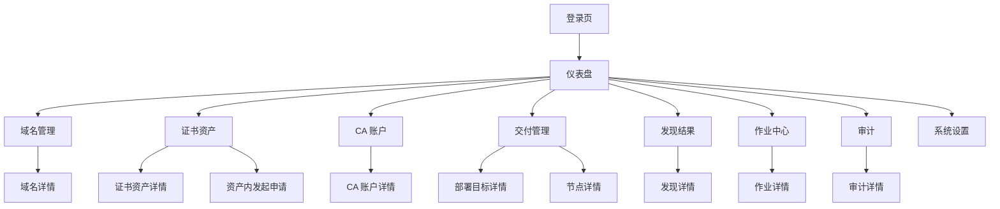
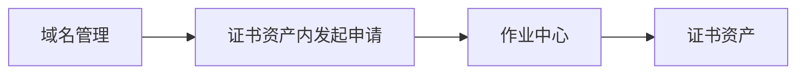
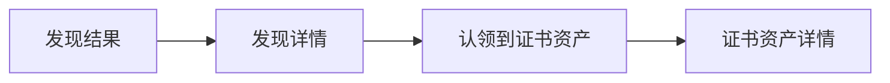
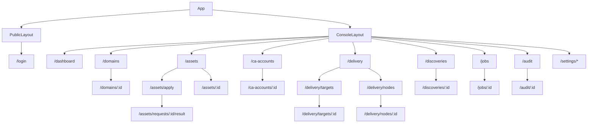
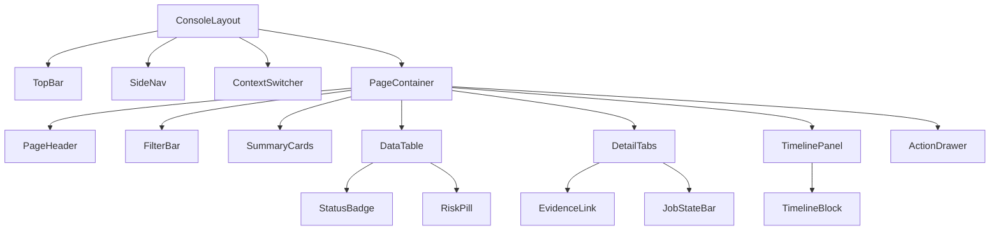

# AutoCertX 前端页面设计 V1.0

- 编写日期：2026-04-16
- 适用范围：一期 GA Web 管理控制台页面设计、交互设计、页面级验收输入
- 关联文档：
  - `doc/需求说明书.md`
  - `doc/GA一期与后续需求规划.md`
  - `doc/一期GA详细设计.md`

## 1. 设计目标

一期前端不是“展示型后台”，而是“证书生命周期控制台”。

页面设计必须同时满足：

- 支撑一期主闭环：
  - 证书申请
  - challenge 跟踪
  - 签发状态查看
  - 部署结果排障
  - 发现与认领
  - 作业追踪
- 适配多角色使用：
  - 租户管理员
  - 安全管理员
  - 平台工程师
  - 审计员
- 页面信息密度高，但不能把复杂度堆成表格海洋
- 所有关键状态都能被直观看到，并能快速跳转到排障入口

## 2. 设计原则

### 2.1 结构原则

- 以“治理对象”和“运行对象”分层设计页面
- 一级导航只放高频工作台，不把内部对象全部提升为一级菜单
- 所有详情页都必须能串起：
  - 基本信息
  - 当前状态
  - 时间线
  - 关联对象
  - 排障入口

### 2.2 视觉原则

- 整体风格采用“控制室 / 风险治理台”方向，不做通用灰白后台模板
- 主字体建议：
  - 正文：`IBM Plex Sans`
  - 等宽信息：`JetBrains Mono`
- 颜色建议：
  - 主色：深蓝灰 `#15304A`
  - 强调色：青蓝 `#0F766E`
  - 成功：绿色 `#1F8A4C`
  - 警告：琥珀 `#B7791F`
  - 错误：砖红 `#B42318`
  - 风险背景：浅琥珀 / 浅红色带
- 页面不使用紫色系主色
- 状态表达优先用：
  - 状态标签
  - 风险条
  - 时间线
  - 分组卡片

### 2.3 交互原则

- 列表页承担“发现问题”和“筛选定位”
- 详情页承担“理解上下文”和“执行动作”
- 高风险动作必须二次确认，并显示影响范围
- 所有失败状态都必须有单跳排障入口

## 3. 用户与页面视角

| 角色 | 最常用页面 | 关注点 |
| --- | --- | --- |
| 租户管理员 | 交付管理、系统设置 | 节点健康、目标配置、环境边界、运行参数 |
| 安全管理员 | 域名管理、CA 账户、审计 | CA 使用、挑战方式、证据与审计 |
| 平台工程师 | 证书资产、交付管理、作业中心、发现结果 | 签发闭环、部署、排障、认领 |
| 审计员 | 审计、证书资产、作业中心 | 谁做了什么、结果如何、证据是否完备 |

## 4. 信息架构

### 4.1 一级导航

- `仪表盘`
- `域名管理`
- `证书资产`
- `CA 账户`
- `交付管理`
- `发现结果`
- `作业中心`
- `审计`
- `系统设置`

### 4.2 站点结构图

### 4.3 全局框架

控制台采用三段式布局：

1. 顶栏
   - Logo
   - 租户 / 项目 / 环境切换器
   - 全局搜索预留位
   - 当前系统版本
   - 当前时间
   - 当前用户与角色
   - 语言切换器（V1: `中文 / EN`）
   - 系统级告警入口
2. 左侧导航
   - 一级导航
   - 风险徽标计数
3. 内容区
   - 面包屑
   - 页面标题区
   - 操作区
   - 页面主体

## 5. 全局页面模式

### 5.1 列表页模式

列表页统一由四部分组成：

- 标题区
  - 页面名称
  - 页面简介
  - 主操作按钮
- 筛选区
  - 搜索
  - 状态筛选
  - 环境 / 目标类型 / 风险等级
- 主列表
  - 支持排序、分页、批量选择
- 右侧或底部摘要
  - 风险摘要
  - 统计摘要

### 5.2 详情页模式

详情页统一由五部分组成：

- 顶部摘要卡
  - 名称、状态、关键标签、最后更新时间
- 主信息区
  - 基本信息
  - 运行信息
- 时间线区
  - 申请、签发、部署、发现、重试、导出
- 关联对象区
  - 节点、目标、作业、审计、证据
- 动作区
  - 续期、重试、认领、忽略、停用、导出

### 5.3 向导页模式

一期只有一个强向导页：`证书资产内的申请向导`。

建议采用 4 步模型：

1. 选择上下文和域名
2. 选择 CA、证书类型、challenge 方式
3. 选择部署目标
4. 复核并提交

## 6. 页面详细设计

## 6.1 登录页

### 页面目标

- 完成账号密码登录
- 装载用户、租户、默认项目、默认环境上下文

### 页面布局

- 左侧品牌叙事区
  - 产品名
  - 一期价值描述
  - 当前版本号
- 右侧登录卡片
  - 用户名
  - 密码
  - 登录按钮
  - 错误反馈区

### 关键交互

- 登录成功后进入 `仪表盘`
- 首次登录若存在多个环境，弹出环境选择器
- 登录失败时展示明确错误，不泄露敏感信息

### 验收要求

- 支持账号密码登录
- 登录后能正确加载当前用户和角色
- 登录失败时错误提示明确
- 未登录时访问受保护路由自动跳转登录页

## 6.2 仪表盘

### 页面目标

- 提供运行概览和风险入口
- 让用户在 10 秒内判断是否存在需要优先处理的问题

### 页面结构

- 顶部 KPI 卡片
  - 域名总量
  - 证书总量
  - 即将到期数
  - 未纳管发现数
  - 在线节点数 / 异常节点数
- 中部风险板块
  - challenge 失败
  - 部署失败
  - discovery 异常
- 底部趋势板块
  - 最近 7 天签发数
  - 最近 7 天失败数
  - 最近 7 天到期风险趋势

### 关键交互

- 点击风险卡片跳转对应模块
- 点击到期风险卡跳转资产列表并带筛选条件

### 验收要求

- 页面首屏加载后能展示关键统计
- 风险入口跳转准确
- 不同租户看到的数据隔离正确

## 6.3 域名管理

### 页面组成

- `域名列表页`
- `域名详情页`

### 域名列表页

展示字段建议：

- 域名
- 类型
- 默认 challenge
- DNS 凭据
- 最近验证状态
- 关联资产数
- 状态

关键交互：

- 新建域名资产
- 搜索域名
- 按 challenge 类型筛选
- 进入详情

### 域名详情页

建议用页签：

- `概览`
- `验证记录`
- `TXT 操作`
- `关联证书`

概览页重点：

- 域名基本信息
- challenge 策略
- DNS 凭据绑定
- 最近验证结果

### 验收要求

- 可创建、编辑、停用域名资产
- 可绑定或更换 DNS 凭据
- 可查看验证历史和 TXT 操作历史
- 能从域名跳转到关联证书资产

## 6.4 证书申请

该页面不再作为一级导航，而是从 `证书资产` 列表页或详情页中发起。

### 页面组成

- `申请向导页`
- `申请结果页`

### 申请向导页

步骤 1：上下文和域名

- 选择项目 / 环境
- 选择主域名
- 添加 SAN

步骤 2：签发参数

- 选择 CA
- 选择证书类型
- 选择 challenge
- 显示 challenge 限制说明

步骤 3：部署目标

- 选择部署目标
- 展示目标类型、节点选择器、安装方式

步骤 4：提交确认

- 汇总 CN、SAN、CA、challenge、目标
- 风险提示
- 提交

### 申请结果页

- 显示申请已创建
- 显示 `CertificateRequest` 编号
- 显示首个 `Job` 入口
- 可跳转作业中心

### 验收要求

- 向导校验规则与后端一致
- 泛域名证书只能选择 `DNS-01`
- 提交后能跳转到作业中心或资产详情
- 提交失败时能展示具体错误

## 6.5 证书资产

### 页面组成

- `资产列表页`
- `资产详情页`
- `资产内申请入口`

### 资产列表页

展示字段建议：

- 资产名
- 当前版本
- CN / SAN 摘要
- 到期时间
- 当前状态
- 目标数
- 最近部署状态
- 最近发现状态

关键交互：

- 搜索和筛选
- 批量查看风险
- 发起新证书申请
- 进入资产详情

### 资产详情页

建议用双栏结构：

- 左栏
  - 资产摘要
  - 当前版本
  - 到期风险
  - 续期入口
- 右栏
  - 部署目标
  - 最近部署
  - 最近发现
  - 审计和证据入口

详情页签建议：

- `概览`
- `版本`
- `部署`
- `发现`
- `作业`
- `审计`

### 验收要求

- 资产详情能串起申请、签发、部署、发现、审计
- 列表页能直接发起新证书申请
- 失败状态可单跳进入作业详情
- 支持手动触发续期
- 风险状态表达清晰

## 6.6 CA 账户

### 页面组成

- `CA 账户列表页`
- `CA 账户详情页`

### 页面重点

- 管理 ACME 账户
- 查看目录地址、状态、能力摘要
- 查看最近状态校验时间

详情页签建议：

- `概览`
- `能力`
- `关联申请`
- `审计`

### 验收要求

- 支持新增、启停用 CA 账户
- 能查看能力元数据
- 能查看关联申请和审计记录

## 6.7 交付管理

`交付管理` 是一级导航，内部拆成两个治理子页：

- `部署目标`
- `节点管理`

这两个子页共享顶部摘要、筛选器和交付视角入口，但对象模型不合并。

### 模块级摘要

- 在线节点数 / 异常节点数
- 部署目标数
- 最近部署失败数
- 最近发现异常数

### 模块级页签

- `部署目标`
- `节点管理`

## 6.7.1 部署目标

### 页面组成

- `部署目标列表页`
- `部署目标详情页`

### 页面重点

- 管理 `NGINX / Tomcat` 目标
- 展示目标类型、节点选择器、安装路径摘要
- 展示关联资产和最近部署结果

### 验收要求

- 支持创建和编辑部署目标
- 目标详情能看到关联资产
- 能单跳进入最近部署记录

## 6.7.2 节点管理

### 页面组成

- `节点列表页`
- `节点详情页`

### 节点列表页

展示字段建议：

- 节点名
- 版本
- 协议版本
- 标签
- 状态
- 最近心跳
- 最近任务结果

### 节点详情页

页签建议：

- `概览`
- `能力`
- `最近任务`
- `最近发现`
- `授权范围`

### 验收要求

- 支持创建注册令牌
- 支持查看节点状态、版本、能力
- 支持停用节点
- 异常节点状态能直观看到

## 6.9 发现结果

### 页面组成

- `发现结果列表页`
- `发现详情页`

### 列表页重点

- 节点
- 服务
- 配置路径
- 指纹
- 到期时间
- 匹配状态
- 是否未纳管

### 详情页重点

- 原始配置位置
- 证书元数据
- 匹配结果
- 认领或忽略动作
- 关联资产或异常原因

### 验收要求

- 能区分 `matched / unmanaged / invalid / ignored`
- 支持认领和忽略
- 能单跳到关联节点、目标或资产

## 6.10 作业中心

### 页面组成

- `作业列表页`
- `作业详情页`

### 作业列表页

建议重点字段：

- job 类型
- 资源类型
- 当前状态
- 优先级
- 最近错误
- 最近更新时间

### 作业详情页

建议结构：

- 顶部状态条
- Job 基本信息
- Attempt 时间线
- 错误信息
- 证据区

### 验收要求

- 可按失败状态快速筛选
- 作业详情能看到 attempts 历史
- 支持重试和取消
- 能查看关联 challenge、部署或发现证据

## 6.11 审计

### 页面组成

- `审计列表页`
- `审计详情页`

### 页面重点

- 支持按 actor、action、resource、时间范围过滤
- 支持 `CSV` 导出入口，调用 `POST /api/v1/audit-events/export-csv`
- 审计详情展示 request_id、trace_id、detail_jsonb 摘要

### 验收要求

- 审计查询性能满足日常检索
- 详情页能跳转到关联资源
- 只读角色不可执行资源变更

## 6.12 系统设置

### 页面组成

- `Webhook 设置`
- `续期窗口设置`
- `基础安全设置`

### 页面重点

- Webhook 列表和状态
- 事件订阅配置
- 续期窗口配置
- 基础安全参数配置
- 配置变更审计入口

### 验收要求

- 支持新增和编辑 Webhook
- 支持修改续期窗口
- 支持修改基础安全设置
- 配置修改可追溯到审计

## 7. 跨页面核心流程

### 7.1 证书申请主流程

这里的 `证书申请` 表示从 `证书资产` 内部发起申请，不再是独立一级导航。

### 7.2 部署排障流程

### 7.3 发现认领流程

## 8. 页面状态设计

### 8.1 通用状态

每个页面都必须显式处理：

- `loading`
- `empty`
- `error`
- `forbidden`
- `partial-data`

### 8.2 状态表达组件

建议统一状态组件：

- `StatusBadge`
- `RiskPill`
- `TimelineBlock`
- `EvidenceLink`
- `JobStateBar`
- `EmptyStatePanel`
- `PermissionGuard`

## 9. 响应式与国际化

### 9.1 响应式策略

- 桌面端优先
- 平板支持列表 + 抽屉详情
- 手机端只保证：
  - 登录
  - 作业详情查看
  - 资产摘要查看
  - 节点状态查看

### 9.2 国际化策略

- 中英双语从页面文案键开始规划
- 状态文本、按钮文案、提示语都不得写死在组件中
- V1 在顶栏右上角提供显式语言切换，支持 `zh-CN / en-US`
- 语言切换后不刷新当前业务上下文，不重置筛选条件和当前页面
- 语言优先级遵循：
  - 用户当前显式选择
  - 用户默认语言
  - 租户默认语言
  - 系统默认语言 `zh-CN`
- 时间、日期、数字、状态标签和按钮文案都要跟随 locale 展示
- 原型阶段允许通过本地存储记忆语言选择；正式前端需回写用户偏好接口

## 10. 前端页面级验收矩阵

| 页面 | 核心验收要求 |
| --- | --- |
| 登录页 | 登录成功、失败提示、未登录跳转 |
| 仪表盘 | KPI 正确、风险入口可跳转 |
| 域名管理 | 域名 CRUD、DNS 凭据绑定、验证历史可见 |
| 证书资产 | 详情串起版本、部署、发现、审计，并可直接发起申请 |
| CA 账户 | 账户 CRUD、能力可见、状态明确 |
| 交付管理-部署目标 | 目标 CRUD、关联资产可见 |
| 交付管理-节点管理 | 注册令牌、节点状态、能力、停用 |
| 发现结果 | 匹配状态正确、支持认领和忽略 |
| 作业中心 | 状态、attempt、错误、证据完整 |
| 审计 | 过滤查询、详情跳转、只读权限 |
| 系统设置 | Webhook 配置、续期窗口、审计留痕 |
| 全局壳层 | 支持 `中文 / EN` 切换，顶栏版本/时间/角色/上下文信息跟随 locale 正确展示 |

## 11. 前端路由与页面组件树

### 11.1 路由规划

建议按“平台壳 + 业务模块”组织 Vue Router：

| 路由 | 页面 | 说明 |
| --- | --- | --- |
| `/login` | 登录页 | 未认证入口 |
| `/dashboard` | 仪表盘 | 默认首页 |
| `/domains` | 域名列表 | 域名治理入口 |
| `/domains/:id` | 域名详情 | 含验证记录、TXT 操作、关联证书 |
| `/assets` | 证书资产列表 | 生命周期台账 |
| `/assets/apply` | 证书申请向导 | 从资产工作台发起的强向导页 |
| `/assets/requests/:id/result` | 申请结果页 | 提交后结果页 |
| `/assets/:id` | 证书资产详情 | 版本、部署、发现、作业、审计聚合 |
| `/ca-accounts` | CA 账户列表 | ACME 账户治理 |
| `/ca-accounts/:id` | CA 账户详情 | 能力、关联申请、审计 |
| `/delivery` | 交付管理首页 | 交付治理工作台 |
| `/delivery/targets` | 部署目标列表 | 目标治理 |
| `/delivery/targets/:id` | 部署目标详情 | 关联资产、最近部署 |
| `/delivery/nodes` | 节点列表 | Agent 节点治理 |
| `/delivery/nodes/:id` | 节点详情 | 能力、最近任务、授权范围 |
| `/discoveries` | 发现结果列表 | 未纳管、异常、已匹配证书发现 |
| `/discoveries/:id` | 发现详情 | 认领、忽略、关联资产 |
| `/jobs` | 作业列表 | Job 检索与失败筛选 |
| `/jobs/:id` | 作业详情 | Attempt、证据、错误详情 |
| `/audit` | 审计列表 | 审计查询 |
| `/audit/:id` | 审计详情 | 事件详情与资源跳转 |
| `/settings/webhooks` | Webhook 设置 | 系统设置子页 |
| `/settings/renewal-window` | 续期窗口设置 | 系统设置子页 |
| `/settings/security` | 基础安全设置 | 系统设置子页 |

### 11.2 路由树

### 11.3 页面组件树

建议按“布局组件 / 页面容器 / 业务区块 / 通用组件”四层拆分。

### 11.4 关键页面组件拆分建议

`仪表盘`
- `DashboardPage`
- `DashboardKpiCards`
- `RiskWorkbench`
- `IssueTrendChart`
- `LatestJobsPanel`

`域名详情`
- `DomainDetailPage`
- `DomainSummaryCard`
- `DomainValidationTimeline`
- `TxtOperationTable`
- `RelatedAssetTable`

`证书申请向导`
- `RequestWizardPage`
- `RequestContextStep`
- `RequestIssuanceStep`
- `RequestTargetStep`
- `RequestReviewStep`
- `RequestSubmitResult`

`证书资产详情`
- `AssetDetailPage`
- `AssetSummaryPanel`
- `AssetVersionPanel`
- `AssetDeploymentPanel`
- `AssetDiscoveryPanel`
- `AssetAuditPanel`

`交付管理`
- `DeliveryWorkspacePage`
- `DeliverySummaryCards`
- `DeliveryTargetTable`
- `DeliveryNodeTable`
- `DeliveryRiskPanel`

`作业详情`
- `JobDetailPage`
- `JobStatusHeader`
- `AttemptTimeline`
- `JobErrorPanel`
- `EvidencePanel`

### 11.5 路由守卫与上下文切换

- 未登录访问控制台路由时统一跳转 `/login`
- 登录后必须先装载 `currentUser`、`currentTenant`、`currentProject`、`currentEnvironment`
- 上下文切换后，列表页刷新查询条件，详情页若不属于当前上下文则跳转回列表页
- 所有需要权限校验的按钮都必须同时受页面级路由守卫和组件级 `PermissionGuard` 控制

## 12. 页面到 API 映射

### 12.1 认证与平台壳

| 页面 / 组件 | 主要接口 | 作用 |
| --- | --- | --- |
| 登录页 | `POST /api/v1/auth/login` | 登录 |
| 顶栏用户菜单 | `GET /api/v1/auth/me` | 当前用户与角色 |
| 环境切换器 | `GET /api/v1/auth/context` | 当前租户 / 项目 / 环境上下文 |
| 左侧导航风险计数 | `GET /api/v1/statistics/summary` | 风险徽标与导航计数 |

### 12.2 仪表盘与统计

| 页面 / 组件 | 主要接口 | 作用 |
| --- | --- | --- |
| 仪表盘 KPI | `GET /api/v1/statistics/dashboard` | 域名、证书、节点、风险总览 |
| 风险工作台 | `GET /api/v1/jobs?status=failed` `GET /api/v1/discoveries?match_status=unmanaged` | 风险聚合入口 |
| 趋势图 | `GET /api/v1/statistics/issuance-trend` | 7 天签发与失败趋势 |

### 12.3 治理类页面

| 页面 / 组件 | 主要接口 | 作用 |
| --- | --- | --- |
| 域名列表 / 详情 | `GET/POST/PUT /api/v1/domains` `GET /api/v1/domains/:id` | 域名资产 CRUD |
| 验证记录页签 | `GET /api/v1/domains/:id/validations` | 域名验证记录 |
| TXT 操作页签 | `GET /api/v1/domains/:id/txt-operations` | TXT 执行历史 |
| CA 账户列表 / 详情 | `GET/POST/PUT /api/v1/ca-accounts` `GET /api/v1/ca-accounts/:id` | ACME 账户治理 |
| 部署目标列表 / 详情 | `GET/POST/PUT /api/v1/targets` `GET /api/v1/targets/:id` | 部署目标治理 |
| 节点列表 / 详情 | `GET /api/v1/nodes` `GET /api/v1/nodes/:id` | 节点治理 |
| 注册令牌创建 | `POST /api/v1/nodes/registration-tokens` | 节点注册令牌 |
| 系统设置 | `GET/POST/PUT /api/v1/settings/webhooks*` `GET/PUT /api/v1/settings/renewal-window` `GET/PUT /api/v1/settings/security` | Webhook、续期窗口、安全设置 |

### 12.4 运行类页面

| 页面 / 组件 | 主要接口 | 作用 |
| --- | --- | --- |
| 资产页申请入口 / 证书申请向导 | `POST /api/v1/certificate-requests` | 创建申请 |
| 申请结果页 | `GET /api/v1/certificate-requests/:id` | 申请结果 |
| 证书资产列表 / 详情 | `GET /api/v1/assets` `GET /api/v1/assets/:id` | 资产台账 |
| 手动续期 | `POST /api/v1/assets/:id/renew` | 发起续期 |
| 发现结果列表 / 详情 | `GET /api/v1/discoveries` `GET /api/v1/discoveries/:id` | 发现记录 |
| 认领发现结果 | `POST /api/v1/discoveries/:id/claim` | 认领到资产 |
| 忽略发现结果 | `POST /api/v1/discoveries/:id/ignore` | 忽略发现 |
| 作业列表 / 详情 | `GET /api/v1/jobs` `GET /api/v1/jobs/:id` | Job 检索 |
| 作业重试 / 取消 | `POST /api/v1/jobs/:id/retry` `POST /api/v1/jobs/:id/cancel` | 运维动作 |
| 审计列表 / 详情 | `GET /api/v1/audit-events` `GET /api/v1/audit-events/:id` `POST /api/v1/audit-events/export-csv` | 审计检索与 CSV 导出 |

### 12.5 前端查询策略

- 列表页默认使用服务端分页、排序、过滤
- 详情页使用聚合接口，避免前端拼装多个基础查询
- 仪表盘、导航风险计数、作业列表允许短轮询
- 申请结果页、作业详情页采用轮询或 `SSE` 预留位，但一期默认走轮询

## 13. 权限与动作控制设计

### 13.1 页面权限边界

| 页面 | 只读角色 | 运维角色 | 管理角色 |
| --- | --- | --- | --- |
| 仪表盘 | 可查看 | 可查看 | 可查看 |
| 域名管理 | 可查看 | 可查看和验证 | 可 CRUD 和绑定凭据 |
| 证书资产 | 可查看 | 可续期、查看部署 | 可续期、调整绑定 |
| CA 账户 | 可查看 | 不可修改 | 可 CRUD |
| 交付管理-部署目标 | 可查看 | 可查看和验证 | 可 CRUD |
| 交付管理-节点管理 | 可查看 | 可停用节点 | 可创建注册令牌、停用节点 |
| 发现结果 | 可查看 | 可认领和忽略 | 可认领和忽略 |
| 作业中心 | 可查看 | 可重试 / 取消 | 可重试 / 取消 |
| 审计 | 可查看 | 可查看 | 可查看和导出 |
| 系统设置 | 不可见或只读 | 只读 | 可修改 |

### 13.2 高风险动作确认

以下动作必须进入二次确认弹窗，并展示影响对象与审计提示：

- 停用域名资产
- 停用 CA 账户
- 停用节点
- 修改续期窗口
- 修改 Webhook
- 手动续期
- 作业取消
- 发现结果忽略

### 13.3 前端权限实现建议

- 路由层使用 `meta.permissions`
- 页面层使用 `usePermission()` 判断是否展示按钮
- 组件层使用 `PermissionGuard` 防止误显示
- 后端权限拒绝必须被前端正确转换为 `forbidden` 状态页，不可只弹通用错误

## 14. 研发落地建议

前端研发建议按三条并行线推进：

1. `平台壳与共享组件`
   - 登录
   - 顶栏
   - 左侧导航
   - 路由守卫
   - Query 层
   - 通用状态组件
2. `治理页面`
   - 域名管理
   - CA 账户
   - 交付管理
   - 系统设置
3. `运行页面`
   - 仪表盘
   - 证书资产
   - 作业中心
   - 发现结果
   - 审计

如果继续往下推进，下一步最合适的是补两份实现输入：

- `前端页面低保真线框图`
- `Pinia store / query key / composable 设计`
